# 🌟 Vithey Microservices Dev Runner & TUI Dashboard


The **Vithey Dev Runner** provides a developer-friendly Terminal User Interface (TUI) and high-speed execution runner. It executes shared infrastructure (databases, caches, message brokers, discovery, and AI engine) inside **lightweight Docker containers** while compiling and running microservice code directly on your **host Mac/Linux JVM** for instant feedback, hot-reload, and minimal RAM consumption.

---

## ⚡ Quick Start: Interactive TUI

From the project root, simply run:

```bash
./run-backend-dev.sh
```

An interactive menu appears with arrow-key navigation:

```text
╔══════════════════════════════════════════════════════════════════════════════╗
║                     🌟 VITHEY MICROSERVICES DEV RUNNER 🌟                    ║
║    Lightweight Docker Infra  •  Host JVM Code Execution  •  macOS / Linux    ║
╚══════════════════════════════════════════════════════════════════════════════╝

 Select an action:
 Use [↑/↓] or [j/k] to navigate, [Enter] to select, [q] to quit

 ❯ ▶ 🚀 1. Launch Full Stack                  Docker Infra + All 9 Host Microservices
     🎯 2. Run Single Service                 Choose 1 service to run with live foreground logs
     🐳 3. Start Docker Infra Only            Postgres, Redis, RabbitMQ, MinIO, Eureka, Config, AI
     📊 4. Health & Status Matrix             View real-time UP/DOWN status of all ports
     📜 5. Stream Service Logs                View live tail logs from background runs
     🛑 6. Stop Everything                    Stop all running host services & Docker containers
     🚪 7. Exit                               Close runner
```

---

## 🎮 TUI Features & Controls

| Key | Action |
|---|---|
| **`↑` / `k`** | Navigate up |
| **`↓` / `j`** | Navigate down |
| **`Enter`** | Select option |
| **`1` – `7`** | Direct shortcut to menu items |
| **`q` / `Ctrl+C`** | Exit or return to previous screen |

### 1. 🚀 Launch Full Stack (Option 1)
- Boots all required Docker containers (`vithey-postgres`, `vithey-redis`, `vithey-rabbitmq`, `vithey-minio`, `vithey-eureka-server`, `vithey-config-server`, `vithey-ai-core`).
- Pre-compiles and starts all 9 Spring Boot microservices on host JVMs.
- Shows live startup health as services report `UP`.
- Press `Ctrl+C` in that terminal to cleanly shut down all 9 services.

### 2. 🎯 Run Single Service (Option 2)
- Interactive picker to choose an individual service (e.g., `content-service`, `auth-service`, `career-service`).
- Automatically frees any port conflicts and starts the service in the foreground with full live colored logs.

### 3. 📊 Real-Time Health & Status Matrix (Option 4)
- Live color-coded overview of all Docker infrastructure and host microservice ports:
  - `● UP` (Green): Service is healthy and responding to HTTP actuator checks.
  - `▲ BUSY` (Yellow): Port is active or starting up.
  - `○ DOWN` (Gray): Service is stopped and port is free.
- Press `r` to instantly refresh status; `b` to return to main menu.

### 4. 📜 Live Service Log Viewer (Option 5)
- Stream real-time logs (`tail -f`) for any background service from `.logs/<service>.log`.

---

## ⚡ Direct CLI Commands (Non-Interactive)

You can also pass arguments directly without entering the interactive menu:

```bash
# Run all needed containers and all 9 host services
./run-backend-dev.sh all

# Run only a specific service in the foreground
./run-backend-dev.sh content-service
./run-backend-dev.sh auth-service
./run-backend-dev.sh career-service

# Start only Docker infrastructure containers
./run-backend-dev.sh --infra-only

# Print status matrix and exit
./run-backend-dev.sh --status

# Stop all background host services and Docker containers
./run-backend-dev.sh --stop

# List all available services and port numbers
./run-backend-dev.sh --list
```

---

## 🐳 Architecture Overview: Docker vs. Host JVM

```mermaid
graph TD
    Client["📱 Flutter Mobile App / Postman"]
    
    subgraph Host["💻 Host Machine (Mac / Linux JVM)"]
        Gateway["🌐 api-gateway (:8080)"]
        Auth["🔐 auth-service (:8081)"]
        User["👤 user-profile-service (:8082)"]
        File["📁 file-service (:8083)"]
        Content["📰 content-service (:8084)"]
        Career["💼 career-service (:8085)"]
        Finance["💳 finance-service (:8086)"]
        Chat["💬 chat-service (:8087)"]
        Notif["🔔 notification-service (:8088)"]
    end
    
    subgraph Docker["🐳 Docker Infrastructure Containers"]
        Postgres["🐘 PostgreSQL (:15432)"]
        Redis["⚡ Redis Cache (:16379)"]
        RabbitMQ["🐰 RabbitMQ Broker (:5672)"]
        MinIO["🪣 MinIO S3 (:19000)"]
        Eureka["🔍 Eureka Registry (:8761)"]
        Config["⚙️ Config Server (:8888)"]
        AICore["🧠 AI Core Python (:8100)"]
    end
    
    Client --> Gateway
    Gateway --> Auth & User & Content & Career & Finance & Chat & Notif & File
    Gateway -.-> AICore
    
    Host --> Postgres
    Host --> Redis
    Host --> RabbitMQ
    Host --> MinIO
    Host --> Eureka
    Host --> Config
```



| Component | Runs Where | Port / URL | Description |
|---|---|---|---|
| **api-gateway** | Host JVM | `http://localhost:8080` | Main entrypoint for Flutter app |
| **auth-service** | Host JVM | `http://localhost:8081` | Student auth & JWT verification |
| **user-profile-service** | Host JVM | `http://localhost:8082` | Student profiles and bios |
| **file-service** | Host JVM | `http://localhost:8083` | MinIO media upload coordinator |
| **content-service** | Host JVM | `http://localhost:8084` | Social feed, posts, comments, stories |
| **career-service** | Host JVM | `http://localhost:8085` | Job postings, applications, CVs |
| **finance-service** | Host JVM | `http://localhost:8086` | Student financial records |
| **chat-service** | Host JVM | `http://localhost:8087` | WebSocket & peer-to-peer chat |
| **notification-service** | Host JVM | `http://localhost:8088` | Push notifications |
| **PostgreSQL 16** | Docker | `localhost:15432` | Shared relational database |
| **Redis 7** | Docker | `localhost:16379` | Cache & rate limiter |
| **RabbitMQ 3** | Docker | `localhost:5672` (UI: `15672`) | Event broker |
| **MinIO** | Docker | `localhost:19000` (Console: `19001`) | S3-compatible asset storage |
| **Eureka Server** | Docker | `http://localhost:8761` | Microservice discovery |
| **Config Server** | Docker | `http://localhost:8888` | Central Spring Cloud config |
| **AI Core (Python)** | Docker | `http://localhost:8100` | AI Chat & CV generation engine |

---

## 📱 Connecting Flutter to Backend

When launching the Flutter application:
```bash
cd vithey_app
./scripts/run-app.sh
```
- **Android Emulator**: connects automatically via `http://10.0.2.2:8080/api/v1`
- **Physical Phone**: auto-detects your Mac's LAN IP (`http://<LAN_IP>:8080/api/v1`) and sets up `adb reverse tcp:8080 tcp:8080`.
