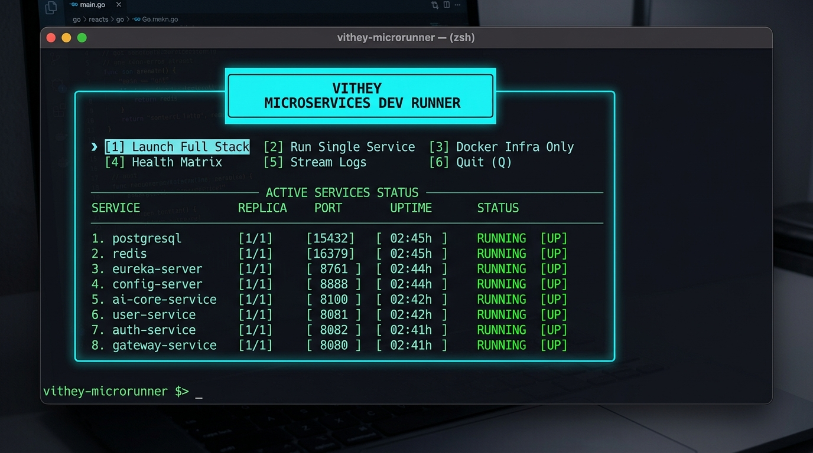

# Vithey Microservices Dev Runner & CLI Dashboard



The **Vithey Dev Runner** provides a high-performance Terminal User Interface (TUI) and rapid CLI execution engine. It coordinates shared infrastructure (PostgreSQL, Redis, RabbitMQ, MinIO, Eureka, Config Server, and AI Core) in **lightweight Docker containers** while executing Spring Boot microservices directly on the **host Mac/Linux JVM** for sub-second iteration and minimal memory footprint.

---

## Quick Start: Interactive CLI Dashboard

From the project root:

```bash
./run-backend-dev.sh
```

The interactive dashboard launches with arrow-key navigation:

```text
┌──────────────────────────────────────────────────┐
│                  VITHEY RUNNER                   │
└──────────────────────────────────────────────────┘

 Select command:

  > [1]  Launch Full Stack
    [2]  Run Single Service
    [3]  Start Docker Infra
    [4]  Status Matrix
    [5]  Tail Logs
    [6]  Stop All
    [q]  Quit

 [↑/↓] Navigate  •  [Enter] Select  •  [q] Quit
```

---

## Keyboard Controls & Navigation

| Key | Action |
|---|---|
| **`↑` / `k`** | Navigate up |
| **`↓` / `j`** | Navigate down |
| **`Enter`** | Select highlighted command |
| **`1` - `6`** | Instant execution shortcut |
| **`q` / `Ctrl+C`** | Exit or return to previous screen |

---

## Commands & Workflows

### 1. Launch Full Stack (Command 1)
- Verifies and starts all Docker infrastructure containers (`vithey-postgres`, `vithey-redis`, `vithey-rabbitmq`, `vithey-minio`, `vithey-eureka-server`, `vithey-config-server`, `vithey-ai-core`).
- Pre-checks Maven dependencies and launches all 9 Spring Boot microservices on host JVMs concurrently.
- Automatically monitors HTTP actuator health probes and reports when all services are `[UP]`.
- Press `Ctrl+C` to gracefully terminate all 9 services at once.

### 2. Run Single Service (Command 2)
- Interactive picker to select an individual microservice (`auth-service`, `content-service`, `career-service`, `api-gateway`, etc.).
- Automatically resolves port conflicts and starts the chosen service in the foreground with live logs.

### 3. Status & Health Matrix (Command 4)
- Live color-coded inspection using parallel probe worker threads (renders in under 50ms):
  - `[UP]` (Green): Service is healthy and responding to HTTP actuator health checks.
  - `[BUSY]` (Yellow): Port is bound or starting up.
  - `[DOWN]` (Dim): Service is stopped and port is free.
  - `[RUNNING]` (Green): Docker container is active and healthy.
- Press `r` to refresh live probes; `b` or `q` to return to the main menu.

### 4. Tail Service Logs (Command 5)
- Stream real-time output (`tail -f`) from any background service log stored in `.logs/<service>.log`.

---

## Direct CLI Mode (Non-Interactive)

All functionality is also directly accessible via CLI arguments:

```bash
# Run full stack (infra + all 9 services)
./run-backend-dev.sh all

# Run a single service in foreground
./run-backend-dev.sh content-service
./run-backend-dev.sh auth-service
./run-backend-dev.sh career-service

# Start Docker infrastructure containers only
./run-backend-dev.sh --infra-only

# Print health matrix table to stdout and exit
./run-backend-dev.sh --status

# Stop all background host services and Docker containers
./run-backend-dev.sh --stop

# List all available service names and port numbers
./run-backend-dev.sh --list
```

---

## Architecture: Docker Infrastructure vs. Host JVM

```mermaid
graph TD
    Client["Flutter Mobile App / Postman"]
    
    subgraph Host["Host Machine (Mac / Linux JVM)"]
        Gateway["api-gateway (:8080)"]
        Auth["auth-service (:8081)"]
        User["user-profile-service (:8082)"]
        File["file-service (:8083)"]
        Content["content-service (:8084)"]
        Career["career-service (:8085)"]
        Finance["finance-service (:8086)"]
        Chat["chat-service (:8087)"]
        Notif["notification-service (:8088)"]
    end
    
    subgraph Docker["Docker Infrastructure Containers"]
        Postgres["PostgreSQL (:15432)"]
        Redis["Redis Cache (:16379)"]
        RabbitMQ["RabbitMQ Broker (:5672)"]
        MinIO["MinIO S3 (:19000)"]
        Eureka["Eureka Registry (:8761)"]
        Config["Config Server (:8888)"]
        AICore["AI Core Python (:8100)"]
    end
    
    Client --> Gateway
    Gateway --> Auth & User & Content & Career & Finance & Chat & Notif & File
    Gateway -.-> AICore
    
    Host --> Postgres
    Host --> Redis
    Host --> RabbitMQ
    Host --> MinIO
    Host --> Eureka
    Host --> Config
```



| Component | Execution Target | Port / URL | Responsibility |
|---|---|---|---|
| **api-gateway** | Host JVM | `http://localhost:8080` | Spring Cloud Gateway entrypoint |
| **auth-service** | Host JVM | `http://localhost:8081` | Authentication & JWT token issuing |
| **user-profile-service** | Host JVM | `http://localhost:8082` | Student profile records & bios |
| **file-service** | Host JVM | `http://localhost:8083` | MinIO media upload management |
| **content-service** | Host JVM | `http://localhost:8084` | Social feed, posts, comments, stories |
| **career-service** | Host JVM | `http://localhost:8085` | Job postings, applications, CVs |
| **finance-service** | Host JVM | `http://localhost:8086` | Student financial records |
| **chat-service** | Host JVM | `http://localhost:8087` | WebSocket & peer-to-peer chat |
| **notification-service** | Host JVM | `http://localhost:8088` | Notification dispatch |
| **PostgreSQL 16** | Docker Container | `localhost:15432` | Relational database storage |
| **Redis 7** | Docker Container | `localhost:16379` | Cache & gateway rate limiter |
| **RabbitMQ 3** | Docker Container | `localhost:5672` (UI: `15672`) | Asynchronous event broker |
| **MinIO** | Docker Container | `localhost:19000` (UI: `19001`) | S3-compatible asset store |
| **Eureka Server** | Docker Container | `http://localhost:8761` | Microservice discovery registry |
| **Config Server** | Docker Container | `http://localhost:8888` | Central Spring Cloud configuration |
| **AI Core (Python)** | Docker Container | `http://localhost:8100` | AI Chat & CV generation engine |

---

## Flutter Integration

When running the mobile client:
```bash
cd vithey_app
./scripts/run-app.sh
```
- **Android Emulator**: connects automatically via `http://10.0.2.2:8080/api/v1`
- **Physical Device**: auto-detects host Mac LAN IP (`http://<LAN_IP>:8080/api/v1`) and executes `adb reverse tcp:8080 tcp:8080`.
