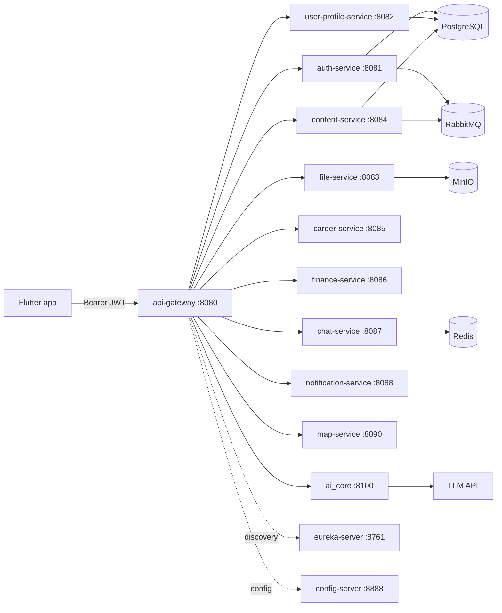

# Project Overview

> Status: Verified baseline · Last reviewed: 2026-09-30
> Evidence: `AGENTS.md`, `plan.md`, `api_docs.md`, `backend/`, `vithey_app/`, `ai_core/`, `monitoring/`
> Evidence anchor: `../_meta/EVIDENCE-BASIS.md`

## 1. Purpose

This document introduces **Vithey**, an AUB student "superapp", and the monorepo that
implements it. It is the entry point to the documentation package and summarises the
product, its components, its architecture, and where the detailed documents live.

Master index: [`07-document-index.md`](../00-project-overview/07-document-index.md).

## 2. Product identity

| Item | Value | Status |
| --- | --- | --- |
| Product name | **Vithey** (on-device display name **Vithey**) | [VERIFIED] |
| Product type | Student superapp: social feed, jobs/CV, student finance, peer chat, AI assistant, notifications, map | [VERIFIED] |
| Client context | Built for the **ACLEDA Bank App Competition 2026**; AUB student context | [VERIFIED] `docs/Prompt Frontend/00-project-summary.md`, `docs/Prompt Backend/COMMON_CONTEXT.md` |
| Contractual client / entity | Exact legal client and signatory not established in the repository | [TBD] TBD — Requires confirmation. |
| Repository | Monorepo at `D:\project\Acleda Mobile App` | [VERIFIED] |
| Remote `origin` | `https://github.com/Kimheang-code-IT/Mobile-App-ACLEDA.git` | [VERIFIED] git remote |
| Remote `upstream` | `https://github.com/vithey-mobile/Mobile-App-ACLEDA.git` | [VERIFIED] git remote |
| Integration branch / promotion target | `main` / `dev` (auto-promotion by CI) | [VERIFIED] `.github/workflows/ci-promote-dev.yml` |
| Flutter version | `1.0.0+1` | [VERIFIED] `vithey_app/pubspec.yaml` |
| AI engine version | distribution `vithey-ai` `0.2.0` | [VERIFIED] `ai_core/pyproject.toml` |
| Backend version | `vithey-backend 0.0.1-SNAPSHOT` | [VERIFIED] `backend/pom.xml` |
| History window | first commit `7e35770` 2026-06-27 → latest `d11106f` 2026-09-30 | [VERIFIED] git log (an activity window, not a contractual date) |

## 3. Repository layout

| Path | What | Toolchain |
| --- | --- | --- |
| `vithey_app/` | Flutter mobile app (GetX, Dio, Isar) | Flutter / Dart |
| `backend/` | Maven multi-module Spring Cloud stack | Java 21 / Maven |
| `ai_core/` | Python CV engine (FastAPI, LLM-backed) | Python 3.10+ |
| `monitoring/` | Prometheus / Grafana / Loki stack | Docker Compose |
| `docs/` | Build specs and prompts (reference) + this documentation package | — |
| `plan.md` | Locked "Profile M" demo architecture + runbook | — |
| `api_docs.md` | Flutter ↔ gateway API contract | — |

There is **no root `README.md`**; `AGENTS.md` is the contributor entry point. [VERIFIED]

## 4. Component map

| Component | Path | Notes | Status |
| --- | --- | --- | --- |
| Flutter app | `vithey_app/` (pubspec package `aub_connect_app`) | Modules under `lib/modules/`: auth, home, jobs, profile, chat, chatbot, finance, search, settings, map | [VERIFIED] |
| Backend | `backend/` (Spring Boot 3.3.5, Spring Cloud 2023.0.3) | Gateway + 9 domain services + Eureka + Config | [VERIFIED] |
| AI engine | `ai_core/` (package `vithey_ai`) | Owns the whole `/api/v1/ai/**` surface (chat + CV) | [VERIFIED] `ai_core/vithey_ai/api/flutter_routes.py` |
| Monitoring | `monitoring/` | Prometheus, Grafana, Loki, Promtail, node-exporter, cAdvisor | [VERIFIED] `monitoring/README.md` |
| Java AI service | *retired* | The Spring `ai-service` no longer exists; do not reintroduce it | [VERIFIED] `backend/DOCKER.md`, `api_docs.md` §10 |

## 5. High-level architecture

Rules (from `plan.md` and `api_docs.md`):

- The Flutter client calls **only** the gateway; it never calls `ai_core` or the LLM directly. [VERIFIED]
- Service discovery is Eureka; runtime config is Spring Cloud Config **native** (files in `config-repo/`). [VERIFIED]
- Each domain service owns its own PostgreSQL database; there is no shared database. [VERIFIED]
- Cross-service asynchronous events use RabbitMQ on exchange `vithey.events`. [VERIFIED]

Deeper detail: [`../01-requirements/02-software-requirements-SRS.md`](../01-requirements/02-software-requirements-SRS.md).

## 6. Delivery model

The locked delivery target is the **Profile M local demo**: all Vithey domain services
live plus `ai_core`, on a single local PC, for roughly **10 concurrent users**.
Staging and production do not exist. See
[`03-project-scope.md`](03-project-scope.md) and `plan.md` for the full definition.

## 7. Documentation map (this package)

| Document | Purpose |
| --- | --- |
| [`02-project-objectives.md`](02-project-objectives.md) | Business and technical objectives |
| [`03-project-scope.md`](03-project-scope.md) | Demo scope vs out-of-scope |
| [`04-stakeholders.md`](04-stakeholders.md) | Stakeholders (largely TBD) |
| [`05-team-roles-responsibilities.md`](05-team-roles-responsibilities.md) | Team (inferred) and responsibilities |
| [`06-glossary.md`](06-glossary.md) | Terminology |
| [`../01-requirements/`](../01-requirements/) | BRD, SRS, requirements, use cases, stories, acceptance, traceability |

## 8. Open questions

- Legal/contractual client name and signatories: [TBD] TBD — Requires confirmation.
- Formal acceptance criteria ownership and UAT scheduling: [TBD] TBD — Requires confirmation.
- Production hosting environment (bank-approved): [TBD] TBD — Requires confirmation.
