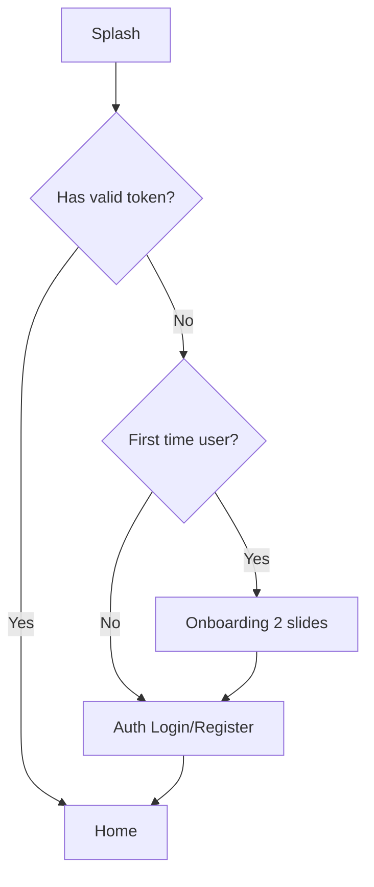

# Navigation & Screen Flow

## App entry flow



## Main navigation (after login)

```text
Home (feed)
├── Create Post
├── Post Detail → Apply CV (job posts)
├── Profile (self or other user)
│   ├── Preview CV
│   ├── Applicant CV Preview (job poster)
│   ├── Settings
│   └── Student Verification → Finance
├── Chat list → Chat Detail
├── Notifications
└── AI Chatbot (FAB or menu item)
```

## Screen connection table

| From screen | User action | To screen |
|-------------|-------------|-----------|
| Splash | Auto after token check | Home, Onboarding, or Auth |
| Onboarding | Skip / Get Started | Auth |
| Auth | Login / Register success | Home |
| Home | Tap post | Post Detail |
| Home | Tap Apply on job | Apply CV |
| Home | Tap avatar | Profile |
| Home | Nav: Chat | Chat |
| Home | Nav: Notifications | Notification |
| Home | Nav: Create | Create Post |
| Create Post | Publish success | Home |
| Post Detail | Apply CV (job) | Apply CV |
| Profile | View CV icon | Preview CV |
| Profile | Applicants (poster) | Applicant CV Preview |
| Profile | Settings gear | Settings |
| Profile | Verify student CTA | Student Verification |
| Student Verification | Success | Finance |
| Finance | Not verified gate | Student Verification |
| Chat | Tap conversation | Chat Detail |
| Chat | New message request | Chat Detail (after accept) |
| Settings | Logout | Auth |

## Route names (Flutter)

Defined in `lib/core/constants/app_routes.dart` — keep in sync with this doc.

| Route constant | Screen |
|----------------|--------|
| `SPLASH` | Splash |
| `ONBOARDING` | Onboarding |
| `AUTH` | Auth |
| `HOME` | Home |
| `CREATE_POST` | Create Post |
| `POST_DETAIL` | Post Detail |
| `APPLY_CV` | Apply CV |
| `PREVIEW_CV` | Preview CV |
| `PROFILE` | Profile |
| `FINANCE` | Finance |
| `STUDENT_VERIFICATION` | Student Verification |
| `CHAT` | Chat |
| `CHAT_DETAIL` | Chat Detail |
| `CHATBOT` | AI Chatbot |
| `NOTIFICATION` | Notification |
| `SETTINGS` | Settings |
| `APPLICANT_CV_PREVIEW` | Applicant CV Preview |

## API entry point

All mobile API calls go through **API Gateway**: `http://localhost:8080/api/v1` (local dev).
