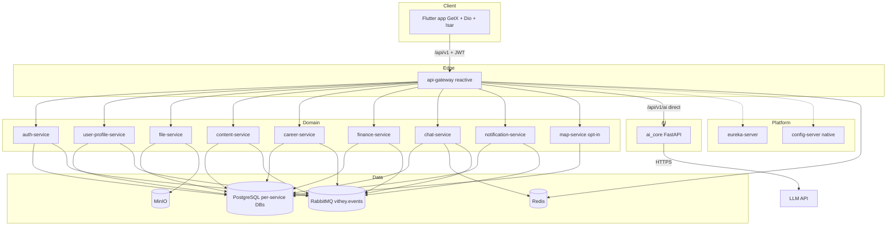

# Software Requirements Specification (SRS)

> Status: Verified baseline · Last reviewed: 2026-09-30
> Evidence: `backend/`, `vithey_app/`, `ai_core/`, `monitoring/`, `backend/infrastructure/config-repo/`, `api_docs.md`, `plan.md`
> Method: IEEE-830-style structure adapted to a repository-evidenced system. Requirements follow `FR-<MODULE>-NNN` / `NFR-<AREA>-NNN`.

## 1. Introduction

### 1.1 Purpose
Specify the software architecture and requirements of Vithey so the system can be built,
tested, and handed over consistently with the repository.

### 1.2 Scope
Vithey is a Flutter mobile client over a Spring Cloud microservice backend, with a Python
AI engine. The current deliverable is a **local demo** (Profile M). Staging and production
do not exist. [VERIFIED] `plan.md` §0, EVIDENCE-BASIS §9.

### 1.3 Intended audience
Developers, QA, DevOps, and business reviewers. Business context is in the
[BRD](01-business-requirements-BRD.md).

### 1.4 Definitions
See [`../00-project-overview/06-glossary.md`](../00-project-overview/06-glossary.md).

### 1.5 Requirement conventions
- `[VERIFIED]` supported by a cited path; `[INFERRED]`/`[PLANNED]`/`[TBD]` per
  `../_meta/EVIDENCE-BASIS.md`.
- IDs: `FR-<MODULE>-NNN`, `NFR-<AREA>-NNN`. Traceability:
  [`09-requirements-traceability-matrix.md`](09-requirements-traceability-matrix.md).

## 2. Overall description

### 2.1 Product perspective
Vithey is a greenfield monorepo with four buildable components:

| Component | Technology | Port(s) |
| --- | --- | --- |
| `vithey_app` | Flutter + GetX 4.6.6, Dio 5.4, Isar 3.1 | n/a |
| `backend` | Java 21, Spring Boot 3.3.5, Spring Cloud 2023.0.3 | 8080–8088, 8090, 8761, 8888 |
| `ai_core` | Python 3.10+, FastAPI | 8100 |
| `monitoring` | Prometheus, Grafana, Loki, Promtail, node-exporter, cAdvisor | 3000, 9090, 3100, 9100, 8095 |

[VERIFIED] `vithey_app/pubspec.yaml`, `backend/pom.xml`, `ai_core/pyproject.toml`, `monitoring/README.md`.

### 2.2 Architecture

### 2.3 Architectural principles

| ID | Principle | Evidence | Status |
| --- | --- | --- | --- |
| AP-01 | The client talks only to the gateway | `api_docs.md` §1, `plan.md` §2 | [VERIFIED] |
| AP-02 | Each service owns its database | `backend/services/*/.../db/migration/` | [VERIFIED] |
| AP-03 | Discovery via Eureka; config via native config-server | `backend/infrastructure/` | [VERIFIED] |
| AP-04 | Inter-service calls use OpenFeign through Eureka with circuit breaker | `config-repo/application.yml` | [VERIFIED] |
| AP-05 | Async integration uses RabbitMQ exchange `vithey.events` | `config-repo/application.yml` | [VERIFIED] |
| AP-06 | The Python `ai_core` owns the entire AI surface | `ai_core/vithey_ai/api/flutter_routes.py` | [VERIFIED] |
| AP-07 | JSON is snake_case; responses use the `{data,meta,error}` envelope | `api_docs.md` §1 | [VERIFIED] |

### 2.4 User classes

| Class | Role | Description |
| --- | --- | --- |
| General user | `USER` | Default registered user |
| Student | `STUDENT` | Verified; finance access |
| Company | `COMPANY` | Job poster / recruiter |
| Admin | `ADMIN` | Backend-only |

[VERIFIED] `auth-service/.../entity/Role.java`.

## 3. System interfaces

### 3.1 External interfaces

| Interface | Direction | Protocol | Evidence |
| --- | --- | --- | --- |
| Flutter ↔ gateway | Client → system | HTTPS/JSON + STOMP WS | `api_docs.md` §1, §9 |
| Gateway ↔ `ai_core` | Internal | HTTP `/api/v1/ai/**` direct to `http://ai-core:8100` (not Eureka) | `config-repo/api-gateway.yml` |
| `ai_core` ↔ LLM | Internal → external | HTTPS (OpenAI-compatible) | `ai_core/vithey_ai/deepseek_client.py` |
| Service ↔ PostgreSQL | Internal | JDBC (HikariCP) | `config-repo/application.yml` |
| Service ↔ RabbitMQ | Internal | AMQP | `config-repo/application.yml` |
| Service ↔ Redis | Internal | Redis protocol | `config-repo/application.yml` |
| file-service ↔ MinIO | Internal | S3 API | EVIDENCE-BASIS §3 |
| map-service ↔ Google Places | Internal → external | HTTPS | `api_docs.md` §12 |

### 3.2 User interfaces
The Flutter app uses `shadcn_flutter` for its design layer, with light and dark themes and
hardcoded English strings (`AppStrings`); Khmer is a stored preference only. [VERIFIED] EVIDENCE-BASIS §7.

### 3.3 Software interfaces
`GET /actuator/health` and `/actuator/prometheus` on Java services; `GET /health` on
`ai_core`. [VERIFIED] `backend/DEMO.md`, `monitoring/README.md`.

## 4. System features (summary)

Detailed functional requirements are enumerated in
[`03-functional-requirements.md`](03-functional-requirements.md).

| Feature | Primary service | Requirement prefix |
| --- | --- | --- |
| Authentication & RBAC | auth-service | FR-AUTH |
| Profiles & search | user-profile-service | FR-USER |
| Files | file-service | FR-FILE |
| Feed, posts, comments, follows | content-service | FR-CONTENT |
| Jobs & applications | career-service | FR-CAREER |
| Student finance | finance-service | FR-FINANCE |
| Peer chat | chat-service | FR-CHAT |
| Notifications | notification-service | FR-NOTIF |
| Map / places | map-service | FR-MAP |
| AI chat & CV | ai_core | FR-AI |
| Search fan-out | client + content/user-profile | FR-SEARCH |

## 5. Data requirements

- One PostgreSQL database per service; default `public` schema; Flyway with
  `ddl-auto: validate`, `open-in-view: false`. [VERIFIED] `config-repo/application.yml`
- Databases: `auth_db`, `user_db`, `file_db`, `content_db`, `career_db`, `finance_db`,
  `chat_db`, `notification_db`, `ai_db`, `map_db`. [VERIFIED] `init-databases.sql`
- `ai_db` is created but no longer used by Java after the AI retirement. [VERIFIED] EVIDENCE-BASIS §8.

### 5.1 Known data defects (documented, not silently fixed)

| ID | Defect | Evidence |
| --- | --- | --- |
| DD-01 | career-service has two migrations sharing version `V3` (Flyway conflict) | `career-service/.../db/migration/V3__*` (two files) |
| DD-02 | career `UserCv` entity `@Id` maps `user_id` while the DB PK is `id` | EVIDENCE-BASIS §8 |
| DD-03 | user-profile trigram index re-create is a no-op due to `IF NOT EXISTS` | `user-profile-service/.../V3__Enable_pg_trgm_and_full_name_gin_index.sql` |
| DD-04 | Enum vs DB CHECK supersets in several services | EVIDENCE-BASIS §8 |

## 6. Security requirements

- JWT (HMAC, JJWT 0.12.6): claims `sub`, `email`, `roles`; access TTL 15m, refresh 7d. [VERIFIED] EVIDENCE-BASIS §5
- Gateway validates JWT and injects `X-User-Id`, `X-User-Roles`, `X-User-Email`. [VERIFIED] `JwtAuthenticationGlobalFilter`, `UserHeaderForwardFilter`
- Each domain service repeats a `SecurityConfig` + `JwtAuthenticationFilter` (defense in depth). [VERIFIED]
- Only finance-service uses method security (`@PreAuthorize("hasRole('STUDENT')")` on `FeeController`, `PaymentController`). [VERIFIED]
- Bcrypt password storage; refresh/reset/email tokens stored hashed. [VERIFIED] EVIDENCE-BASIS §5
- Public gateway paths: register, login, refresh, forgot-password, reset-password, verify-email (+ actuator/swagger). [VERIFIED] `PublicPathMatcher.java`
- Secrets live only in gitignored `.env` files. [VERIFIED] EVIDENCE-BASIS §13
- Formal security assessment: **not performed**. [VERIFIED] EVIDENCE-BASIS §12

## 7. Deployment requirements

- Docker Compose (base + demo overlay); resource caps from `backend/.env`. [VERIFIED]
- Multi-stage Java Dockerfiles (non-root `vithey`), single-stage `ai_core`. [VERIFIED] EVIDENCE-BASIS §9
- No K8s/Helm/Terraform/Jenkins. [VERIFIED] EVIDENCE-BASIS §9
- CI: 9 per-service workflows + promotion pipeline publishing 13 images to GHCR. [VERIFIED] `.github/workflows/`
- Environments: Local development (verified), Local demo (verified), Staging (does not exist), Production (does not exist). [VERIFIED] EVIDENCE-BASIS §9

## 8. Constraints and assumptions

| ID | Constraint / assumption | Status |
| --- | --- | --- |
| SC-01 | Java 21 and Maven required | [VERIFIED] `AGENTS.md` |
| SC-02 | Web/Chrome unsupported for the Flutter app (Isar, secure storage, camera) | [VERIFIED] `vithey_app/README.md` |
| SC-03 | Config changes require rebuilding the config-server image | [VERIFIED] EVIDENCE-BASIS §4 |
| SC-04 | Android release currently signs with debug keys (explicit TODO) | [VERIFIED] EVIDENCE-BASIS §7 |
| SC-05 | Single shared Postgres in demo | [VERIFIED] `plan.md` §3.4 |
| SC-06 | No staging/production environment exists | [VERIFIED] EVIDENCE-BASIS §9 |

## 9. Non-functional requirements
See [`04-non-functional-requirements.md`](04-non-functional-requirements.md).

## 10. Verification
Test strategy in `backend/TESTING.md` and EVIDENCE-BASIS §10. Test execution during this
documentation task was **not performed**.

## 11. Related documents

- [`03-functional-requirements.md`](03-functional-requirements.md)
- [`04-non-functional-requirements.md`](04-non-functional-requirements.md)
- [`05-user-roles-permissions.md`](05-user-roles-permissions.md)
- [`../00-project-overview/01-project-overview.md`](../00-project-overview/01-project-overview.md)
