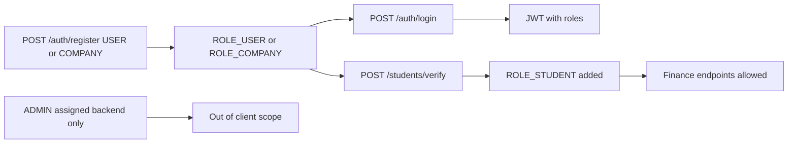

# User Roles & Permissions

> Status: Verified baseline · Last reviewed: 2026-09-30
> Evidence: `backend/services/auth-service/src/main/java/com/vithey/auth/entity/Role.java`, `backend/services/finance-service/.../controller/`, `api_docs.md` §18, `backend/services/api-gateway/.../PublicPathMatcher.java`

## 1. Role model

Vithey defines four roles in `Role.java`:

| Role | Granted by | Spring authority | Primary capabilities |
| --- | --- | --- | --- |
| `USER` | Registration | `ROLE_USER` | Default app access: feed, profile, chat, jobs, AI |
| `COMPANY` | Registration as company | `ROLE_COMPANY` | Post `JOB` posts, review applicants |
| `STUDENT` | `POST /students/verify` | `ROLE_STUDENT` | Finance (`/fees`, `/payments`) in addition to `USER` |
| `ADMIN` | Backend only | `ROLE_ADMIN` | Administrative scope; not implemented in the Flutter client |

[VERIFIED] `Role.java`; `api_docs.md` §18. JWT claims carry `sub`, `email`, `roles[]`. [VERIFIED]

## 2. Role acquisition flow

[VERIFIED] `api_docs.md` §3, §18; `StudentVerificationService`.

## 3. Permission matrix

Legend: Y = allowed, N = denied/not applicable, C = conditional, TBD = requires confirmation.

| Capability | `USER` | `COMPANY` | `STUDENT` | `ADMIN` |
| --- | --- | --- | --- | --- |
| Register / login | Y | Y | Y | Y |
| View/edit own profile | Y | Y | Y | Y |
| View public profiles | Y | Y | Y | Y |
| Create posts / comments / reactions | Y | Y | Y | Y |
| Follow / unfollow | Y | Y | Y | Y |
| Upload files | Y | Y | Y | Y |
| Apply to jobs | Y | C | Y | Y |
| Post `JOB` listing | N | Y | C | Y |
| Review applicants / update status | N | Y (own posts) | N | Y |
| Peer chat | Y | Y | Y | Y |
| AI chat / CV generate | Y | Y | Y | Y |
| Finance (`/fees`, `/payments`) | N → 403 | N → 403 | Y | TBD |
| Map / places | Y | Y | Y | Y |
| Notifications | Y | Y | Y | Y |
| Admin back-office | N | N | N | TBD |

Notes:
- Finance is the **only** place method-security is applied: `@PreAuthorize("hasRole('STUDENT')")` on `FeeController` and `PaymentController`. [VERIFIED]
- `COMPANY` posting restrictions are described in `api_docs.md` §18; code-level enforcement beyond role membership is not centralised. [INFERRED] — requires business confirmation.
- `ADMIN` endpoints are outside the Flutter client scope. [VERIFIED] `api_docs.md` §18.

## 4. Endpoint access map

### 4.1 Public (no JWT)

| Endpoint | Evidence |
| --- | --- |
| `POST /api/v1/auth/register` | `PublicPathMatcher.java` |
| `POST /api/v1/auth/login` | same |
| `POST /api/v1/auth/refresh` | same |
| `POST /api/v1/auth/forgot-password` | same |
| `POST /api/v1/auth/reset-password` | same |
| `POST /api/v1/auth/verify-email` | same |

Actuator and Swagger paths are also excluded from JWT enforcement. [VERIFIED] EVIDENCE-BASIS §5.

### 4.2 Protected (JWT required)

All other `/api/v1/**` routes require a Bearer token. The gateway also injects
`X-User-Id`, `X-User-Roles`, `X-User-Email` downstream. [VERIFIED] `JwtAuthenticationGlobalFilter`, `UserHeaderForwardFilter`.

### 4.3 Documented discrepancy

`/api/v1/students/verify` is routed to auth-service but is **not** in the public matcher,
so the gateway requires a JWT for it. [VERIFIED] `api_docs.md` §15; `PublicPathMatcher.java`.

## 5. Authorization enforcement points

| Layer | Mechanism | Coverage |
| --- | --- | --- |
| Gateway | JWT validation + public path allow-list | All routes except public paths |
| Domain services | `SecurityConfig` + `JwtAuthenticationFilter` (stateless) | Each service |
| Method security | `@PreAuthorize` | finance-service only (`FeeController`, `PaymentController`) |
| Business rules | Service-level checks (e.g. owner-only delete, poster-only status) | Selected endpoints |

[VERIFIED] EVIDENCE-BASIS §5; Action_Plan 11.x.

## 6. Open questions

- Full `ADMIN` capability set and whether an admin console is expected: [TBD] TBD — Requires confirmation.
- Whether `COMPANY` should be restricted from applying to jobs (matrix above shows "C"): [TBD] TBD — Requires confirmation.
- Whether more endpoints should adopt `@PreAuthorize` beyond finance: [TBD] TBD — Requires confirmation.

## 7. Related documents

- [`03-functional-requirements.md`](03-functional-requirements.md)
- [`06-use-cases.md`](06-use-cases.md)
- [`../01-requirements/02-software-requirements-SRS.md`](02-software-requirements-SRS.md) §6
