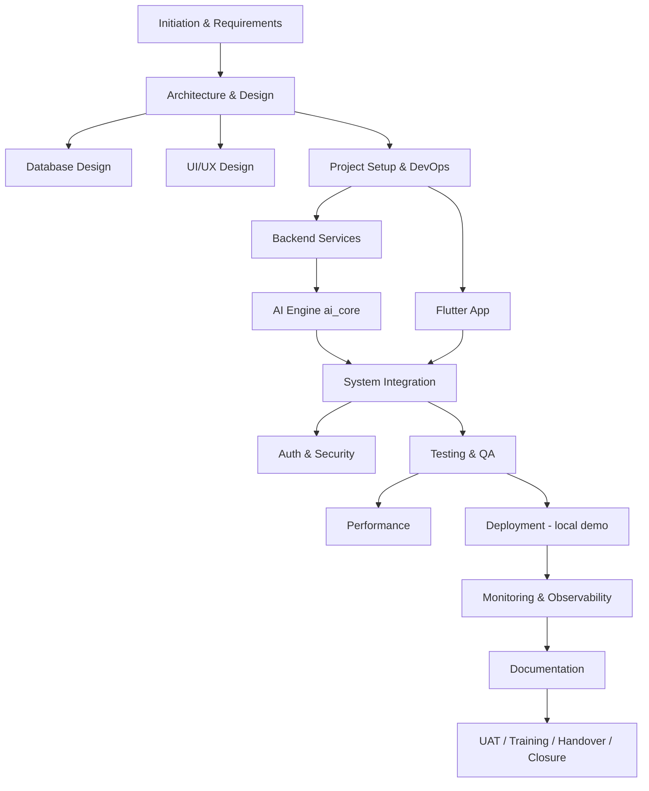

# Project Plan

> Status: Partially complete / Requires confirmation · Last reviewed: 2026-09-30
> Evidence: `plan.md` (locked "Profile M"), `AGENTS.md`, `Action_Plan_Vithey.csv`, `api_docs.md`, `backend/DOCKER.md`, `backend/DEMO.md`, `docs/Prompt Devops/DEVOPS_REQUIREMENTS_PROPOSAL.md`, git history
> Evidence anchor: `../_meta/EVIDENCE-BASIS.md`

Part of the Vithey documentation set · Master index:
[`../00-project-overview/07-document-index.md`](../00-project-overview/07-document-index.md) ·
Siblings: [Action plan](02-action-plan.md) · [Milestones](03-milestones.md) ·
[WBS](04-work-breakdown-structure.md) · [Team assignment](05-team-assignment.md) ·
[Timeline](06-project-timeline.md) · [Status report](07-project-status-report.md) ·
[Change request log](08-change-request-log.md) · [Decision log](09-decision-log.md) ·
[Meeting minutes](10-meeting-minutes/README.md) · [Risk management](../18-risk-management/01-risk-register.md).

## 1. Purpose

This is the management-level project plan for **Vithey**. It ties together the locked
delivery target, the work breakdown, the schedule as far as it can be evidenced, the team
as far as it can be inferred, and the governance gaps that remain open.

It does **not** restate engineering detail. Architecture is in
[`../03-system-design/01-system-architecture.md`](../03-system-design/01-system-architecture.md);
scope is in [`../00-project-overview/03-project-scope.md`](../00-project-overview/03-project-scope.md).

## 2. Project identity

| Item | Value | Status |
| --- | --- | --- |
| Product | **Vithey** — AUB student superapp | [VERIFIED] `docs/00-project-overview/01-project-overview.md` |
| Delivery context | **ACLEDA Bank App Competition 2026** | [VERIFIED] `docs/Prompt Frontend/00-project-summary.md`, `docs/Prompt Backend/COMMON_CONTEXT.md` |
| Locked delivery target | **Profile M local demo** — all Vithey domain services live + `ai_core`, one PC, ~10 concurrent users | [VERIFIED] `plan.md` §0, §3.2 |
| Repository | Monorepo `D:\project\Acleda Mobile App` | [VERIFIED] |
| Integration / promotion branches | `kimheang` (working) → `main` → `dev` (CI auto-promotion) | [VERIFIED] `.github/workflows/ci-promote-dev.yml` |
| Contractual client / signatories | Not established in the repository | [TBD] TBD — Requires confirmation. |
| History window (evidence-derived) | `7e35770` 2026-06-27 → `d11106f` 2026-09-30 | [VERIFIED] git log; an activity window, **not** a contractual schedule |

## 3. Delivery model

- **Environment:** local demo only. **Staging and production do not exist.** [VERIFIED] `EVIDENCE-BASIS.md` §9.
- **Runtime:** Docker Compose base + `docker-compose.demo.yml` overlay, started by
  `backend/scripts/docker-up-demo.ps1`. [VERIFIED] `backend/DEMO.md`.
- **Optional components:** `map-service` and `monitoring` are Compose **profiles**, started
  on demand. [VERIFIED] `AGENTS.md`, `monitoring/README.md`.
- **AI:** Flutter → gateway → `ai_core` → LLM; AI chat is a **stub**; GDCE/RAG is out of
  scope. [VERIFIED] `AGENTS.md`, `plan.md` §8.

## 4. Objectives

Business and technical objectives are catalogued in
[`../00-project-overview/02-project-objectives.md`](../00-project-overview/02-project-objectives.md).
The demo success criteria are the 7 checks in `plan.md` §9 (stack stability, 10-user login,
live CV generation, incomplete-profile path, concurrency cap, stub chatbot, live Flutter CV).
[VERIFIED] `plan.md` §9.

## 5. Work breakdown

The full work breakdown is in [`04-work-breakdown-structure.md`](04-work-breakdown-structure.md),
organised into the 23 sections of `Action_Plan_Vithey.csv`. The line-item plan is
[`02-action-plan.md`](02-action-plan.md).

## 6. Phased plan (from `plan.md` §5)

`plan.md` §5 defines a backend-first phased sequence. Its checkboxes are a mix of ticked and
unticked and represent the plan author's view; they are reproduced here as **[PLANNED]** intent
and **not** as proof of completion.

| Phase | Intent | Exit condition (as planned) | Status |
| --- | --- | --- | --- |
| 0 — Review & freeze | Lock Profile M, no GDCE, API-key AI | Plan approved | Partially ticked in `plan.md` §0/§14 |
| 1 — Demo infra (Profile M) | All services + `ai_core` boot under memory caps | Healthchecks green, no GDCE | [PLANNED]/[VERIFIED] compose + scripts exist |
| 2 — Wire `ai_core` CV (P0) | `POST /ai/cv/generate` works end-to-end | Authenticated draft JSON via gateway | [VERIFIED] `ai_core/vithey_ai/api/flutter_routes.py` |
| 3 — Chat stub (P1) | Stub-only chatbot, no GDCE | Works through gateway | [VERIFIED] `AI_CHAT_MODE=stub` |
| 4 — Flutter live switch | Auto-Create CV uses live API | End-to-end on device | [PLANNED] flags exist; device run not evidenced |
| 5 — Optional P2 rule-based AI | Job match / skills score | Only if time remains | [PLANNED]/not shipped (`docs/09-ai/11-ai-limitations.md` §9) |

> Note: `plan.md` §5–§7 still describe a Java `ai-service` facade; the module is **retired** and
> Python `ai_core` owns the AI surface. Those sections are historical. [VERIFIED] `plan.md` update banner, `AGENTS.md`.

## 7. Milestones

Milestones are derived from git activity windows and the action-plan sections; they are **not**
formally approved milestone dates. See [`03-milestones.md`](03-milestones.md).

## 8. Schedule

Populated start/end dates in the action plan are **evidence-derived** from git activity windows
(per the `Action_Plan_Vithey.csv` remarks). Unknown dates are `TBD`. There is no formally
baselined, approved schedule in the repository. See [`06-project-timeline.md`](06-project-timeline.md).

## 9. Team

No authoritative staffing record exists. Names are inferred from git author metadata and the
`Action_Plan_Vithey.csv` "Responsible Party" column. See [`05-team-assignment.md`](05-team-assignment.md).

## 10. Governance status

| Artefact | Status |
| --- | --- |
| Formal acceptance / sign-off | **Not present** (blank fields in `plan.md` §14) [VERIFIED] |
| UAT | **Not executed** [VERIFIED] `EVIDENCE-BASIS.md` §12 |
| Security assessment / pen test | **Not performed** [VERIFIED] `../10-security/11-security-review-report.md` |
| Staging | **Does not exist** [VERIFIED] |
| Production deployment | **Not performed** [VERIFIED] |
| Meeting minutes | **None found in the repository** [VERIFIED] see [`10-meeting-minutes/README.md`](10-meeting-minutes/README.md) |

## 11. Risks and issues

The register, issue log, known limitations, technical debt and mitigation plan are in
[`../18-risk-management/`](../18-risk-management/). Highest-severity technical items:
career-service duplicate Flyway `V3`; career `UserCv @Id` mismatch; smoke ITs not run by
default; no Alertmanager; monitoring scrape gaps; Android release debug signing; no
staging/production; no automated backups.

## 12. Open questions

- Contractual client name, signatories, and formal schedule: [TBD] TBD — Requires confirmation.
- Whether the bank expects a hosted environment and its specification: [TBD] TBD — Requires confirmation.
- Scope classification of each task (Original vs Additional vs Future): [TBD] TBD — Requires business confirmation (currently [INFERRED]).
