# Work Breakdown Structure (WBS)

> Status: Partially complete · Last reviewed: 2026-09-30
> Evidence: `Action_Plan_Vithey.csv` section structure, `plan.md`, repository tree
> Evidence anchor: `../_meta/EVIDENCE-BASIS.md`

Part of the Vithey documentation set · Master index:
[`../00-project-overview/07-document-index.md`](../00-project-overview/07-document-index.md) ·
Sibling: [Project plan](01-project-plan.md) · [Action plan](02-action-plan.md) ·
[Milestones](03-milestones.md) · [Team assignment](05-team-assignment.md) · [Timeline](06-project-timeline.md).

## 1. Basis

The WBS mirrors the **23 sections** of `Action_Plan_Vithey.csv`. Task IDs shown (e.g. `1.1`,
`8.7`) are the CSV IDs and are the navigation key to the line-by-line
[action plan](02-action-plan.md). Scope classification is [INFERRED] from `plan.md` §0/§8
(see the action plan legend).

## 2. WBS tree

```mermaid
flowchart TD
  Root[Vithey - Profile M demo]
  Root --> A[1 Initiation & Requirements]
  Root --> B[2 Analysis & Architecture]
  Root --> C[3 UI/UX Design]
  Root --> D[4 Database Design]
  Root --> E[5 Setup & DevOps]
  Root --> F[6 Gateway & Identity]
  Root --> G[7 Domain Services]
  Root --> H[8 ai_core]
  Root --> I[9 Flutter App]
  Root --> J[10 System Integration]
  Root --> K[11 Auth & Authorization]
  Root --> L[12 Security]
  Root --> M[13 Finance & Reporting]
  Root --> N[14 Testing & QA]
  Root --> O[15 Bug Fixing & Defects]
  Root --> P[16 Performance]
  Root --> Q[17 Deployment]
  Root --> R[18 Monitoring]
  Root --> S[19 Documentation]
  Root --> T[20 UAT]
  Root --> U[21 Training & KT]
  Root --> V[22 Handover]
  Root --> W[23 Closure]
```

## 3. WBS dictionary

| WBS | Section | Task IDs | Primary deliverables | Scope classification | Status (CSV) |
| --- | --- | --- | --- | --- | --- |
| 1 | Project Initiation and Requirements | 1.1–1.5 | Scope doc, functional & backend specs, DevOps requirements, locked demo plan | Original Scope | Completed |
| 2 | System Analysis and Architecture | 2.1–2.5 | Architecture spec, API contract, AI flow design, resource plan, discovery/config design | Original Scope | Completed |
| 3 | UI and UX Design | 3.1–3.14 | Design tokens/themes and screen designs for all client modules | Original Scope (3.13 Additional Work) | Completed |
| 4 | Database Design | 4.1–4.11 | Per-service schemas, shared Postgres layout, demo seed data | Original Scope (4.10 Additional Work) | Mostly Completed; 4.11 Not Started |
| 5 | Project Setup and DevOps | 5.1–5.8 | Maven multi-module, Eureka, Config Server, Flutter skeleton, Dockerfiles, Compose, CI | Original Scope | Completed |
| 6 | Backend — Gateway and Identity | 6.1–6.6 | api-gateway, auth lifecycle, verification/password reset, student verify, profile/settings, user search | Original Scope | Completed |
| 7 | Backend — Domain Services | 7.1–7.12 | file, content, career, finance, chat (REST + STOMP), block/report, notification, map/places | Original Scope (7.12 Additional Work) | Completed / 7.12 Pending Review |
| 8 | AI Engine `ai_core` | 8.1–8.8 | FastAPI service, extraction/generation, normalize, dedupe, quality score, LLM client, chat stub, CV routes, Docker image | Original Scope | Completed |
| 9 | Frontend — Flutter App | 9.1–9.15 | Core client, all module clients, offline chat, placeholders | Original Scope (9.13 Additional Work; 9.14/9.15 Future Enhancement) | Completed / two Not Started |
| 10 | System Integration | 10.1–10.7 | Endpoint alignment, auth/token refresh, mock→live switch, CV e2e, STOMP, uploads, smoke script | Original Scope | Completed |
| 11 | Authentication and Authorization | 11.1–11.5 | JWT issuance/validation, role model, public paths + header forwarding, finance gating | Original Scope (11.5 Future Enhancement) | Completed / 11.5 Not Started |
| 12 | Security | 12.1–12.7 | Password hashing, token security, secure storage, rate limiting, secrets, CORS, formal review | Original Scope (12.7 Future Enhancement) | Completed / 12.7 Not Started |
| 13 | Finance and Reporting | 13.1–13.4 | Finance dashboard, ACLEDA launch, invoice preview, reporting module | Original Scope (13.4 Future Enhancement) | Completed / 13.4 Not Started |
| 14 | Testing and QA | 14.1–14.8 | Unit, context, smoke IT, ai_core tests, Flutter tests, health checks, map IT, UAT execution | Original Scope (14.7 Internal Technical Improvement; 14.8 Future Enhancement) | Completed / 14.5 In Progress |
| 15 | Bug Fixing and Defects | 15.1–15.6 | Duplicate V3 fix, post PATCH, compose gating, stale docs, WIP branch recovery, placeholders | Internal Technical Improvement | Pending Review / In Progress / Blocked / Not Started |
| 16 | Performance Optimization | 16.1–16.6 | Memory caps, JVM tuning, data-store tuning, Redis caching, LLM cost controls, offline chat | Original Scope | Completed |
| 17 | Deployment | 17.1–17.5 | Demo runbook, automation scripts, CI image publish, monitoring deployment, production deploy | Original Scope (17.5 Future Enhancement) | Completed / 17.5 Not Started |
| 18 | Monitoring and Observability | 18.1–18.4 | Prometheus + alerts, Grafana dashboards, Loki/Promtail logs, host/container metrics | Original Scope | Completed |
| 19 | Documentation | 19.1–19.5 | Master plan, API contract, backend ops docs, repo conventions/readmes, ai_core docs | Original Scope | Completed |
| 20 | User Acceptance Testing | 20.1–20.3 | UAT plan/cases, UAT execution log, UAT sign-off | Future Enhancement | Not Started |
| 21 | Training and Knowledge Transfer | 21.1–21.2 | Developer onboarding pack, operations runbook training | Future Enhancement | Not Started |
| 22 | Handover | 22.1–22.2 | Handover package, bank reporting pack | Future Enhancement | Not Started / 22.2 In Progress |
| 23 | Project Closure | 23.1–23.2 | Final acceptance, closure report | Future Enhancement | Not Started |

## 4. Verification notes

- WBS sections and task IDs are taken directly from `Action_Plan_Vithey.csv`. [VERIFIED]
- Section-to-deliverable mapping is summarised from the CSV "Task ID/Action/Deliverable" columns. [VERIFIED]
- Scope classifications are [INFERRED] from `plan.md` §0/§8 and the delivered module set — requires business confirmation.
- Statuses are the CSV's reported values and are **not** independently verified (`EVIDENCE-BASIS.md` §10).

## 5. Cross-links

- [Action plan](02-action-plan.md) · [Milestones](03-milestones.md) · [Timeline](06-project-timeline.md)
- [Risk register](../18-risk-management/01-risk-register.md) · [Issue log](../18-risk-management/02-issue-log.md)
