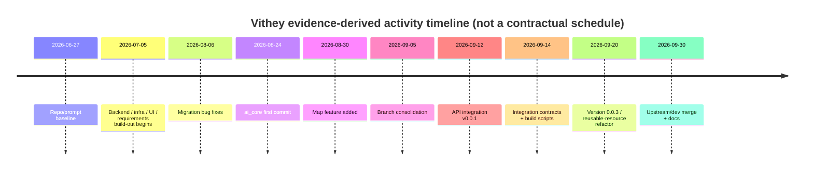

# Project Timeline

> Status: Requires confirmation · Last reviewed: 2026-09-30
> Evidence: git history (`git log --date=short`), `Action_Plan_Vithey.csv` start/end columns, `plan.md`
> Evidence anchor: `../_meta/EVIDENCE-BASIS.md` §1

Part of the Vithey documentation set · Master index:
[`../00-project-overview/07-document-index.md`](../00-project-overview/07-document-index.md) ·
Sibling: [Project plan](01-project-plan.md) · [Milestones](03-milestones.md) ·
[Action plan](02-action-plan.md) · [Status report](07-project-status-report.md).

## 1. Important caveat

**There is no formally baselined or approved project schedule in the repository.** Every date
below is **evidence-derived** from git activity windows (the `Action_Plan_Vithey.csv` remarks say
the dates are "the git activity window"). They are **not** contractual planned dates. The only
hard date anchor is the repository history window:

> first commit `7e35770` "Prompt" **2026-06-27** → latest `d11106f` **2026-09-30**.
> [VERIFIED] `EVIDENCE-BASIS.md` §1.

## 2. Evidence-derived activity timeline

| Period (evidence-derived) | Activity evidenced | Key commits / artefacts |
| --- | --- | --- |
| 2026-06-27 | Project baseline / prompts | `7e35770` "Prompt" |
| 2026-07-05 → 2026-08-06 | Backend, infra, UI, requirements build-out | `Action_Plan_Vithey.csv` date windows; `backend/`, `vithey_app/`; `4ac45f8` migration fixes |
| 2026-08-21 → 2026-08-30 | Auth/UI iteration; map added; AI CV start | `4c1f151`, `6d794a5`, `307f2cd`, `f096bf5`, `be87718`, `b261c1f` |
| 2026-08-31 → 2026-09-05 | Branch consolidation; map-service + Shadcn UI; finance screen | merges `bcb3eea`, `40cfc86`, `5ab1bb7`, `b7acec7`, `8e727b3`; `1420b0d` |
| 2026-09-06 → 2026-09-14 | Settings/auth/theme; API integration v0.0.1; integration contracts; compose/build scripts | `688669d`, `3d0810f`, `caf5e95`, `5b16cb9` |
| 2026-09-19 → 2026-09-20 | Production config update; version 0.0.3; reusable-resource refactor | `c93d138`, `3537584`, `ac227fd` |
| 2026-09-30 | Upstream/dev merge (map-service + build scripts); documentation package | `d11106f`; `docs/_meta/` |

> The tag `presync-20260930` sits at commit `3537584` ("updaate version 0.0.3", 2026-09-20).
> [VERIFIED] `EVIDENCE-BASIS.md` §1.

## 3. Timeline (Mermaid)

## 4. Phase schedule mapping

`Action_Plan_Vithey.csv` groups tasks into date windows. The most common evidence-derived windows
(per the CSV) are:

| Window | CSV sections that use it |
| --- | --- |
| 2026-07-05 → 2026-09-30 | Backend, infrastructure, DB, security, DevOps, scripts |
| 2026-07-05 → 2026-09-20 | Flutter modules, finance, testing/QA |
| 2026-08-24 → 2026-09-20 | `ai_core` (all §8 tasks) |
| 2026-09-05 → 2026-09-30 | Map-service, career CV, jobs/CV client |
| 2026-09-19 → 2026-09-20 | Demo plan, API contract, integration, resource plan |

> These are the CSV's populated windows. They are evidence-derived and not formally baselined.

## 5. Post-demo activities (dates not established)

| Activity | Status | Date |
| --- | --- | --- |
| Seed data preparation (CSV 4.11) | Not Started | [TBD] |
| UAT (CSV 20.1–20.3) | Not Started | [TBD] |
| Security review (CSV 12.7) | Not Started | [TBD] |
| Training (CSV 21.x) | Not Started | [TBD] |
| Handover (CSV 22.x) | Not Started | [TBD] |
| Production deployment (CSV 17.5) | Not Started | [TBD] |
| Closure (CSV 23.x) | Not Started | [TBD] |

## 6. Open questions

- Client-agreed baseline start, end and any deadline: [TBD] TBD — Requires confirmation.
- Whether a formal schedule/Gantt was agreed outside the repository: [TBD] TBD — Requires confirmation.

## 7. Cross-links

- [Milestones](03-milestones.md) · [Action plan](02-action-plan.md) · [Status report](07-project-status-report.md)
