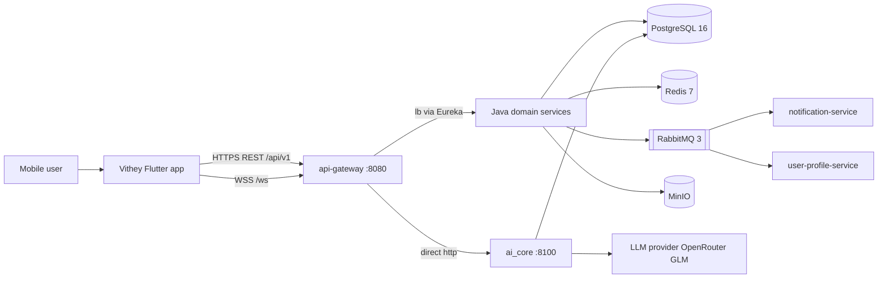

# System Architecture

> Status: Verified · Last reviewed: 2026-09-30
> Evidence: `backend/infrastructure/config-repo/*.yml`, `backend/docker-compose.yml`, `backend/services/*/src/main/java`, `ai_core/vithey_ai/`, `vithey_app/lib/`, `monitoring/`

Part of the Vithey documentation set · Master index: [`../00-project-overview/07-document-index.md`](../00-project-overview/07-document-index.md) · Siblings: [HLD](02-high-level-design-HLD.md) · [LLD](03-low-level-design-LLD.md) · [Components](04-component-diagram.md) · [Data flow](05-data-flow-diagram.md) · [Sequences](06-sequence-diagrams.md) · [Network](07-network-architecture.md) · [Tech stack](08-technology-stack.md)

## 1. Context

**Vithey** is a student superapp delivered as a monorepo with three runnable tiers:

1. **Flutter mobile client** (`vithey_app/`) — Android-first; talks only to the gateway.
2. **Vithey backend** (`backend/`) — Java 21 / Spring Boot 3.3.5 microservices behind an API gateway.
3. **ai_core** (`ai_core/`) — Python FastAPI engine that owns the `/api/v1/ai/**` surface (CV generation + chat).

Supporting layers: shared PostgreSQL/Redis/RabbitMQ/MinIO infrastructure and an opt-in monitoring stack. [VERIFIED — AGENTS.md, `backend/docker-compose.yml`, `docs/_meta/EVIDENCE-BASIS.md`]

## 2. Architectural style

- **Microservices per business capability**, each with its own database (no shared schema). [VERIFIED — `backend/infrastructure/scripts/init-databases.sql`, `backend/infrastructure/config-repo/*.yml`]
- **API Gateway pattern** (Spring Cloud Gateway, reactive). The client never calls a domain service directly; the gateway is the single north/south boundary. [VERIFIED — `backend/infrastructure/config-repo/api-gateway.yml`]
- **Centralised config** via Spring Cloud Config with the `native` profile; service runtime config lives in `backend/infrastructure/config-repo/*.yml`. [VERIFIED — `backend/docker-compose.yml` config-server bind mount]
- **Service discovery** via Eureka (`lb://<service>` route targets). [VERIFIED — `api-gateway.yml`]
- **Event-driven integration** over a single RabbitMQ topic exchange `vithey.events`. No Kafka anywhere. [VERIFIED — `backend/services/content-service/.../event/publisher/ContentEventPublisher.java`, `notification-service/.../config/RabbitMqConfig.java`]
- **Synchronous inter-service calls** via OpenFeign resolved through Eureka, with circuit breakers. [VERIFIED — `config-repo/application.yml` `spring.cloud.openfeign.circuitbreaker.enabled: true`, `resilience4j` block]
- **AI is a separate Python service** reached by a direct gateway route (not Eureka). The Java `ai-service` is retired. [VERIFIED — `api-gateway.yml` route `ai-core` → `http://ai-core:8100`; `docs/_meta/EVIDENCE-BASIS.md` §3]

## 3. Components and ports

| Component | Type | Port (container / host) | Eureka name | Data store |
|---|---|---|---|---|
| api-gateway | Spring Cloud Gateway (reactive) | 8080 / 8080 | `api-gateway` | Redis (rate limit) |
| auth-service | Spring Boot MVC | 8081 / 8081 | `auth-service` | `auth_db` |
| user-profile-service | Spring Boot MVC | 8082 / 8082 | `user-profile-service` | `user_db` |
| file-service | Spring Boot MVC | 8083 / 8083 | `file-service` | `file_db` + MinIO |
| content-service | Spring Boot MVC | 8084 / 8084 | `content-service` | `content_db` |
| career-service | Spring Boot MVC | 8085 / 8085 | `career-service` | `career_db` |
| finance-service | Spring Boot MVC | 8086 / 8086 | `finance-service` | `finance_db` |
| chat-service | Spring Boot MVC + STOMP | 8087 / 8087 | `chat-service` | `chat_db` + Redis |
| notification-service | Spring Boot MVC | 8088 / 8088 | `notification-service` | `notification_db` |
| map-service | Spring Boot MVC | 8090 / 8090 | `map-service` | `map_db` + Redis |
| eureka-server | Spring Cloud Netflix Eureka | 8761 / 8761 | (server) | — |
| config-server | Spring Cloud Config (native) | 8888 / 8888 | (server) | `config-repo` |
| ai_core | Python FastAPI | 8100 / 8100 | (not registered) | `ai_db` (created, used for chat persistence) |

[VERIFIED — `config-repo/*.yml`, `backend/docker-compose.yml`, `ai_core/Dockerfile`]

> Discrepancy: the legacy `docs/_shared/SERVICE_REGISTRY.md` still lists a `services/ai-service` on port 8089. That module does not exist in the codebase and is **retired**. [VERIFIED — `backend/pom.xml` `<modules>`, `docs/_meta/EVIDENCE-BASIS.md` §3]

## 4. Gateway surface

The gateway defines 13 routes; all carry a Redis `RequestRateLimiter` except the WebSocket route. [VERIFIED — `config-repo/api-gateway.yml`]

| Route id | Predicate path | Target |
|---|---|---|
| auth-service | `/api/v1/auth/**`, `/api/v1/students/verify` | `lb://auth-service` |
| career-user-cv | `/api/v1/users/me/cv`, `/api/v1/users/me/cv/**` | `lb://career-service` |
| content-user-social | `/api/v1/users/*/follow`, `/followers`, `/following`, `/posts` | `lb://content-service` |
| file-service | `/api/v1/files/**` | `lb://file-service` |
| content-service | `/api/v1/posts/**`, `/comments/**`, `/reactions/**`, `/follows/**` | `lb://content-service` |
| career-service | `/api/v1/jobs/**`, `/job-applications/**` | `lb://career-service` |
| finance-service | `/api/v1/fees/**`, `/payments/**` | `lb://finance-service` |
| chat-service | `/api/v1/conversations/**`, `/messages/**`, `/message-requests/**`, `/users/*/report` | `lb://chat-service` |
| chat-websocket | `/ws/**` | `lb:ws://chat-service` |
| notification-service | `/api/v1/notifications/**` | `lb://notification-service` |
| ai-core | `/api/v1/ai/**` | `http://ai-core:8100` (direct) |
| map-service | `/api/v1/places/**` | `lb://map-service` |
| user-profile-service | `/api/v1/users/**` (order 1) | `lb://user-profile-service` |

Route **order** matters: the three specific `/api/v1/users/...` routes are ordered `0` and the catch-all `/api/v1/users/**` is ordered `1`, so CV and social routes win. [VERIFIED — `config-repo/api-gateway.yml`]

## 5. Security boundary (summary)

Security is implemented at the gateway and repeated in each service (defense in depth).

- Gateway `JwtAuthenticationGlobalFilter` allows a small public set and otherwise requires a `Bearer` token, then injects `X-User-Id`, `X-User-Roles`, `X-User-Email`. [VERIFIED — `.../gateway/filter/JwtAuthenticationGlobalFilter.java`]
- Public gateway paths: register, login, refresh, forgot-password, reset-password, verify-email, `/actuator/**`, swagger. Note `/api/v1/students/verify` is routable but **not** public, so it requires a JWT at the gateway. [VERIFIED — `.../gateway/util/PublicPathMatcher.java`; documented discrepancy `EVIDENCE-BASIS.md` §5]
- Each service has its own `SecurityConfig` + `JwtAuthenticationFilter`, stateless. [VERIFIED — e.g. `auth-service/.../config/SecurityConfig.java`]
- JWT: HMAC (JJWT 0.12.6), claims `sub` (user id), `email`, `roles`; role claims become `ROLE_<NAME>`. [VERIFIED — `auth-service/.../security/JwtProvider.java`]

Full detail: [LLD § Security](03-low-level-design-LLD.md).

## 6. Messaging topology

Single topic exchange `vithey.events`. Producers and consumers: [VERIFIED — service `event/publisher` + `config/RabbitMqConfig.java`]

- Producers: auth (`user.registered`, `student.verified`), content (`post.created`, `comment.added`, `reaction.added`, `follow.created`, `mention.created`), career (`job.application.submitted`, `job.application.status_changed`), chat (`chat.request.received`, `chat.message.sent`), finance (`payment.due`, `payment.overdue`), user-profile (`profile.updated`).
- Notification consumes queues `notification.<routingKey>`. user-profile consumes `user-profile.user.registered`; finance consumes `finance.student.verified`.

## 7. Client architecture (Flutter)

- GetX 4.6.6 for state, DI and routing; Dio 5.4 for HTTP with a single interceptor handling token injection and 401 refresh; Isar 3.1 for local chat storage. [VERIFIED — `vithey_app/pubspec.yaml`, `lib/core/network/dio_client.dart`]
- One base URL from `AppConfig` (`API_BASE_URL`, default `http://localhost:8080/api/v1`) and a WebSocket base (`WS_BASE_URL`, default `ws://10.0.2.2:8080/ws`). [VERIFIED — `lib/core/config/app_config.dart`]
- Auth gating is **manual** in `SplashController`; there are no GetX middleware guards. [VERIFIED — `lib/modules/auth/splash/splash_controller.dart`, `lib/routes/app_pages.dart`]

Full detail: [UI/UX overview](../04-ui-ux/01-ui-ux-overview.md) and [navigation flow](../04-ui-ux/05-navigation-flow.md).

## 8. Environments

- Local development (verified) and local demo (Profile M) are the only environments that exist. Staging and production **do not exist**; no Kubernetes/Helm/Terraform. [VERIFIED — `EVIDENCE-BASIS.md` §9]
- Monitoring is opt-in (`--profile monitoring`). [VERIFIED — `monitoring/docker-compose.yml`]

## 9. Assumptions and open items

- Contractual client/legal entity name: `[TBD]` TBD — Requires confirmation.
- Product is documented from repository evidence only; no formal architecture sign-off exists. Governance status: **Not yet formally assessed**.

See [Network Architecture](07-network-architecture.md) for ports and the deployment topology, and [HLD](02-high-level-design-HLD.md) for design rationale.
