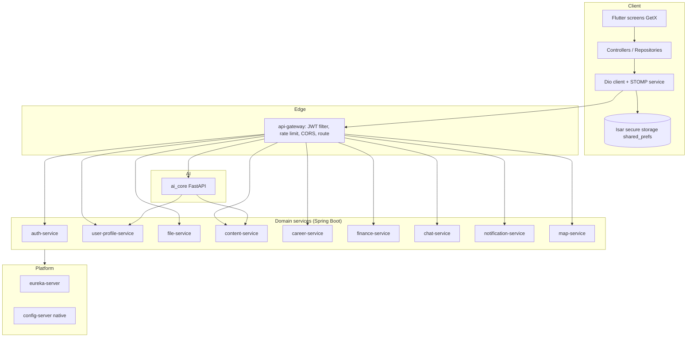

# High-Level Design (HLD)

> Status: Verified · Last reviewed: 2026-09-30
> Evidence: `backend/infrastructure/config-repo/*.yml`, `backend/pom.xml`, `ai_core/vithey_ai/config.py`, `vithey_app/lib/core/config/`, `plan.md`, `api_docs.md`

Part of the Vithey documentation set · Master index: [`../00-project-overview/07-document-index.md`](../00-project-overview/07-document-index.md) · [System architecture](01-system-architecture.md) · [LLD](03-low-level-design-LLD.md)

## 1. Purpose and scope

Vithey is a student "superapp" combining a social feed, job/career tools, student finance, real-time peer chat, notifications, an AI chatbot and AI CV generation behind one mobile client. This HLD describes the decomposition, the driving decisions, and the runtime topology at the component level. Detail lives in the [LLD](03-low-level-design-LLD.md) and the [component](04-component-diagram.md) / [data-flow](05-data-flow-diagram.md) / [sequence](06-sequence-diagrams.md) diagrams.

## 2. Architectural drivers

| Driver | Decision taken | Evidence |
|---|---|---|
| One team, one PC demo | Single-host Docker Compose profile ("Profile M") with env-tunable RAM/JVM caps | `backend/docker-compose.demo.yml`, `plan.md` |
| Clear domain boundaries | One microservice + one database per capability | `init-databases.sql`, `backend/pom.xml` |
| Single client entry point | Reactive Spring Cloud Gateway, client only calls `:8080` | `config-repo/api-gateway.yml` |
| AI is a different toolchain | Python `ai_core` owns `/api/v1/ai/**`; Java `ai-service` retired | `ai_core/vithey_ai/api/flutter_routes.py` |
| Loose coupling for side effects | RabbitMQ topic exchange `vithey.events` | `notification-service/.../RabbitMqConfig.java` |
| Cheap synchronous lookups | Redis used imperatively (rate limit, chat cache, map cache) | `config-repo/api-gateway.yml`, `EVIDENCE-BASIS.md` §4 |
| Demo without infra | Mock-first Flutter feature flags | `vithey_app/lib/core/config/feature_flags.dart` |

## 3. Logical layering

[VERIFIED — repository layout and config]

## 4. Domain decomposition

| Service | Capability | Owns | Key external contracts |
|---|---|---|---|
| `auth-service` | Registration, login, JWT/refresh, email verification, password reset, student verification | `auth_db` (users, refresh tokens, email/reset tokens, student verification) | `/api/v1/auth/**`, publishes `user.registered`, `student.verified` |
| `user-profile-service` | Profile read/update, follows counts projection | `user_db` | `/api/v1/users/**`, consumes `user.registered` |
| `file-service` | File upload/serve | `file_db` + MinIO object store | `/api/v1/files/**` |
| `content-service` | Feed, posts, comments, reactions, follows, mentions | `content_db` | `/api/v1/posts|comments|reactions|follows/**`, publishes 5 social events |
| `career-service` | Jobs, applications, CV storage | `career_db` | `/api/v1/jobs/**`, `/api/v1/job-applications/**`, `/api/v1/users/me/cv**` |
| `finance-service` | Student fees/invoices, payment, verification gate | `finance_db` | `/api/v1/fees/**`, `/api/v1/payments/**`, consumes `student.verified` |
| `chat-service` | Conversations, messages, requests, presence over STOMP | `chat_db` + Redis recent cache | REST `/api/v1/conversations|messages|message-requests/**`, STOMP `/ws`, `/app/chat.send` |
| `notification-service` | Notification inbox + preferences | `notification_db` | `/api/v1/notifications/**`, consumes 10 event queues |
| `map-service` | Nearby place search (Google Places) with Redis cache | `map_db` + Redis | `/api/v1/places/**` |
| `ai_core` | AI chat (stub) + real LLM CV generation from profile/posts | `ai_db` (chat sessions) | `/api/v1/ai/**`, fetches profile + content over HTTP |

[VERIFIED — service `application.yml`, controllers, publishers; `ai_core/vithey_ai/*`]

## 5. Cross-cutting concerns

- **Identity propagation:** gateway validates the JWT and forwards `X-User-Id` / `X-User-Roles` / `X-User-Email`; OpenFeign (`FeignAuthConfig`) forwards `Authorization` and `X-User-*` on internal hops. [VERIFIED — gateway filter; `EVIDENCE-BASIS.md` §4]
- **Response contract:** all JSON is snake_case; list endpoints paginate with `page`/`limit` and a `meta` block; `ai_core` returns `{data, meta, error}`. [VERIFIED — `config-repo/application.yml` `jackson.property-naming-strategy: SNAKE_CASE`; `ai_core/vithey_ai/api/flutter_envelope.py`]
- **Persistence:** one PostgreSQL database per service, Flyway migrations, `ddl-auto: validate`, `open-in-view: false`. [VERIFIED — `config-repo/application.yml`]
- **Resilience:** global OpenFeign circuit breaker; `resilience4j` instances for `content-service`, `file-service`, `user-profile-service`; 5s time-limiter; gateway Redis rate limiter. [VERIFIED — `config-repo/application.yml`, `api-gateway.yml`]
- **Observability:** `/actuator/health` per service and `/actuator/prometheus` for 8 services; ai_core `/health`; Prometheus/Grafana/Loki opt-in. [VERIFIED — `monitoring/prometheus/prometheus.yml`, `config-repo/application.yml`]

## 6. Non-functional targets (as implemented)

| ID | Area | Statement | Status |
|---|---|---|---|
| NFR-SEC-001 | Security | Gateway enforces Bearer JWT on all non-public `/api/v1/**` paths and injects user headers | Verified — `JwtAuthenticationGlobalFilter.java` |
| NFR-PERF-001 | Throughput | Gateway rate-limits to 100 req/s replenish/100 burst (30/60 for places) | Verified — `api-gateway.yml` |
| NFR-REL-001 | Resilience | Circuit breaker on Feign clients with 50% failure threshold, 10s open state | Verified — `config-repo/application.yml` |
| NFR-SCALE-001 | Footprint | All containers have env-driven `mem_limit` + JVM opts | Verified — `docker-compose.demo.yml`, `backend/.env.example` |
| NFR-OBS-001 | Observability | Prometheus scrape + Grafana dashboards + Loki log retention 168h | Verified — `monitoring/` |
| NFR-PRIV-001 | Privacy | Chat/map use Redis with TTL; secrets only in `.env` (not committed) | Verified — `EVIDENCE-BASIS.md` §13 |
| NFR-AVAIL-001 | Availability/HA | Multi-instance, failover, staging/production topology | Not started — no staging/production exists |

## 7. Constraints and deliberate exclusions

- **No production/staging environment, no orchestration** (no K8s/Helm/Terraform). [VERIFIED — `EVIDENCE-BASIS.md` §9]
- **AI chat is a stub**; no RAG / no GDCE integration. CV generation uses the real LLM. [VERIFIED — `ai_core/vithey_ai/chat_service.py`, `EVIDENCE-BASIS.md` §6]
- **English-only UI strings**; Khmer is a stored preference/CV label. No `.arb` files. [VERIFIED — `vithey_app/lib/core/constants/app_strings.dart`]
- **Web/Chrome unsupported** (Isar, secure storage, camera). Android is the target. [VERIFIED — `vithey_app/README.md`]

## 8. Requirement traceability (samples)

| ID | Requirement | Status | Evidence |
|---|---|---|---|
| FR-AUTH-001 | Register / login / refresh JWT | Verified | `auth-service/.../controller/AuthController.java` |
| FR-FEED-001 | Create a post and fan out `post.created` | Verified | `content-service/.../service/PostService.java:70` |
| FR-SOCIAL-001 | Comment / reaction / follow / mention events | Verified | `ContentEventPublisher.java` |
| FR-CHAT-001 | Real-time messaging over STOMP | Verified | `chat-service/.../config/WebSocketConfig.java`; `vithey_app/.../chat_stomp_service.dart` |
| FR-AI-001 | AI CV generation with real LLM | Verified | `ai_core/vithey_ai/cv_app_service.py` |
| FR-AI-002 | AI chat | Stub/Placeholder | `ai_core/vithey_ai/chat_service.py` |
| FR-NOTIF-001 | Event-driven notification inbox | Verified | `notification-service/.../config/RabbitMqConfig.java` |
| FR-FINANCE-001 | Student fee/payment with role gate | Verified | `finance-service` `@PreAuthorize("hasRole('STUDENT')")` on `FeeController`/`PaymentController` |

Open items: [TBD] formal ownership of each service, [TBD] SLA/availability targets — TBD — Requires confirmation.

Continue to the [Low-Level Design](03-low-level-design-LLD.md).
