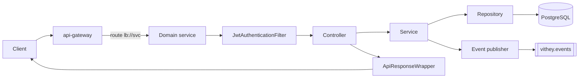
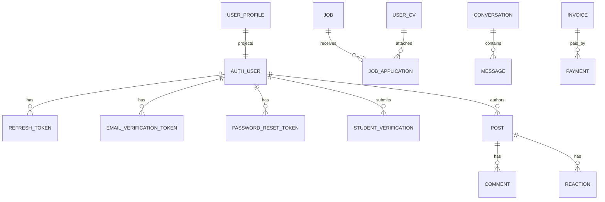

# Low-Level Design (LLD)

> Status: Verified · Last reviewed: 2026-09-30
> Evidence: `backend/services/*/src/main/java/com/vithey/**`, `backend/infrastructure/config-repo/*.yml`, `vithey_app/lib/core/network/dio_client.dart`, `ai_core/vithey_ai/api/**`

Part of the Vithey documentation set · Master index: [`../00-project-overview/07-document-index.md`](../00-project-overview/07-document-index.md) · [System architecture](01-system-architecture.md) · [HLD](02-high-level-design-HLD.md) · [Sequences](06-sequence-diagrams.md)

## 1. Standard service layout

Every domain service follows the same layered package structure under `src/main/java/com/vithey/<domain>/`:

| Package | Responsibility |
|---|---|
| `config/` | `SecurityConfig`, `RabbitMqConfig`, `OpenApiConfig`, `JacksonConfig`, `RedisConfig`, `FeignAuthConfig` |
| `controller/` | REST endpoints under `/api/v1/...` |
| `dto/request`, `dto/response` | snake_case JSON request/response objects |
| `entity/` | JPA entities (§4 data model) |
| `event/payload`, `event/publisher` | RabbitMQ event records + publisher beans |
| `exception/` | `ApiException`, `ErrorCode`, `GlobalExceptionHandler` |
| `mapper/` | MapStruct 1.5.5.Final mappers |
| `repository/` | Spring Data JPA repositories |
| `security/` | `JwtAuthenticationFilter`, `CurrentUser`, `CurrentUserProvider`, `JwtProvider` (auth) |
| `service/` | Domain logic |
| `util/` | `ApiResponseWrapper`, token hash/generator helpers |

[VERIFIED — auth/user-profile/content/career/finance/chat/notification service trees; `backend/pom.xml` mapstruct 1.5.5.Final]

## 2. Request handling chain

1. **Gateway** (`JwtAuthenticationGlobalFilter`, order `HIGHEST_PRECEDENCE+10`) rejects non-public `/api/v1/**` requests without a valid token and injects `X-User-Id`, `X-User-Roles`, `X-User-Email`. [VERIFIED — `api-gateway/.../filter/JwtAuthenticationGlobalFilter.java`]
2. **Service filter** re-validates the JWT independently (`SecurityConfig` + `JwtAuthenticationFilter`, stateless, `@EnableMethodSecurity`). [VERIFIED — `auth-service/.../config/SecurityConfig.java`]
3. **Controller → Service → Repository**, then JSON wrapped in the standard envelope. [VERIFIED — `auth-service/.../util/ApiResponseWrapper.java`]

## 3. API response and error shape

- Jackson serialises snake_case globally; `default-property-inclusion: non_null`. [VERIFIED — `config-repo/application.yml`]
- List endpoints use `page`/`limit` query params and return a `meta` block. [VERIFIED — `api_docs.md`; `ai_core/vithey_ai/api/flutter_envelope.py` `page_meta`]
- Domain errors are mapped to stable `ErrorCode` + HTTP status by `GlobalExceptionHandler`. Gateway errors are emitted by `GatewayErrorHandler` (e.g. `401 UNAUTHORIZED`). [VERIFIED — gateway + auth exception classes]
- ai_core returns the same envelope via `ok(...)` / `fail(...)` / `page_meta(...)`. [VERIFIED — `ai_core/vithey_ai/api/flutter_envelope.py`, `flutter_routes.py`]

## 4. Data model (per-database ownership)

Notes and verified defects (document, do not silently fix): [VERIFIED — `EVIDENCE-BASIS.md` §8]

1. career-service has a **duplicate Flyway version `V3`** (`V3__Job_application_composite_indexes_and_status_check.sql` + `V3__User_cv_file_unique_and_application_fk.sql`).
2. career `UserCv` entity `@Id` maps `user_id` while the DB primary key is `id`.
3. user-profile V3 trigram index re-create is skipped (`IF NOT EXISTS`), so the intended `LOWER(full_name)` GIN index is not created.
4. Entity enums are narrower than some DB `CHECK` constraints in career/content/chat/finance/notification.
5. Flyway migration counts: auth 4, user-profile 3, content 5, career 4, chat 3, finance 3, file 3, notification 4, map 1.

`ai_db` is created by `init-databases.sql`; ai_core uses it for chat session persistence. [VERIFIED — `ai_core/vithey_ai/db.py`, `backend/docker-compose.yml` `DATABASE_URL`]

## 5. Security implementation detail

| Concern | Implementation | Evidence |
|---|---|---|
| Token format | HMAC-signed JWT (JJWT 0.12.6); claims `sub`, `email`, `roles` | `auth-service/.../security/JwtProvider.java` |
| TTLs | access `15m`, refresh `7d` (env `VITHEY_ACCESS_TOKEN_TTL` / `VITHEY_REFRESH_TOKEN_TTL`) | `config-repo/application.yml` |
| Role mapping | `USER`, `STUDENT`, `COMPANY`, `ADMIN` → `ROLE_<NAME>` | `EVIDENCE-BASIS.md` §5 |
| Method security | Used only on `FeeController` and `PaymentController` in finance-service (`@PreAuthorize("hasRole('STUDENT')")`) | finance-service controllers |
| Password/refresh storage | bcrypt; refresh/reset/email tokens stored hashed | `auth-service/.../token/TokenHash.java` |
| Gateway public paths | register, login, refresh, forgot/reset-password, verify-email, actuator, swagger | `PublicPathMatcher.java` |
| Known discrepancy | `/api/v1/students/verify` is routed but not public → JWT required at gateway | `api-gateway.yml` vs `PublicPathMatcher.java` |

Formal security assessment/penetration test: **Not yet formally assessed.** No evidence exists.

## 6. Event contracts

The `ContentEventPublisher` publishes on `vithey.events`; `notification-service` binds durable queues. [VERIFIED — `ContentEventPublisher.java`, `notification-service/.../config/RabbitMqConfig.java`]

| Routing key | Producer | Consumer queue |
|---|---|---|
| `comment.added` | content | `notification.comment.added` |
| `reaction.added` | content | `notification.reaction.added` |
| `follow.created` | content | `notification.follow.created` |
| `mention.created` | content | `notification.mention.created` |
| `chat.request.received` | chat | `notification.chat.request.received` |
| `chat.message.sent` | chat | `notification.chat.message.sent` |
| `payment.due` | finance | `notification.payment.due` |
| `payment.overdue` | finance | `notification.payment.overdue` |
| `job.application.submitted` | career | `notification.job.application.submitted` |
| `job.application.status_changed` | career | `notification.job.application.status_changed` |
| `user.registered` | auth | `user-profile.user.registered` |
| `student.verified` | auth | `finance.student.verified` |
| `post.created` | content | (no consumer queue defined in notification) |
| `profile.updated` | user-profile | (informational) |

## 7. chat-service real-time internals

- STOMP endpoints `/ws` and `/ws/chat`; app prefix `/app`; user prefix `/user`; simple broker `/queue`, `/topic`. [VERIFIED — `chat-service/.../config/WebSocketConfig.java`]
- JWT validated at handshake (`JwtHandshakeInterceptor`) and per-message (`StompAuthChannelInterceptor`). [VERIFIED — chat-service security classes]
- Client publishes to `/app/chat.send` and subscribes to `/user/queue/messages`. [VERIFIED — `vithey_app/lib/data/services/chat_stomp_service.dart:49,84`]
- Redis caches recent messages (`chat:recent:*`, 24h). [VERIFIED — `EVIDENCE-BASIS.md` §4]

## 8. ai_core internals

- `create_app` wires middleware: `RequestContextMiddleware`, `PerClientRateLimitMiddleware` (30/min), `BodySizeLimitMiddleware` (512 KB), CORS. [VERIFIED — `ai_core/vithey_ai/api/app.py`]
- Routes in `flutter_routes.py`: `/api/v1/ai/chat`, `/chat/stream` (SSE), `/messages/{id}/regenerate`, `/chat/requests/{id}` (DELETE), `/sessions`, `/sessions/{id}/messages`, `/sessions/{id}` (DELETE), `/cv/generate`, `/cv/suggest`. [VERIFIED — `flutter_routes.py`]
- Auth accepts JWT (`PyJWT`, `sub`) or gateway `X-User` headers. [VERIFIED — `ai_core/vithey_ai/api/auth.py`]
- CV pipeline: fetch profile+posts (httpx) → LLM JSON-mode extraction (SHA-256 cached) → dedupe → build prompt → LLM → `normalize_cv` → `score_cv` rubric → `StandardCV`. [VERIFIED — `EVIDENCE-BASIS.md` §6]
- Chat is a stub: `ChatService` always calls `stub_reply`; `AI_CHAT_MODE` is read but never branched. [VERIFIED — `chat_service.py`, `config.py`]
- Known limitation: `cv_app_service.to_draft` field mismatch (`items` vs `skills`, `summary` vs `bullets`) can drop fields in the Flutter draft. [VERIFIED — `EVIDENCE-BASIS.md` §6]

## 9. Flutter client internals

- `Dio` interceptor injects `Authorization: Bearer <token>` except for the public auth path set, and on `401` attempts `/auth/refresh` then replays the request. [VERIFIED — `lib/core/network/dio_client.dart`]
- `AppConfig` is initialised from `.env` before `runApp`; defaults `API_BASE_URL=http://localhost:8080/api/v1`, `WS_BASE_URL=ws://10.0.2.2:8080/ws`. [VERIFIED — `lib/core/config/app_config.dart`]
- `FeatureFlags` gates mock vs live repositories (`USE_MOCK_*`) and hard-disables mocks in production. [VERIFIED — `lib/core/config/feature_flags.dart`]
- Local storage: Isar for chat (conversations/messages/outbox), `flutter_secure_storage` for tokens, `shared_preferences` for settings. [VERIFIED — `pubspec.yaml`, `EVIDENCE-BASIS.md` §7]

## 10. Traceability (samples)

| ID | Requirement | Status | Evidence |
|---|---|---|---|
| FR-CHAT-002 | STOMP auth at handshake and message | Verified | `JwtHandshakeInterceptor`, `StompAuthChannelInterceptor` |
| FR-AI-003 | `ai_core` returns `{data,meta,error}` envelope | Verified | `flutter_envelope.py` |
| FR-PLAT-001 | In-memory LLM rate limit 120/60s + HTTP 30/min | Verified | `config.py`, `PerClientRateLimitMiddleware` |

[TBD] Service-level SLOs and alert routing (no Alertmanager) — TBD — Requires confirmation.

See the [Component Diagram](04-component-diagram.md) and [Sequence Diagrams](06-sequence-diagrams.md).
