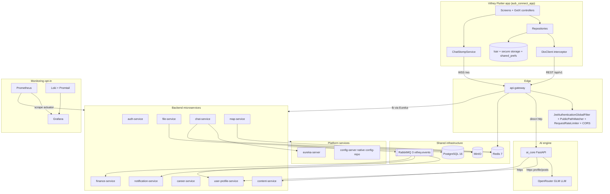
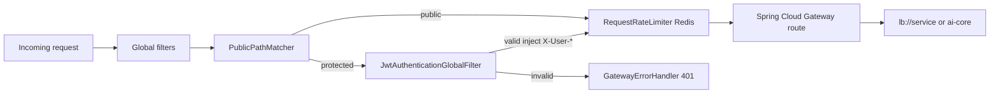
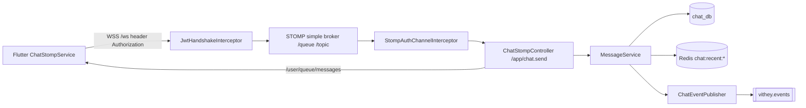

# Component Diagram

> Status: Verified · Last reviewed: 2026-09-30
> Evidence: `backend/services/**`, `backend/infrastructure/**`, `ai_core/vithey_ai/**`, `vithey_app/lib/**`, `monitoring/`

Part of the Vithey documentation set · Master index: [`../00-project-overview/07-document-index.md`](../00-project-overview/07-document-index.md) · [System architecture](01-system-architecture.md) · [Data flow](05-data-flow-diagram.md)

## 1. Top-level component diagram

Legend: `[VERIFIED]` all edges correspond to config or code cited in the sections below.

## 2. Component responsibilities

| Component | Responsibility | Key classes / files |
|---|---|---|
| api-gateway | Single entry, JWT validation + header injection, rate limiting, CORS, routing | `JwtAuthenticationGlobalFilter`, `PublicPathMatcher`, `RedisRateLimiterConfig`, `CorsConfig`, `GatewayErrorHandler` |
| auth-service | Identity lifecycle, JWT mint/refresh, verification codes, publishes identity events | `AuthController`, `AuthService`, `TokenService`, `JwtProvider`, `StudentVerificationService` |
| user-profile-service | Profile CRUD + social projections; consumes `user.registered` | controllers/services, `user-profile.user.registered` listener |
| file-service | Upload/download, MinIO persistence, DB metadata | file controller/service/repository |
| content-service | Feed, posts, comments, reactions, follows, mentions; publishes social events | `PostService`, `CommentService`, `FeedService`, `FollowService`, `ReactionService`, `ContentEventPublisher` |
| career-service | Jobs, applications, CV records | job/application services; `UserCv` entity |
| finance-service | Fees, invoices, payments; STUDENT-gated; consumes `student.verified` | `FeeController`, `PaymentController` (`@PreAuthorize`) |
| chat-service | Conversations, messages, requests; STOMP broker endpoints; Redis recent cache | `ChatStompController`, `WebSocketConfig`, `StompAuthChannelInterceptor`, `RedisConfig` |
| notification-service | Consumes 10 event queues, stores + serves notifications | `RabbitMqConfig`, event listeners |
| map-service | Nearby place search via Google Places + Redis cache | map controllers/services |
| ai_core | AI chat (stub) + real LLM CV generation, owns `/api/v1/ai/**` | `flutter_routes.py`, `cv_app_service.py`, `chat_service.py`, `deepseek_client.py` |

## 3. Gateway internals

[VERIFIED — `backend/services/api-gateway/src/main/java/com/vithey/gateway/**`]

## 4. Chat real-time components

[VERIFIED — `chat-service/.../config/WebSocketConfig.java`, `.../websocket/ChatStompController.java`; `vithey_app/lib/data/services/chat_stomp_service.dart`]

## 5. External dependencies

| Dependency | Used by | Notes |
|---|---|---|
| LLM provider (OpenRouter GLM default) | ai_core | `DEEPSEEK_BASE_URL`, `DEEPSEEK_MODEL` (legacy prefix) |
| Google Places API | map-service | Requires `GOOGLE_PLACES_API_KEY`; map is opt-in via Compose profile |
| SMTP | auth-service | `VITHEY_MAIL_MODE=log` default; SMTP configurable |
| ACLEDA mobile app (deep link) | Flutter finance module | Launcher only |

[VERIFIED — `config.py`, `backend/.env.example`, `acleda_mobile_launcher.dart`]

## 6. Related diagrams

- Runtime topology and ports → [Network Architecture](07-network-architecture.md)
- Data movement → [Data Flow](05-data-flow-diagram.md)
- Time-ordered interactions → [Sequence Diagrams](06-sequence-diagrams.md)
