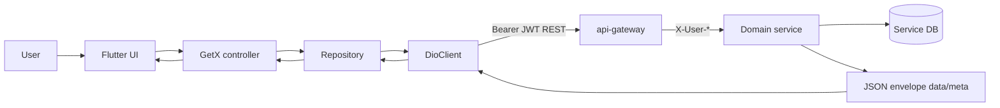
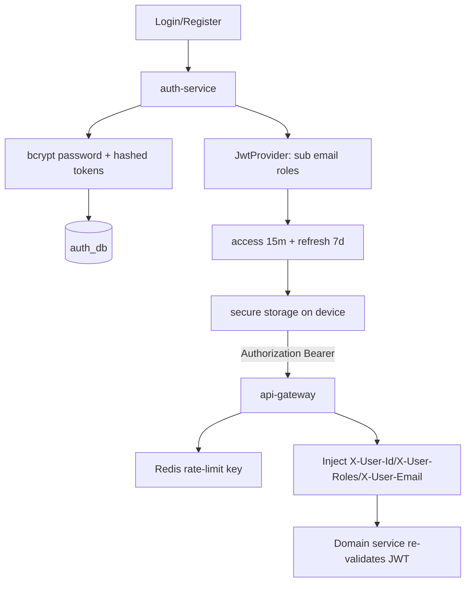
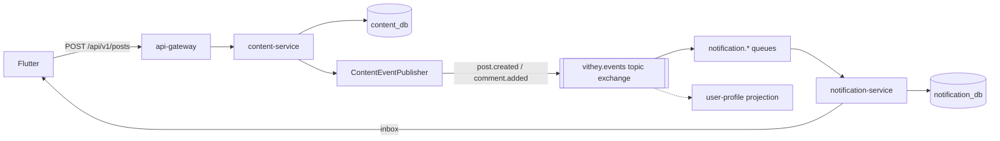
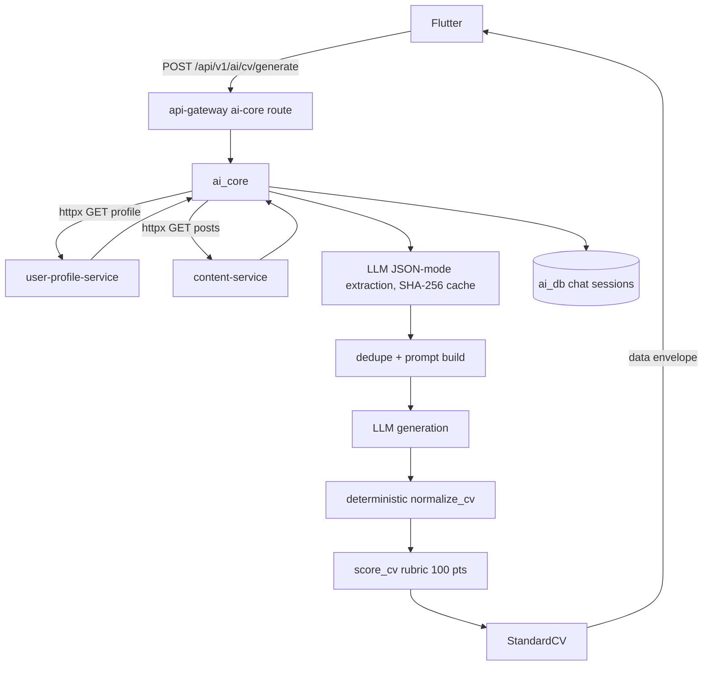
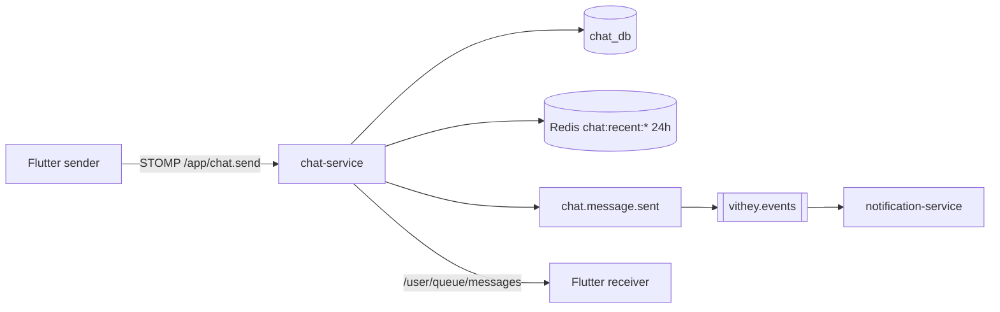
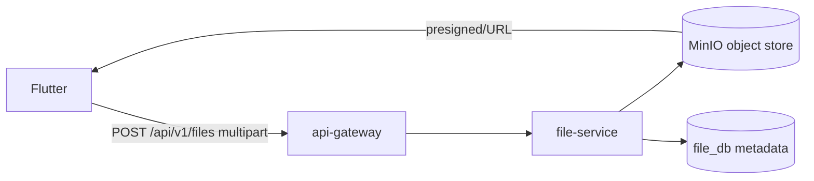

# Data Flow Diagram

> Status: Verified · Last reviewed: 2026-09-30
> Evidence: `backend/services/**`, `backend/infrastructure/config-repo/api-gateway.yml`, `ai_core/vithey_ai/**`, `vithey_app/lib/core/network/dio_client.dart`

Part of the Vithey documentation set · Master index: [`../00-project-overview/07-document-index.md`](../00-project-overview/07-document-index.md) · [Component diagram](04-component-diagram.md) · [Sequence diagrams](06-sequence-diagrams.md)

## 1. Primary request data flow (level 0)

Every client request enters at `:8080`; the client never contacts a service or ai_core directly. [VERIFIED — `api-gateway.yml`, `app_config.dart`]

## 2. Authentication token data flow

[VERIFIED — `JwtProvider.java`, `config-repo/application.yml`, `dio_client.dart`, `JwtAuthenticationGlobalFilter.java`]

## 3. Content + event fan-out data flow

[VERIFIED — `PostService.java:70`, `ContentEventPublisher.java`, `notification-service/.../RabbitMqConfig.java`]

## 4. AI CV generation data flow

[VERIFIED — `ai_core/vithey_ai/api/flutter_routes.py` `/cv/generate`, `cv_app_service.py`, `EVIDENCE-BASIS.md` §6]

## 5. Chat message data flow

[VERIFIED — `WebSocketConfig.java`, `chat_stomp_service.dart`, `EVIDENCE-BASIS.md` §4]

## 6. File upload data flow

[VERIFIED — `backend/docker-compose.yml` MinIO, file-service modules; `api_docs.md`]

## 7. Cache and rate-limit data

| Data | Store | TTL / policy | Evidence |
|---|---|---|---|
| Gateway rate limit counters | Redis | replenish 100/s, burst 100 (places 30/60) | `api-gateway.yml` |
| Chat recent messages | Redis `chat:recent:*` | 24h | `EVIDENCE-BASIS.md` §4 |
| Map place search / detail | Redis | search 5m, detail 24h, degrade on failure | `EVIDENCE-BASIS.md` §4 |
| LLM extraction results | ai_core in-memory | 512 entries, SHA-256 keyed | `config.py`, `EVIDENCE-BASIS.md` §6 |

## 8. Data-at-rest ownership

One PostgreSQL cluster hosts one logical database per service (`auth_db`, `user_db`, `file_db`, `content_db`, `career_db`, `finance_db`, `chat_db`, `notification_db`, `map_db`, `ai_db`). No cross-database joins; integration happens via Feign or events. [VERIFIED — `init-databases.sql`, `EVIDENCE-BASIS.md` §8]

Data quality caveats (see [LLD §4](03-low-level-design-LLD.md)): duplicate career Flyway `V3`, `UserCv` id mapping mismatch, user-profile trigram index no-op, and enum/DB-CHECK supersets remain open defects. They are documented, not fixed here.
