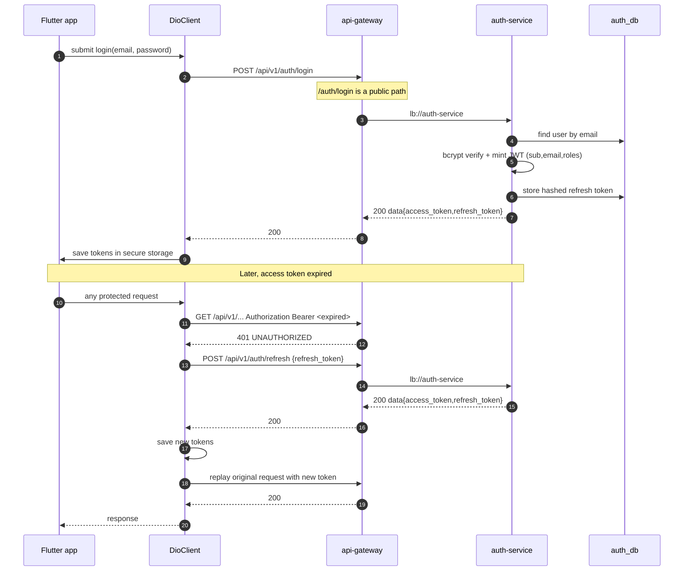
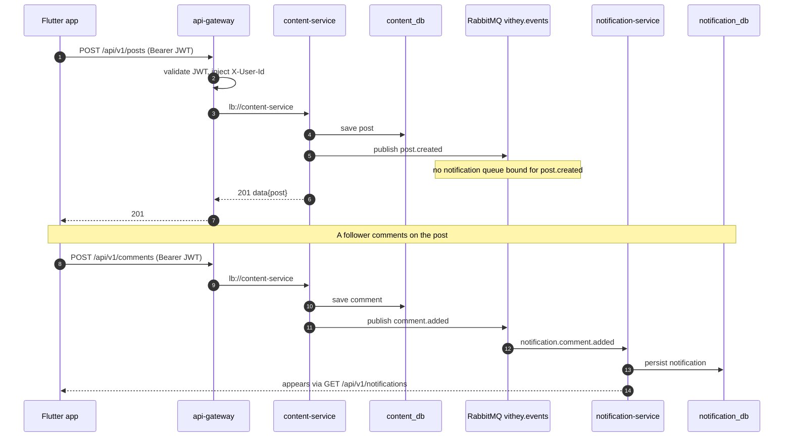
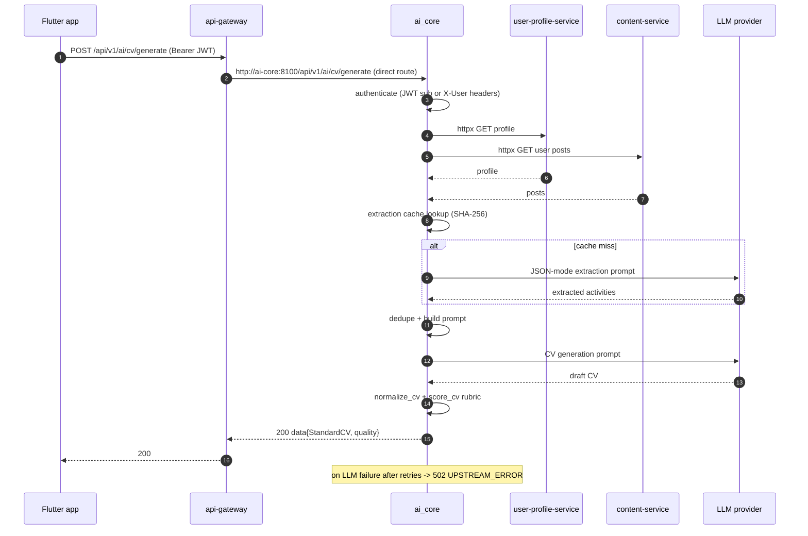
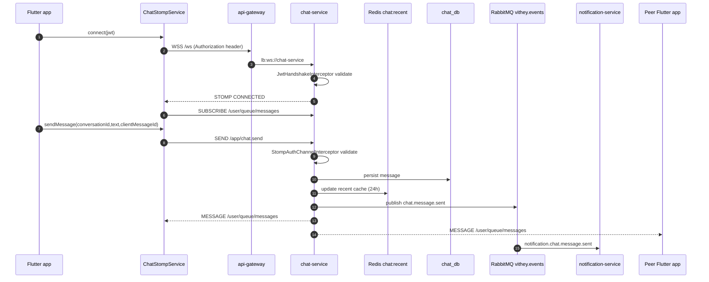
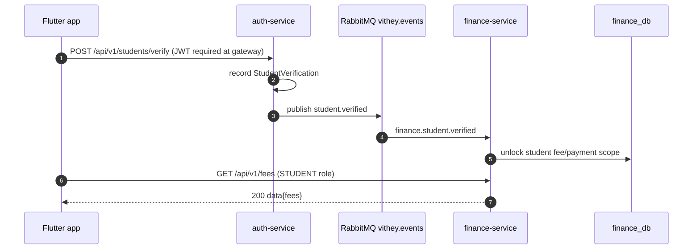

# Sequence Diagrams

> Status: Verified · Last reviewed: 2026-09-30
> Evidence: `auth-service/**`, `api-gateway/**`, `content-service/**`, `notification-service/**`, `ai_core/vithey_ai/**`, `chat-service/**`, `vithey_app/lib/core/network/dio_client.dart`, `vithey_app/lib/data/services/chat_stomp_service.dart`

Part of the Vithey documentation set · Master index: [`../00-project-overview/07-document-index.md`](../00-project-overview/07-document-index.md) · [Data flow](05-data-flow-diagram.md) · [LLD](03-low-level-design-LLD.md)

All participants are real components; every message reflects verified code/config. Error branches (invalid token, refresh failure) are shown where the code implements them.

## 1. Login and JWT refresh

[VERIFIED — `dio_client.dart` interceptor (`onError` 401 → `_tryRefreshToken` → replay), `PublicPathMatcher`, `JwtProvider`, `config-repo/application.yml` TTLs]

## 2. Create post → notification event

[VERIFIED — `PostService.java:70` `publishPostCreated`, `ContentEventPublisher.java`, `notification-service/.../RabbitMqConfig.java` binds `comment.added` → `notification.comment.added`]

## 3. AI CV generation (real LLM)

[VERIFIED — `flutter_routes.py` `/cv/generate`, `cv_app_service.py`, `extraction.py`, `quality.py`, `api-gateway.yml` ai-core route, `auth.py`]

## 4. Chat send over STOMP

[VERIFIED — `WebSocketConfig.java`, `ChatStompController`, `chat_stomp_service.dart:33-92`, `EVIDENCE-BASIS.md` §4]

## 5. Student verification → finance (event chain)

[VERIFIED — auth `StudentVerificationService`/publisher, finance `@PreAuthorize("hasRole('STUDENT')")`, `EVIDENCE-BASIS.md` §4-5]

Cross-reference the [component diagram](04-component-diagram.md) for the static view behind these interactions.
