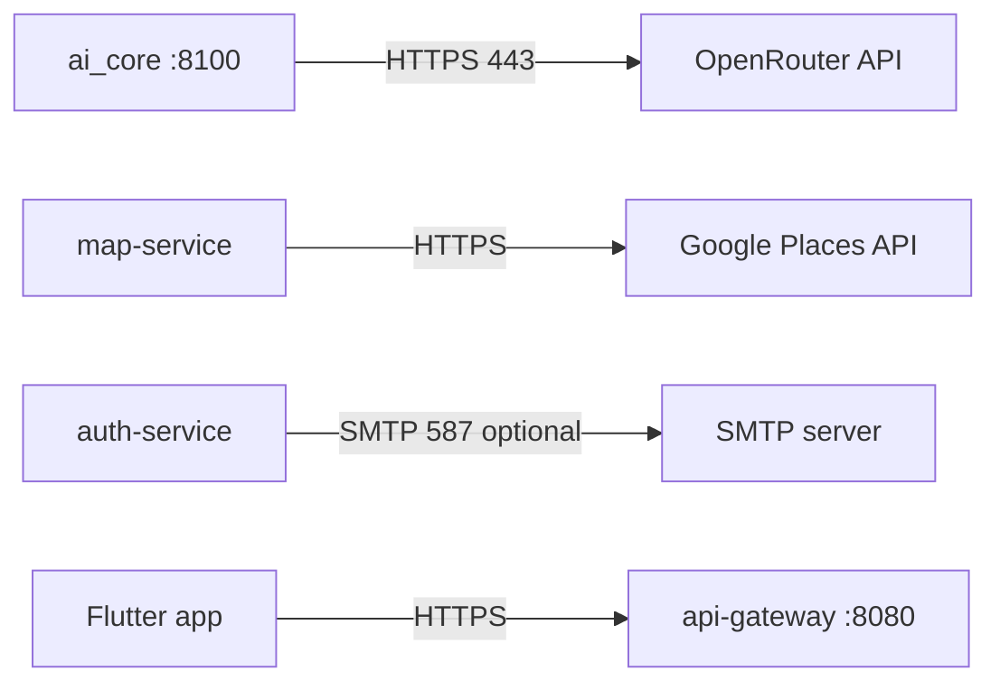

# Network Architecture

> Status: Verified · Last reviewed: 2026-09-30
> Evidence: `backend/docker-compose.yml`, `backend/docker-compose.demo.yml`, `backend/infrastructure/docker-compose.yml`, `backend/.env.example`, `monitoring/docker-compose.yml`, `vithey_app/lib/core/config/app_config.dart`

Part of the Vithey documentation set · Master index: [`../00-project-overview/07-document-index.md`](../00-project-overview/07-document-index.md) · [System architecture](01-system-architecture.md) · [Component diagram](04-component-diagram.md)

## 1. Deployment topology (local demo, "Profile M")

```mermaid
flowchart TB
  subgraph Host["Single developer PC (Docker Desktop + WSL2)"]
    subgraph Net["docker network: vithey-network (bridge)"]
      GW[api-gateway :8080]
      Eureka[eureka-server :8761]
      Config[config-server :8888]
      Auth[auth-service :8081]
      Profile[user-profile-service :8082]
      File[file-service :8083]
      Content[content-service :8084]
      Career[career-service :8085]
      Finance[finance-service :8086]
      Chat[chat-service :8087]
      Notif[notification-service :8088]
      Map["map-service :8090 (profile map)"]
      AI["ai_core :8100"]
      PG[(postgres :5432)]
      Redis[(redis :6379)]
      MQ[(rabbitmq :5672)]
      MinIO[(minio :9000)]
    end
    subgraph Mon["monitoring profile"]
      Prom[prometheus :9090]
      Graf[grafana :3000]
      Loki[loki :3100]
    end
  end
  Emulator[Android emulator 10.0.2.2] -->|8080 REST + /ws| GW
  Device[Physical device LAN IP] -->|8080 REST + /ws| GW
  Browser[Swagger / Grafana UI] --> GW
  Browser --> Graf
  AI -->|HTTPS 443| LLM[(OpenRouter LLM https)]
```

[VERIFIED — `backend/docker-compose.yml`, `docker-compose.demo.yml`, `monitoring/docker-compose.yml`]

## 2. Published host ports

| Service | Container port | Host port | Notes |
|---|---|---|---|
| api-gateway | 8080 | 8080 | only intended public app entry |
| auth-service | 8081 | 8081 | |
| user-profile-service | 8082 | 8082 | |
| file-service | 8083 | 8083 | |
| content-service | 8084 | 8084 | |
| career-service | 8085 | 8085 | |
| finance-service | 8086 | 8086 | |
| chat-service | 8087 | 8087 | also `/ws` via gateway |
| notification-service | 8088 | 8088 | |
| map-service | 8090 | 8090 | opt-in profile `map` |
| ai_core | 8100 | 8100 | exposed, but client uses gateway route |
| eureka-server | 8761 | 8761 | dashboard |
| config-server | 8888 | 8888 | |
| PostgreSQL | 5432 | **15432** | full stack; infra-only compose uses 15433 |
| Redis | 6379 | **16379** | |
| RabbitMQ | 5672 / 15672 | 5672 / 15672 | AMQP + management UI |
| MinIO | 9000 / 9001 | **19000 / 19001** | S3 API + console |
| Prometheus | 9090 | 9090 | monitoring profile |
| Grafana | 3000 | 3000 | monitoring profile |
| Loki | 3100 | 3100 | monitoring profile |
| cAdvisor | 8080 | **8095** | monitoring profile |

[VERIFIED — compose port mappings and `EVIDENCE-BASIS.md` §3]

## 3. Internal service resolution

- Service-to-service calls use Eureka names, never container IPs: `lb://auth-service`, `lb://content-service`, etc. [VERIFIED — `api-gateway.yml`]
- `config-server` is addressed by services through `CONFIG_SERVER_URL` (default `http://localhost:8888`, container `http://config-server:8888`); `config-repo` is bind-mounted read-only into the container for live config. [VERIFIED — `backend/docker-compose.yml:128-130`]
- `ai_core` is **not** registered in Eureka; the gateway routes `/api/v1/ai/**` directly to `http://ai-core:8100`. [VERIFIED — `api-gateway.yml:129-133`]
- ai_core reaches `user-profile-service:8082` and `content-service:8084` by container DNS via `USER_PROFILE_BASE_URL` / `CONTENT_BASE_URL`. [VERIFIED — `docker-compose.yml` ai-core env, `config.py`]

## 4. Client connectivity

| Client | Base URL | Notes |
|---|---|---|
| Android emulator | `http://10.0.2.2:8080/api/v1`, `ws://10.0.2.2:8080/ws` | 10.0.2.2 = host loopback |
| Physical device | `http://<PC-LAN-IP>:8080/api/v1` | same Wi-Fi |
| Default fallback | `http://localhost:8080/api/v1`, `ws://10.0.2.2:8080/ws` | `AppConfig` defaults |

[VERIFIED — `app_config.dart`, `vithey_app/README.md`]

## 5. Compose model and profiles

| File | Purpose |
|---|---|
| `backend/docker-compose.yml` | full stack (infra + platform + 9 core services + ai_core) |
| `backend/docker-compose.demo.yml` | Profile M overrides: env-driven `mem_limit` and JVM opts, map + ai_core wiring |
| `backend/infrastructure/docker-compose.yml` | shared infra only (Postgres 15433) |
| `backend/services/<name>/docker-compose.yml` | one service + its Postgres |
| `monitoring/docker-compose.yml` | Prometheus/Grafana/Loki/Promtail/node-exporter/cAdvisor (profile `monitoring`) |

Optional services are Compose **profiles**, not deleted files: `map` and `monitoring`. A plain `docker compose up` starts nothing in `monitoring/`. [VERIFIED — `monitoring/docker-compose.yml` `profiles: ["monitoring"]`; `docker-compose.demo.yml` `profiles: ["map"]`]

Scripts: `.\scripts\docker-up-demo.ps1` (with `-Profiles map`, `-Services ...`), `docker-down-demo.ps1 [-v]`, `start-dev-host.ps1`, `smoke-api.ps1`. [VERIFIED — `backend/scripts/`]

## 6. Egress and external network

Current egress is limited to the LLM provider, Google Places (map profile) and optional SMTP. `VITHEY_MAIL_MODE=log` is the default, so no SMTP egress is required locally. [VERIFIED — `config.py`, `map-service` env, `auth-service` mail config, `backend/.env.example`]

## 7. Observability network

Prometheus scrapes `/actuator/prometheus` for 8 services (gateway, auth, user-profile, file, content, career, finance, chat, notification) — **not** eureka, config, map or ai_core. Alerts are defined but there is **no Alertmanager**. Loki retention is 168h. [VERIFIED — `monitoring/prometheus/prometheus.yml`, `EVIDENCE-BASIS.md` §9]

## 8. Environments

| Environment | Status |
|---|---|
| Local development | Local development (verified) |
| Local demo (Profile M) | Local demo (verified) |
| Staging | Staging (does not exist) |
| Production | Production (does not exist) |

No Kubernetes/Helm/Terraform/Jenkins exists. `application-prod.yml` is present in `config-repo` but nothing activates it in CI. [VERIFIED — `EVIDENCE-BASIS.md` §9]

[TBD] Ingress/TLS/reverse-proxy design for any future environment — TBD — Requires confirmation.
