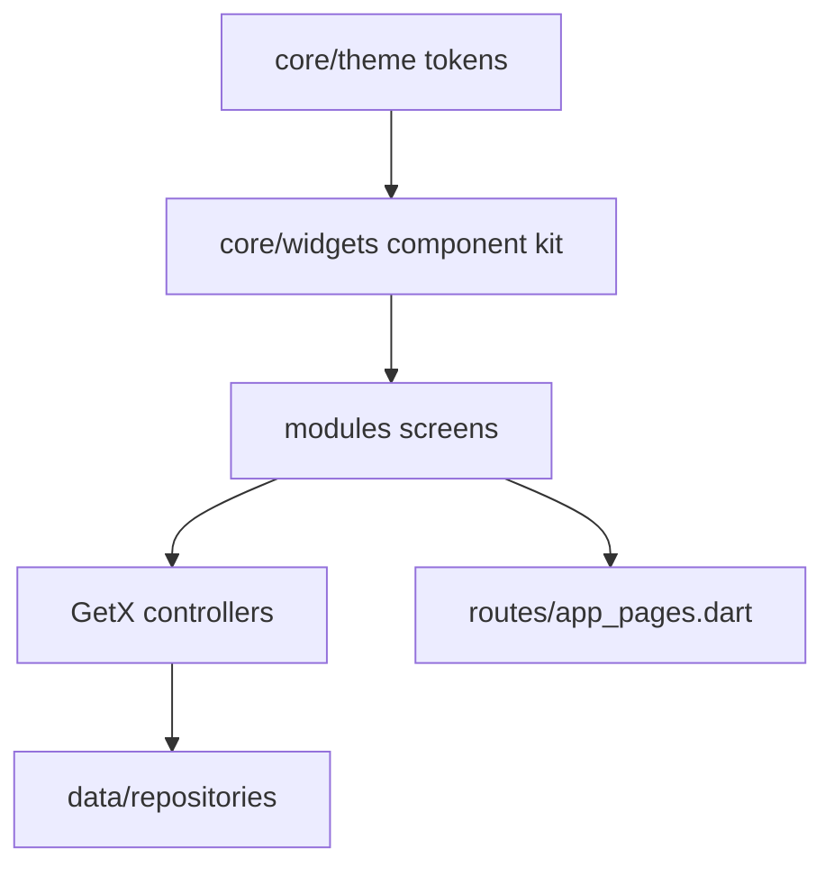

# UI/UX Overview

> Status: Verified · Last reviewed: 2026-09-30
> Evidence: `vithey_app/lib/core/theme/*`, `vithey_app/lib/core/widgets/*`, `vithey_app/lib/modules/**`, `vithey_app/lib/core/constants/app_colors.dart`, `docs/Prompt Frontend/run-genz-complete/DESIGN_SYSTEM.md`

Part of the Vithey documentation set · Master index: [`../00-project-overview/07-document-index.md`](../00-project-overview/07-document-index.md) · Siblings: [User flow](02-user-flow.md) · [Screen inventory](03-screen-inventory.md) · [Design system](04-design-system.md) · [Navigation](05-navigation-flow.md) · [Responsive](06-responsive-design.md) · [Figma](07-figma-reference.md)

## 1. Product and audience

Vithey is an AUB student "superapp": a social feed (posts, reels, jobs), career tools (apply with CV, AI CV creation), student finance, real-time peer chat, notifications, a map of nearby places, and an AI assistant. The Flutter client is the only front-end; it is Android-first. [VERIFIED — `vithey_app/README.md`, `docs/_meta/EVIDENCE-BASIS.md` §1]

## 2. UI architecture

- **GetX** provides state management, dependency injection and routing (`AppPages.routes`). [VERIFIED — `lib/routes/app_pages.dart`]
- **Module-per-feature** layout under `lib/modules/` (auth, home, jobs, profile, chat, chatbot, finance, search, settings, map). There is no `lib/features/`. [VERIFIED — `lib/modules/`]
- **Theme layer** under `lib/core/theme/`; **shared component kit** under `lib/core/widgets/`. [VERIFIED — directory listings]
- **Design tokens** are centralised: `AppColors`, `VitheyType`, `VitheyWeight`, `VitheyRadii`, `AppSemanticColors`. [VERIFIED — `lib/core/theme/`, `lib/core/constants/app_colors.dart`]

## 3. Experience pillars

Derived from the repository's own design contract (`DESIGN_SYSTEM.md`): [VERIFIED]

1. **One job per screen** — title → primary action → content.
2. **Airy, not empty** — consistent horizontal padding, soft section gaps.
3. **Soft geometry** — larger corner radii than legacy 8–12.
4. **Icon-first chrome** — squircle/circular icon buttons with a soft primary wash.
5. **Motion light** — existing animations kept, no noisy parallax.
6. **Complete states** — loading / empty / error / disabled / success via kit widgets.
7. **Dark mode equal** — every surface must work in dark.

## 4. Theme modes and brand

- Primary teal `#03B4AC`, secondary green `#03B03C`, error `#E42407`. [VERIFIED — `app_colors.dart`, `DESIGN_SYSTEM.md`]
- Light and dark themes are both built (`buildLightTheme`, `buildDarkTheme`) and selected via `ThemeMode` persisted as `light|dark|system`. [VERIFIED — `app_theme.dart`]
- Material 3 is enabled; `ColorScheme.fromSeed(seedColor: AppColors.primary)` with explicit primary/secondary/surface overrides. [VERIFIED — `light_theme.dart`]

## 5. Localization (important constraint)

- UI strings are **hardcoded English** in `AppStrings` (`lib/core/constants/app_strings.dart`). There are **no `.arb` files** and no Flutter localization delegate. [VERIFIED]
- A language is stored as a user preference, and CV generation accepts `en` / `km`; these are **labels/preferences only**, not a translated UI. [VERIFIED — `ai_core/vithey_ai/config.py` `ALLOWED_LANGUAGES = {"en","km"}`, `intro_ribbon_controller.dart` `AppLanguageOption`]

## 6. Known UI gaps, stubs and disabled features

| Feature | Status | Evidence |
|---|---|---|
| Google sign-in | **Stub/Placeholder** — UI only, throws unless mock/flag | `feature_flags.dart` `enableGoogleAuth`; `auth/google_auth_screen.dart` |
| Push notifications (FCM) | **Stub/Placeholder** — no Firebase packages, no `google-services.json` | `EVIDENCE-BASIS.md` §7 |
| Chat voice/video call | **Stub/Placeholder** — simulated | `chat_stomp_service.dart` `simulateIncomingCall` |
| Chatbot file attachments | **Not started** — "coming soon" string | `app_strings.dart` `chatbotAttachComingSoon` |
| 2FA / biometric / data & storage / accessibility | **Not started** — "coming soon" | `EVIDENCE-BASIS.md` §7 |
| AI chatbot responses | **Stub/Placeholder** — deterministic `stub_reply` | `ai_core/vithey_ai/chat_service.py` |
| AI CV generation | **Implemented** — real LLM pipeline | `ai_core/vithey_ai/cv_app_service.py` |

## 7. State coverage standard

Every screen is expected to handle four states using the shared kit: `LoadingWidget`, `EmptyStateWidget`, `AppErrorWidget`, disabled `CustomButton`, and `ShimmerListTile` for list skeletons. The offline state uses `OfflineBanner`. [VERIFIED — `lib/core/widgets/`; `DESIGN_SYSTEM.md` checklist]

## 8. Accessibility and responsiveness

- Icon buttons enforce a minimum tap target (`VitheyRadii.iconButton = 48`). [VERIFIED — `vithey_radii.dart`, `app_bottom_navigation.dart`]
- Layouts use finite `BoxConstraints(maxWidth: 420)` for centered auth/dialog content and `MediaQuery.sizeOf` for proportional sizing. [VERIFIED — `vithey_dialog.dart`, `login_screen.dart`]
- No formal accessibility audit exists. Governance: **Not yet formally assessed**. [TBD] WCAG target level — TBD — Requires confirmation.

See [Screen Inventory](03-screen-inventory.md) for the full route list and [Design System](04-design-system.md) for tokens and components.
