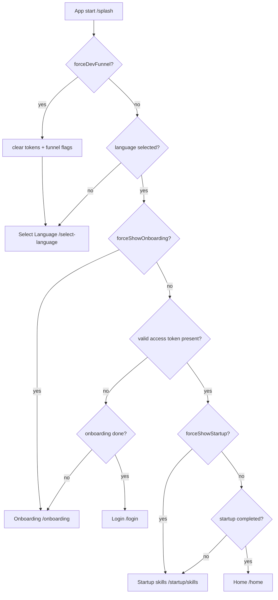
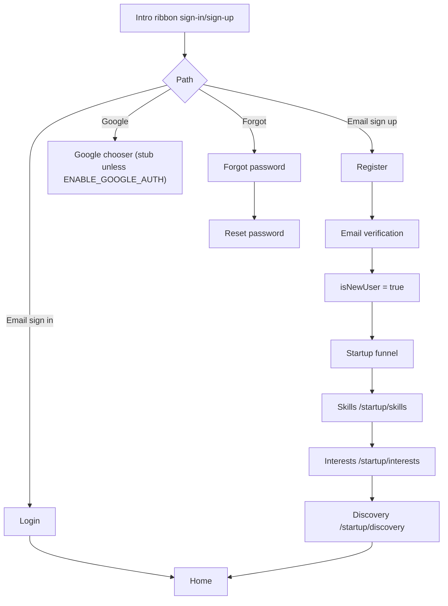
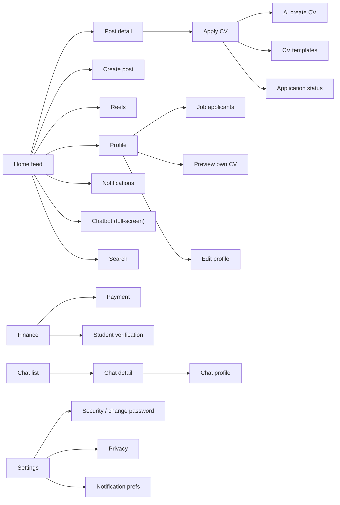

# User Flow

> Status: Verified · Last reviewed: 2026-09-30
> Evidence: `vithey_app/lib/modules/auth/splash/splash_controller.dart`, `vithey_app/lib/core/utils/auth_navigation.dart`, `vithey_app/lib/modules/auth/intro_ribbon_controller.dart`, `vithey_app/lib/routes/app_pages.dart`, `vithey_app/lib/modules/home/shell/main_shell_screen.dart`

Part of the Vithey documentation set · Master index: [`../00-project-overview/07-document-index.md`](../00-project-overview/07-document-index.md) · [UI/UX overview](01-ui-ux-overview.md) · [Navigation flow](05-navigation-flow.md) · [Screen inventory](03-screen-inventory.md)

## 1. First launch / returning-user decision

The entire gate is decided synchronously in `SplashController._resolveNextRouteLocal()` — **there is no GetX middleware**. [VERIFIED — `splash_controller.dart:179-233`]

Notes: `mock*` tokens are cleared automatically; token/language/onboarding reads have a 500 ms timeout fallback. [VERIFIED — `splash_controller.dart:188-227`]

## 2. Onboarding continuum

Language, three onboarding slides, sign-in and sign-up live in a single `IntroRibbonScreen` controlled by `IntroRibbonController` (pages 0–5). Navigation is **button-driven only** — PageView swipe is disabled. [VERIFIED — `intro_ribbon_controller.dart`]

| Index | `AppRoutes` | Content |
|---|---|---|
| 0 | `/select-language` | Language choice |
| 1–3 | `/onboarding` | "Connect with Your Campus Community", "Jobs & Career Growth", "Finance, Chat & AI Support" |
| 4 | `/login`, `/auth` | Sign in |
| 5 | `/register` | Sign up |

## 3. Registration and sign-in branches

`AuthNavigation.goAfterAuth` routes new registrations to the startup funnel once, and marks returning users' funnel complete so cold start lands on Home. [VERIFIED — `auth_navigation.dart:15-33`]

## 4. Post-authentication main loop

After auth the app enters the persistent `MainShellScreen`, which hosts four tabs in a `PageView`; the chatbot opens as a full-screen route. [VERIFIED — `main_shell_screen.dart`]

## 5. Feature entry points

| Feature | Entry | Routes |
|---|---|---|
| Social feed | Home tab | `/home`, `/posts/detail`, `/create-post`, `/reels` |
| Search | Home app bar | `/search`, `/search/see-all` |
| Jobs / CV | Home job cards, Profile | `/apply-cv`, `/apply-cv/templates`, `/apply-cv/ai-create`, `/apply-cv/status`, `/profile/jobs/applicants`, `/profile/cv` |
| Finance | Bottom nav / profile | `/finance`, `/finance/pay`, `/student-verification`, `/verification-status` |
| Chat | Bottom nav slot 3 (messages mode) | `/chat`, `/chat/detail`, `/chat/profile` |
| AI chatbot | Bottom nav slot 3 (default) | `/chatbot` |
| Notifications | Bottom nav bell | `/notifications` |
| Map | Feature entry | `/map` |
| Settings | Profile | `/settings` + sub-routes |

[VERIFIED — `app_routes.dart`, `app_pages.dart`, `app_bottom_navigation.dart` (`MainTabNavigation` order: Profile 0, Home 1, Reel 2, Chatbot 3, Notifications 4)]

## 6. Mock-first flow

With `USE_MOCK_*` flags on, the whole UI runs without a backend: login accepts any credentials and repositories serve fixtures. Live API is the default; mocks are opt-in and hard-disabled in production. [VERIFIED — `feature_flags.dart`, `vithey_app/README.md`]

## 7. Abandonment / error states

- Offline: `OfflineBanner` is shown; `connectivity_plus` drives network awareness. [VERIFIED — `lib/core/widgets/offline_banner.dart`]
- Token invalid: `DioClient` attempts refresh, then clears tokens on failure (forcing the auth funnel on next cold start). [VERIFIED — `dio_client.dart:69-92`, `splash_controller.dart`]
- Startup timeout: splash falls back to Select Language after a bounded wait. [VERIFIED — `splash_controller.dart:96-102`]

Continue to [Screen Inventory](03-screen-inventory.md) and [Navigation Flow](05-navigation-flow.md).
