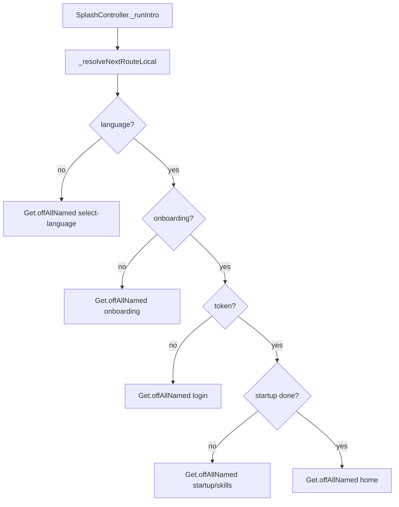

# Navigation Flow

> Status: Verified · Last reviewed: 2026-09-30
> Evidence: `vithey_app/lib/routes/app_pages.dart`, `vithey_app/lib/modules/auth/splash/splash_controller.dart`, `vithey_app/lib/core/navigation/main_tab_navigation.dart`, `vithey_app/lib/modules/home/shell/main_shell_screen.dart`, `vithey_app/lib/core/utils/auth_navigation.dart`, `vithey_app/lib/core/widgets/app_bottom_navigation.dart`

Part of the Vithey documentation set · Master index: [`../00-project-overview/07-document-index.md`](../00-project-overview/07-document-index.md) · [User flow](02-user-flow.md) · [Screen inventory](03-screen-inventory.md)

## 1. Routing mechanism

GetX named routing is the only navigation mechanism. `AppPages.routes` registers 46 `GetPage`s and `initial = '/splash'`. There is **no `GetMiddleware` / redirect guard** anywhere; the auth decision is manual and runs inside `SplashController`. [VERIFIED — `app_pages.dart`, `splash_controller.dart`]

```dart
// app_pages.dart
static const initial = AppRoutes.splash;
static final routes = <GetPage>[ GetPage(name: '/splash', page: ...), ... ];
```

## 2. Auth gating (manual, not middleware)



All exits use `Get.offAllNamed(...)` so the splash is removed from the stack. [VERIFIED — `splash_controller.dart:167-177`]

- `forceDevFunnel` clears tokens and funnel flags, then restarts at Select Language. [VERIFIED — `splash_controller.dart:180-186`]
- After auth, `AuthNavigation.goAfterAuth(isNewUser:)` sends new users to `/startup/skills` and home for returning users. [VERIFIED — `auth_navigation.dart`]
- If a token is missing but the funnel is complete, login is the landing page; there is no automatic redirect back to login on 401 within an open screen beyond the Dio retry logic. [VERIFIED — `dio_client.dart`]

## 3. Post-login shell navigation

`MainShellScreen` hosts a `PageView` of four embedded screens and a floating pill bottom bar. Tab changes animate the page content only; the bar stays put. The bar hides on scroll down (threshold 6 px) and reappears on scroll up. [VERIFIED — `main_shell_screen.dart`]

| Tab index | Label | Target | Opens as |
|---|---|---|---|
| 0 | Profile | `ProfileScreen(embedded: true)` | page |
| 1 | Home | `HomeScreen(embedded: true)` | page |
| 2 | Reel | `ReelsScreen(embedded: true)` | page |
| 3 | Chatbot / Chat | `ChatbotScreen` or chat in messages mode | full-screen route via `Get.toNamed('/chatbot')` |
| 4 | Notifications | `NotificationScreen(embedded: true)` | page |

[VERIFIED — `main_tab_navigation.dart`, `app_bottom_navigation.dart`, `main_shell_screen.dart`]

## 4. Global navigation graph

```mermaid
flowchart LR
  Splash[/splash] --> SelectLang[/select-language]
  SelectLang --> Onboarding[/onboarding]
  SelectLang --> Login[/login]
  Onboarding --> Login
  Login --> Register[/register]
  Login --> Forgot[/auth/forgot-password]
  Login --> Google[/auth/google]
  Register --> Startup[/startup/skills]
  Startup --> Interests[/startup/interests]
  Interests --> Discovery[/startup/discovery]
  Discovery --> Home[/home]
  Login --> Home
  Home --> CreatePost[/create-post]
  Home --> PostDetail[/posts/detail]
  Home --> Reels[/reels]
  Home --> Search[/search]
  Search --> SeeAll[/search/see-all]
  Home --> Profile[/profile]
  Profile --> ProfileView[/profile/view]
  Profile --> EditProfile[/profile/edit]
  Profile --> Applicants[/profile/jobs/applicants]
  Profile --> CvPreview[/profile/cv]
  PostDetail --> ApplyCv[/apply-cv]
  ApplyCv --> Templates[/apply-cv/templates]
  ApplyCv --> AiCv[/apply-cv/ai-create]
  ApplyCv --> ApplySuccess[/apply-cv/success]
  ApplyCv --> AppStatus[/apply-cv/status]
  Home --> Finance[/finance]
  Finance --> Pay[/finance/pay]
  Finance --> StudentVerify[/student-verification]
  Home --> Notifs[/notifications]
  Home --> Chatbot[/chatbot]
  Home --> Chat[/chat]
  Chat --> ChatDetail[/chat/detail]
  ChatDetail --> ChatProfile[/chat/profile]
  Profile --> Settings[/settings]
  Settings --> Account[/settings/account]
  Settings --> Privacy[/settings/privacy]
  Settings --> NotifPref[/settings/notifications]
  Settings --> Security[/settings/security]
  Security --> ChangePwd[/settings/security/change-password]
  Settings --> Help[/settings/help-center]
  Settings --> About[/settings/about]
  Home --> Map[/map]
  Profile --> ScanQr[/profile/scan-qr]
```

## 5. Tab re-entry helpers

- `goToMainTab(index)` in `main_shell_screen.dart` returns to the shell (`Get.until`) then selects the tab via the registered `MainShellController`, or falls back to `Get.offAllNamed('/home', arguments: index)`. [VERIFIED]
- `MainTabNavigation.handle` opens the chatbot full-screen for index 3 and otherwise delegates to `goToMainTab`. [VERIFIED]

## 6. Transitions

Most routes use the default GetX transition. Notable overrides: `/select-language`, `/onboarding`, `/auth`, `/login`, `/register` use `Transition.noTransition` (the intro ribbon is one continuum), and the Google auth routes use `Transition.downToUp` at 320 ms. [VERIFIED — `app_pages.dart:108-160`]

## 7. Gating caveats

- Because gating is manual, a deep link directly to a protected route is not blocked by a route guard; the API (gateway JWT filter) is the enforcement point, and Dio's refresh/clear logic decides the user experience. [VERIFIED — no middleware files; `JwtAuthenticationGlobalFilter.java`; `dio_client.dart`]
- [TBD] Desired deep-link / notification-tap routing policy — TBD — Requires confirmation.
