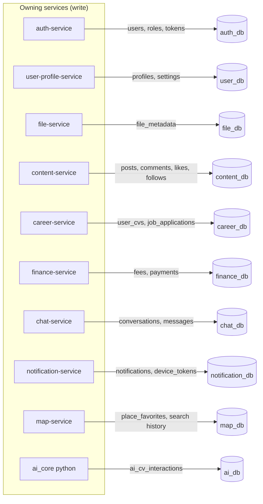

# Database Overview

> Status: Verified · Last reviewed: 2026-09-30
> Evidence: `backend/infrastructure/scripts/init-databases.sql`, `backend/infrastructure/config-repo/*.yml`, `backend/services/*/src/main/resources/application.yml`, `backend/services/*/src/main/resources/db/migration/*.sql`

## 1. Purpose and scope

Vithey uses a **database-per-service** model: every stateful backend service owns exactly one
PostgreSQL database and its own Flyway migration history. No service reads another service's
schema directly — cross-service data is shared through REST (Feign), RabbitMQ events, or the
gateway-injected `X-User-*` headers. [VERIFIED]

This document set covers the nine service-owned databases. `ai_db` is created by the init script
but is **not** owned by any current Java service (the Java `ai-service` is retired); Python
`ai_core` writes to it for AI CV interactions. [VERIFIED]

## 2. Databases and ownership

| Database | Owning service | Created by | Migration files | Notes |
|---|---|---|---|---|
| `auth_db` | `auth-service` | `init-databases.sql` | 4 | Users, roles, tokens, student verification |
| `user_db` | `user-profile-service` | `init-databases.sql` | 3 | Profiles + settings |
| `file_db` | `file-service` | `init-databases.sql` | 3 | File metadata only (bytes live in MinIO) |
| `content_db` | `content-service` | `init-databases.sql` | 5 | Posts, comments, reactions, follows, mentions |
| `career_db` | `career-service` | `init-databases.sql` | 4 files / 3 versions | `user_cvs`, `job_applications` (two `V3` files — see §4) |
| `finance_db` | `finance-service` | `init-databases.sql` | 3 | Fee catalog + per-student payments |
| `chat_db` | `chat-service` | `init-databases.sql` | 3 | Conversations, messages, blocks, reports |
| `notification_db` | `notification-service` | `init-databases.sql` | 4 | Inbox + device tokens |
| `map_db` | `map-service` | `init-databases.sql` | 1 | Place favorites + search history |
| `ai_db` | `ai_core` (Python; no Java owner) | `init-databases.sql` | none (Python-managed) | CV interaction log |

Evidence: `backend/infrastructure/scripts/init-databases.sql:1-10`, `backend/infrastructure/config-repo/*-service.yml`.

## 3. Substrate and conventions

- **Engine:** PostgreSQL 16 (`postgres:16-alpine`), one container `vithey-postgres`. Host port
  `15432` (full stack) or `15433` (infra-only compose). [VERIFIED: `backend/docker-compose.yml:19-36`]
- **Schema:** default `public` schema in every database. No custom schemas, no cross-database
  foreign keys. [VERIFIED]
- **JPA:** Hibernate `ddl-auto: validate`; `open-in-view: false`; JDBC timezone `UTC`.
  [VERIFIED: `backend/infrastructure/config-repo/application.yml:6-13`]
- **Migrations:** Flyway per service, `locations: classpath:db/migration`, `enabled: true`.
  [VERIFIED: each service `application.yml`; see `06-migration-strategy.md`]
- **Naming:** tables are plural `snake_case`; columns `snake_case`; primary keys are `id UUID`
  (composite keys use the natural pair, e.g. `conversation_participants (conversation_id, user_id)`).
- **JSON:** `jsonb` columns are used for flexible preference/education/skill payloads (profiles,
  settings, notifications).
- **Timestamps:** `TIMESTAMPTZ` (maps to `OffsetDateTime` / `Instant`). Date-only fields use `DATE`.
- **Soft delete:** `deleted_at TIMESTAMPTZ` on `users`, `posts`, `file_metadata`, `messages`
  (see `09-data-retention.md`).
- **Connection pooling:** HikariCP, `maximum-pool-size` from `DB_POOL_MAX` (default 5),
  `minimum-idle` from `DB_POOL_MIN` (default 1). [VERIFIED: `config-repo/application.yml:1-5`]

## 4. Data defects (carry-over)

Five verified data defects are documented in full in
[`03-database-schema.md`](03-database-schema.md) and
[`06-migration-strategy.md`](06-migration-strategy.md). They are **documented, not silently fixed**:

1. career-service has **two Flyway files sharing version `V3`**.
2. career `UserCv` entity `@Id` maps `user_id` while the DB primary key is `id`.
3. user-profile trigram index is a **no-op** (`IF NOT EXISTS` skips the intended `LOWER(full_name)` GIN index).
4. **Enum vs DB CHECK supersets** in career/content/chat/finance/notification.
5. `*SmokeIT` tests are **not run by plain `mvn test`** (no failsafe plugin).

## 5. Data ownership map (cross-service)

Key cross-service references are **by UUID only, without database-level FKs** because the target
row lives in another database:

| Data | Referenced by | Via |
|---|---|---|
| `user_id` | profiles, settings, posts, follows, reactions, user_cvs, job_applications, payments, conversations, notifications, place_* | JWT `sub` / gateway `X-User-Id` |
| `file_id` / `cv_file_id` | posts.media_file_id, user_cvs.cv_file_id, job_applications.cv_file_id, messages.file_id, profiles.avatar_file_id | file-service REST |
| `job_post_id` | job_applications.job_post_id | content-service posts (type `JOB`) |
| `reference_id` | notifications.reference_id | originating service event |

`job_applications.cv_file_id` **does** have a same-database FK to `user_cvs(cv_file_id)`
(career_db); all other cross-service ids are unconstrained. [VERIFIED]

## 6. Read more

- Entity/table detail: [`03-database-schema.md`](03-database-schema.md)
- Diagrams: [`02-ERD.md`](02-ERD.md)
- Migration + defects: [`06-migration-strategy.md`](06-migration-strategy.md)
- Backup: [`08-backup-restore.md`](08-backup-restore.md) · Retention: [`09-data-retention.md`](09-data-retention.md)
- API counterpart: [`../06-api/01-api-overview.md`](../06-api/01-api-overview.md)
