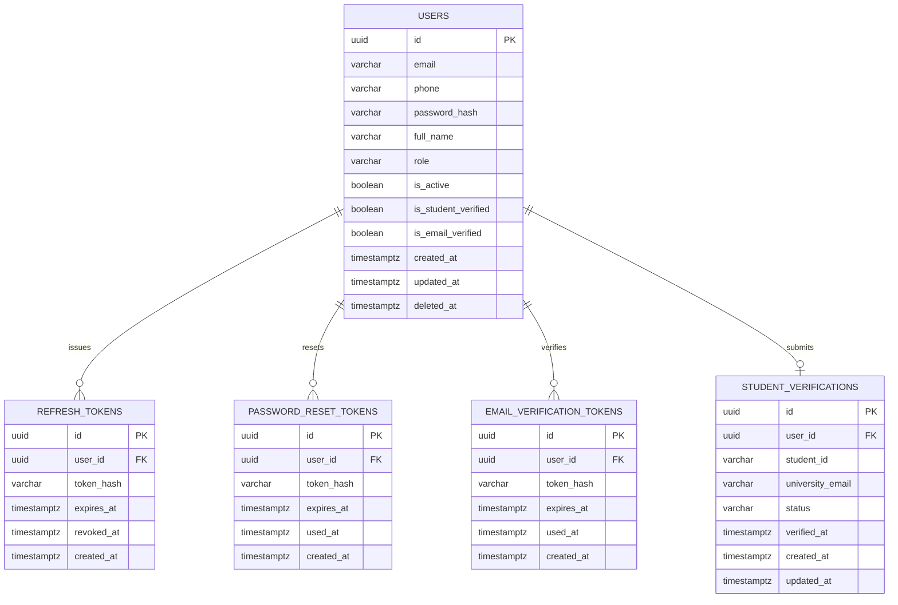
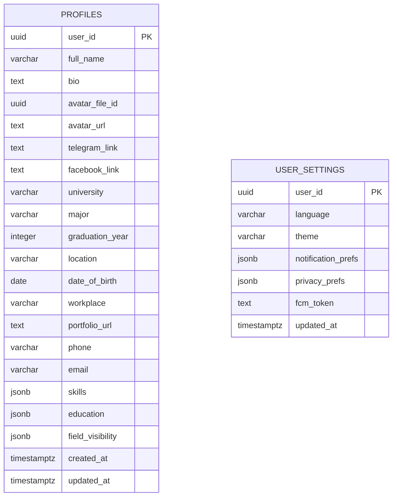
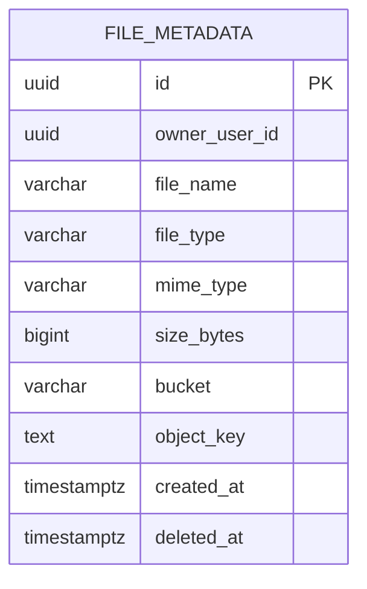
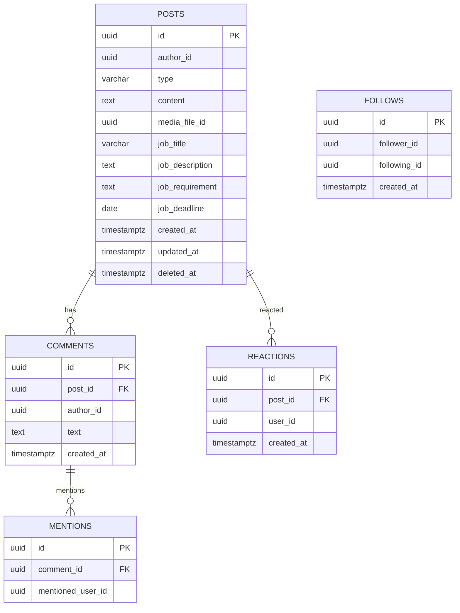
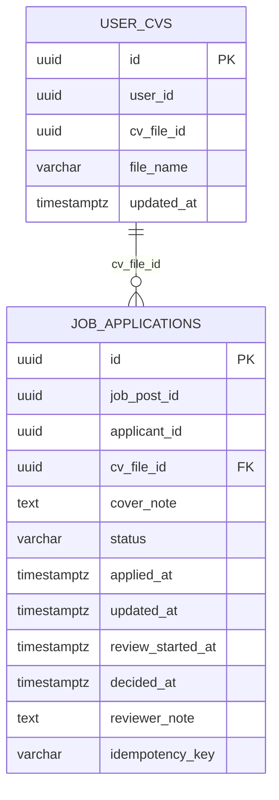
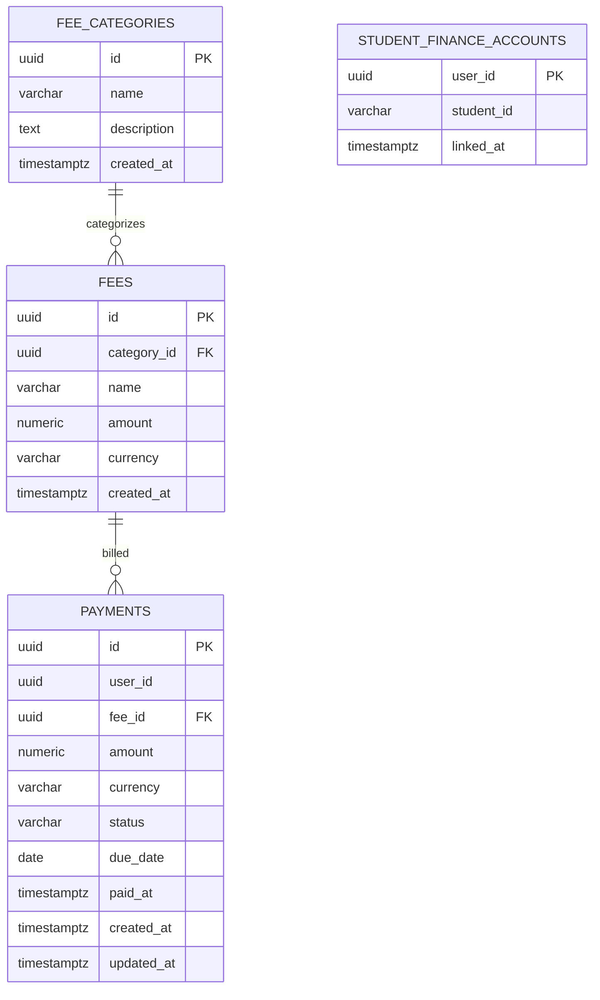
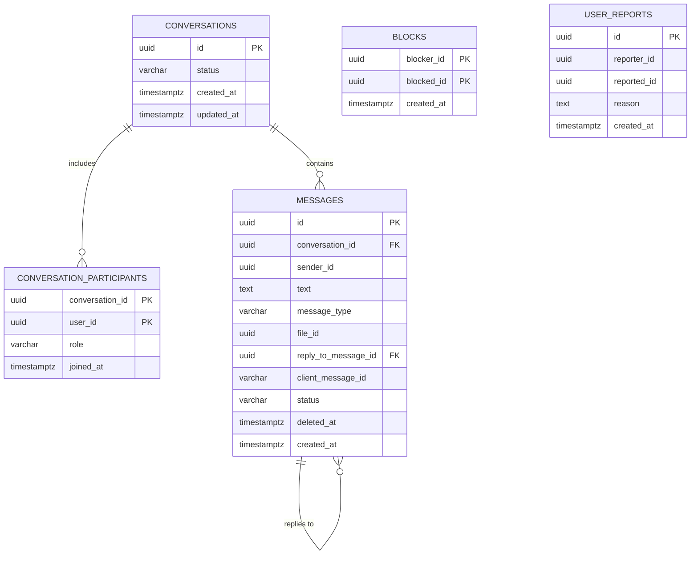
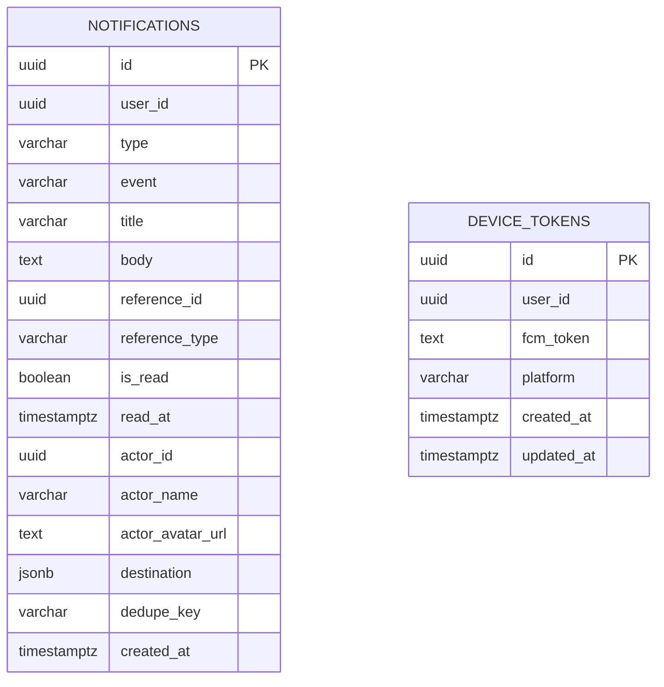
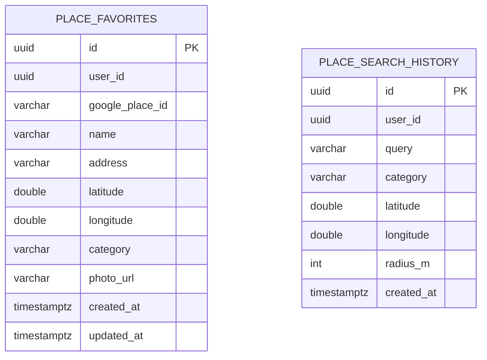
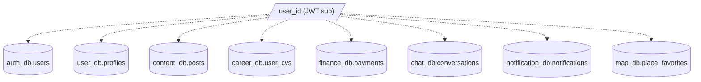

# Entity Relationship Diagrams (ERD)

> Status: Verified · Last reviewed: 2026-09-30
> Evidence: `backend/services/*/src/main/resources/db/migration/*.sql`, `backend/services/*/src/main/java/**/entity/*.java`

These diagrams reflect the **actual** PostgreSQL schema (derived from Flyway migrations), not
Hibernate model inference. Cross-database references are shown as comments, not solid
relationships, because there are no cross-database foreign keys. Relationship labels use Mermaid
`erDiagram` crow's-foot notation.

## 1. auth_db (auth-service)

`users.role` ∈ `USER | STUDENT | COMPANY | ADMIN`; `student_verifications.status` ∈
`PENDING | VERIFIED | REJECTED`. Token FKs cascade on user hard-delete (V2/V4).

## 2. user_db (user-profile-service)

`profiles` and `user_settings` share the same logical key (`user_id`) but have no FK between them;
`avatar_file_id` is a cross-service reference to file_db (unconstrained).

## 3. file_db (file-service)

`file_type` ∈ `AVATAR | CV | POSTER | VIDEO | CHAT_ATTACHMENT` (V3). `owner_user_id` is a logical
reference to auth_db; `object_key` is unique.

## 4. content_db (content-service)

`posts.type` DB CHECK ∈ `VIDEO | POSTER | JOB | STANDARD` (entity enum only `VIDEO | POSTER | JOB`
— defect #4). `reactions` unique `(post_id, user_id)`; `follows` unique `(follower_id,
following_id)` and self-follow check. `author_id`, `user_id`, `follower_id`, `following_id`,
`mentioned_user_id`, `media_file_id` are cross-service refs.

## 5. career_db (career-service)

`job_applications.cv_file_id` → `user_cvs(cv_file_id)` (the only same-DB FK in career_db). Note
the entity model defect: `UserCv` `@Id` maps `user_id`, while the DB primary key is `id`
(defect #2). `status` DB CHECK is a superset of the `ApplicationStatus` enum (defect #4).

## 6. finance_db (finance-service)

`fees`/`payments` amount checks are `amount > 0`. `status` DB CHECK ∈
`UNPAID | PAID | OVERDUE | PENDING | CANCELLED` while `PaymentStatus` enum is `UNPAID | PAID |
OVERDUE` (defect #4). `currency` ∈ `KHR | USD` (enum, no DB CHECK). Seed data: 2 categories,
3 fees.

## 7. chat_db (chat-service)

`conversations.status` DB CHECK ∈ `PENDING | ACTIVE | BLOCKED | DECLINED | ARCHIVED | CLOSED`
(entity only `PENDING | ACTIVE | BLOCKED | DECLINED`); `conversation_participants.role` DB CHECK ∈
`REQUESTER | RECIPIENT | MEMBER | ADMIN` (entity only `REQUESTER | RECIPIENT`); `messages.status`
CHECK ∈ `SENT | DELIVERED | READ | DELETED` (entity only `SENT | DELIVERED | READ`) — all defect
#4. `message_type` ∈ `TEXT | IMAGE | FILE`.

## 8. notification_db (notification-service)

`type` DB CHECK is a large superset including `LIKE | COMMENT | MENTION | FOLLOW | CHAT |
CHAT_REQUEST | JOB | PAYMENT | SYSTEM | STUDENT_VERIFICATION | ...`; the entity enum omits
`SYSTEM`-legacy `MESSAGE`/`APPLICATION_UPDATE`/`PAYMENT_DUE` and `POST_SHARE`/`AI`, so it is both
a subset and a superset of the DB list (defect #4).

## 9. map_db (map-service)

`place_favorites` unique `(user_id, google_place_id)`. `PlaceSearchHistory.MAX_ENTRIES_PER_USER =
20` (application-enforced). No FKs (only logical `user_id`).

## 10. Grouped overview

See [`03-database-schema.md`](03-database-schema.md) for full column/constraint/index detail.
