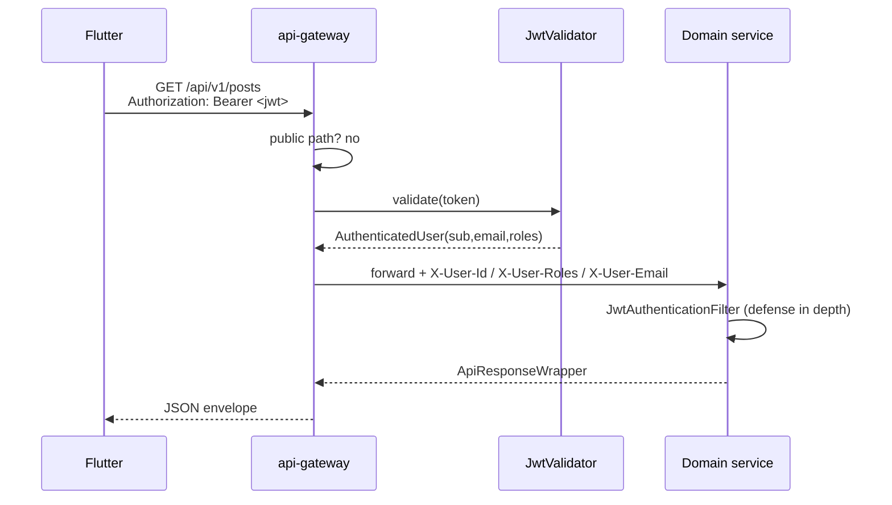

# API Gateway

> Status: Verified · Last reviewed: 2026-09-30
> Evidence: `backend/infrastructure/config-repo/api-gateway.yml`, `backend/services/api-gateway/src/main/resources/application.yml`, `backend/services/api-gateway/src/main/java/**`

The gateway (`api-gateway`, port `8080`) is a reactive Spring Cloud Gateway. It is the single entry
point for Flutter: it validates the JWT, rate-limits, applies CORS, and forwards identity headers
downstream. It uses Eureka for service discovery (`lb://`) except for `ai_core`, which is a direct
HTTP target. [VERIFIED]

## 1. Route table

Derived from `api-gateway.yml:15-164` (order = config order; `order: 0` routes precede the `order: 1`
`/api/v1/users/**` catch-all).

| # | Route id | Path predicate | Target | Rate limit |
|---|---|---|---|---|
| 1 | auth-service | `/api/v1/auth/**`, `/api/v1/students/verify` | `lb://auth-service` | 100/100 |
| 2 | career-user-cv | `/api/v1/users/me/cv`, `/api/v1/users/me/cv/**` | `lb://career-service` | 100/100 |
| 3 | content-user-social | `/api/v1/users/*/follow`, `/followers`, `/following`, `/posts` | `lb://content-service` | 100/100 |
| 4 | file-service | `/api/v1/files/**` | `lb://file-service` | 100/100 |
| 5 | content-service | `/api/v1/posts/**`, `/comments/**`, `/reactions/**`, `/follows/**` | `lb://content-service` | 100/100 |
| 6 | career-service | `/api/v1/jobs/**`, `/api/v1/job-applications/**` | `lb://career-service` | 100/100 |
| 7 | finance-service | `/api/v1/fees/**`, `/api/v1/payments/**` | `lb://finance-service` | 100/100 |
| 8 | chat-service | `/api/v1/conversations/**`, `/messages/**`, `/message-requests/**`, `/api/v1/users/*/report` | `lb://chat-service` | 100/100 |
| 9 | chat-websocket | `/ws/**` | `lb:ws://chat-service` | none |
| 10 | notification-service | `/api/v1/notifications/**` | `lb://notification-service` | 100/100 |
| 11 | ai-core | `/api/v1/ai/**` | `http://ai-core:8100` (direct, not Eureka) | 100/100 |
| 12 | map-service | `/api/v1/places/**` | `lb://map-service` | 30/60 (places-specific) |
| 13 | user-profile-service (order 1) | `/api/v1/users/**` (catch-all) | `lb://user-profile-service` | 100/100 |

Rate-limit args are `vithey.gateway.rate-limit.replenish-rate:burst-capacity` (defaults 100/100,
overridable via `VITHEY_GATEWAY_RATE_LIMIT_*`). `key-resolver` is `#{@rateLimitKeyResolver}`.

> **Routing note:** the gateway does **not** route `/api/v1/activities/**` or the legacy
> `/api/v1/cv/generate`; those `ai_core` engine routes are reachable only inside the Docker network.
> The gateway routes `/api/v1/students/verify` to auth-service, but it is not public (JWT required).

## 2. JWT authentication flow

`JwtAuthenticationGlobalFilter` (`Ordered.HIGHEST_PRECEDENCE + 10`) runs for every request whose path
starts with `/api/v1/` and is not public.

- On missing/invalid token the gateway returns `401` with `{"error":{"code":"UNAUTHORIZED",
  "message":"Missing or invalid token","details":[]}}` and never reaches the service.
- `JwtValidator` verifies HMAC signature with `vithey.jwt.secret` (env `VITHEY_JWT_SECRET`) and reads
  `sub`, `email`, `roles` claims. [VERIFIED: `JwtValidator.java`]
- `RequestIdGlobalFilter` (order `HIGHEST_PRECEDENCE`) sets `X-Request-ID` on request and response.
- `UserHeaderForwardFilter` exists as a placeholder (no-op) at order `HIGHEST_PRECEDENCE + 20`.

## 3. Public paths (no JWT)

`PublicPathMatcher` allows exactly:
`/api/v1/auth/register`, `/api/v1/auth/login`, `/api/v1/auth/google`, `/api/v1/auth/refresh`,
`/api/v1/auth/forgot-password`, `/api/v1/auth/reset-password`, `/api/v1/auth/verify-email`,
`/actuator/**`, `/swagger-ui.html`, `/swagger-ui/**`, `/v3/api-docs/**`. All other `/api/v1/**`
requests require a Bearer token. Paths not starting with `/api/v1/` bypass the JWT filter.

## 4. Rate limiting

- Redis-based `RequestRateLimiter` on all `/api/v1/**` routes (except `/ws/**`).
- Default token bucket: refill 100/s, burst 100, `requestedTokens=1`.
- Places route uses a tighter 30/s refill with burst 60.
- Redis host/port from `REDIS_HOST` / `REDIS_PORT`. Exceeding the limit yields `429`.

## 5. CORS

`allowed-origins` from `VITHEY_CORS_ALLOWED_ORIGINS` (default `*`). Configured in
`CorsConfig`. [VERIFIED]

## 6. Configuration and service discovery

- Config via Spring Cloud Config **native** profile: `backend/infrastructure/config-repo/`, baked
  into the config-server image. Changes require rebuilding config-server (compose also bind-mounts
  the repo for local). [VERIFIED]
- Eureka client enabled by `EUREKA_CLIENT_ENABLED` (default `true`); `defaultZone` from `EUREKA_URL`.
- The `ai-core` route uses the static hostname `http://ai-core:8100`, so it resolves only inside the
  compose network.

## 7. Observability

- `management.endpoints.web.exposure.include: health,info,metrics,prometheus`.
- `GET /actuator/health` for liveness.

## 8. Gateway OpenAPI

The gateway contributes its own OpenAPI definition (`Vithey API Gateway`, bearer scheme) at
`/v3/api-docs`; Swagger UI path is `/swagger-ui.html`. It does not aggregate downstream specs.
See [`15-openapi-swagger.md`](15-openapi-swagger.md).

## 9. TBD

- No gateway-level request/response payload logging or tracing beyond `X-Request-ID`:
  `TBD — Requires confirmation.`
- Whether the `ai-core` route should be hidden in production: `TBD — Requires confirmation.`
