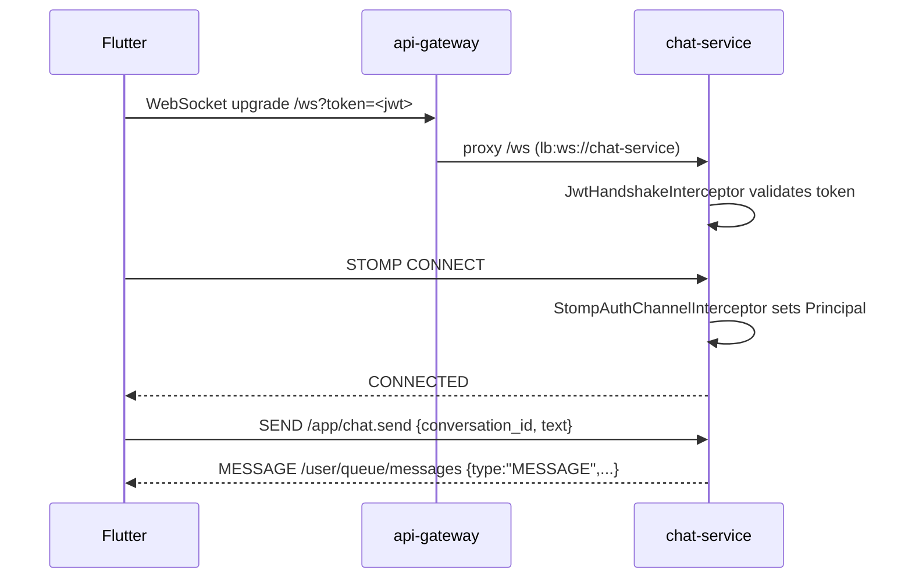

# WebSocket API (chat-service, STOMP)

> Status: Verified · Last reviewed: 2026-09-30
> Evidence: `backend/services/chat-service/src/main/java/com/vithey/chat/config/WebSocketConfig.java`, `websocket/ChatStompController.java`, `websocket/ChatWebSocketEventListener.java`, `security/JwtHandshakeInterceptor.java`, `security/StompAuthChannelInterceptor.java`, `service/RealtimeMessageService.java`, `dto/realtime/*.java`

Real-time peer chat is STOMP 1.2 over WebSocket, served by chat-service and proxied by the gateway
at `/ws/**` (`lb:ws://chat-service`). REST chat endpoints are documented in
[`09-chat-api.md`](09-chat-api.md).

## 1. Connection

| Item | Value |
|---|---|
| Gateway URL | `ws://{host}:8080/ws` |
| Direct service endpoints | `/ws`, `/ws/chat` |
| Protocol | STOMP 1.2 (no SockJS) |
| Broker | Spring simple broker on `/queue`, `/topic` |
| App destination prefix | `/app` |
| User destination prefix | `/user` |
| Allowed origins | `*` (`setAllowedOriginPatterns("*")`) |

## 2. Handshake JWT

The `JwtHandshakeInterceptor` accepts a credential in three ways (first match wins):

1. `Authorization: Bearer <jwt>` header on the handshake.
2. `?token=<jwt>` query parameter.
3. Gateway-injected `X-User-Id` (with optional `X-User-Email`, `X-User-Roles`).

On the STOMP `CONNECT` frame, `StompAuthChannelInterceptor` converts the handshake attribute into an
authenticated `Principal` (`StompUser`) with `ROLE_<name>` authorities. If none of the three
credentials is present, the handshake is rejected.



## 3. Client → server destinations

Client publishes to the **full destination** `/app/<mapping>`:

| Destination | Mapping | Payload (snake_case) | Handler |
|---|---|---|---|
| `/app/chat.send` | `/chat.send` | `{ conversation_id, text, client_message_id, reply_to_message_id, message_type, file_id }` | `send` → `MessageService.sendMessage` |
| `/app/chat.typing` | `/chat.typing` | `{ conversation_id, is_typing }` | `typing` → `TypingService` |
| `/app/chat.heartbeat` | `/chat.heartbeat` | none | `heartbeat` → `PresenceService.refreshHeartbeat` |
| `/app/chat.read` | `/chat.read` | `{ conversation_id, message_id }` | `read` → `MessageService.markRead` |

`chat.send` returns a `MessageResponse` to the sender and delivers frames to the recipients.
Unauthenticated principals raise `UNAUTHORIZED`.

## 4. Server → client subscriptions

| Subscription | Frames |
|---|---|
| `/user/queue/messages` | `MESSAGE`, `READ_RECEIPT`, `TYPING` |
| `/user/queue/presence` | `PRESENCE` |

Frames are addressed per user via `convertAndSendToUser(userId, "/queue/messages", payload)`. Filter
inbound frames by `conversation_id`.

## 5. Frame types and payloads

All frames carry a `type` discriminator.

### `MESSAGE`
```json
{
  "type": "MESSAGE",
  "conversation_id": "c1d2e3f4-...",
  "message_id": "d4e5f6a7-...",
  "sender_id": "018a4379-...",
  "text": "Hello",
  "message_type": "TEXT",
  "file_id": null,
  "status": "DELIVERED",
  "created_at": "2026-09-30T08:00:00Z"
}
```

### `READ_RECEIPT`
```json
{
  "type": "READ_RECEIPT",
  "conversation_id": "c1d2e3f4-...",
  "message_id": "d4e5f6a7-...",
  "reader_id": "018a4379-...",
  "read_at": "2026-09-30T08:01:00Z"
}
```

### `TYPING`
```json
{ "type": "TYPING", "conversation_id": "c1d2e3f4-...", "user_id": "018a4379-...", "is_typing": true }
```

### `PRESENCE`
```json
{ "type": "PRESENCE", "user_id": "018a4379-...", "status": "ONLINE", "last_seen_at": "2026-09-30T08:00:00Z" }
```

Presence goes online on `SessionConnectedEvent` and offline on `SessionDisconnectEvent`; heartbeat
refreshes a 90-second Redis TTL (`chat.presence-ttl-seconds`, default 90). Typing uses a 5-second
TTL.

## 6. Delivery and presence backing store

- Presence and typing are kept in Redis with short TTLs; recent messages are cached
  (`chat:recent:*`, 24 h).
- The gateway does **not** apply the Redis rate limiter to `/ws/**` (the route has no
  `RequestRateLimiter` filter).

## 7. TBD

- STOMP-level authorization for subscribing to another user's `/user/queue` (Spring user
  destinations are per-principal; broader ACL not configurable here):
  `TBD — Requires confirmation.`
- Message history pagination cursors over WS (only the REST list supports `page`/`limit`):
  `TBD — Requires confirmation.`
- Clustering: the simple broker is in-memory, so multi-replica fan-out requires a broker relay —
  `TBD — Requires confirmation.`
