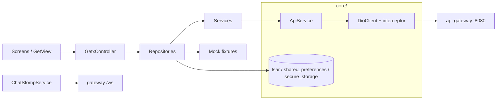
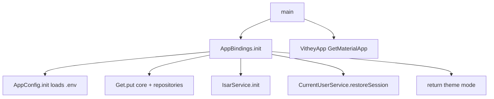

# Flutter Frontend Architecture

> Status: Verified · Last reviewed: 2026-09-30
> Evidence: `vithey_app/pubspec.yaml`, `vithey_app/lib/main.dart`, `vithey_app/lib/app.dart`, `vithey_app/lib/core/`

This document describes the architecture of the **Vithey** Flutter client (`vithey_app/`). It is the entry point for the frontend documentation set. See the master index at [`../00-project-overview/07-document-index.md`](../00-project-overview/07-document-index.md).

## 1. Purpose and scope

The Flutter app is the only user-facing client. It talks exclusively to the `api-gateway` at `:8080` — never to `ai_core`, `chat-service`, or any downstream service directly. [VERIFIED] Evidence: `AGENTS.md`, `vithey_app/.env.example`.

- Package name: `aub_connect_app` (pubspec `54`). Display name on device: **Vithey** (`android:label="Vithey"`, `CFBundleDisplayName = Vithey`). [VERIFIED]
- Version: `1.0.0+1`. [VERIFIED]
- Dart SDK constraint: `>=3.3.0 <4.0.0`. [VERIFIED] `vithey_app/pubspec.yaml`
- Web/Chrome is unsupported (Isar, secure storage, camera). Run on Android emulator or physical device. [VERIFIED] `AGENTS.md`

## 2. Technology stack

| Concern | Package | Version | Notes |
| --- | --- | --- | --- |
| State / DI / routing | `get` | ^4.6.6 | GetX controllers, bindings, `GetMaterialApp` |
| Networking | `dio` | ^5.4.0 | Single interceptor (token injection + 401 refresh) |
| Design system | `shadcn_flutter` | ^0.0.52 | Injected via `shad. Theme` in `app.dart` |
| Markdown (chatbot) | `gpt_markdown` | ^1.2.1 | Assistant message rendering |
| Realtime chat | `stomp_dart_client` | ^2.0.0 | STOMP over WebSocket |
| Local DB | `isar` / `isar_flutter_libs` | ^3.1.0+1 | Chat only (conversations, messages, outbox) |
| Token storage | `flutter_secure_storage` | ^9.0.0 | Access + refresh tokens |
| Settings storage | `shared_preferences` | ^2.2.2 | Theme, language, privacy, notification prefs |
| Env config | `flutter_dotenv` | ^5.1.0 | `.env` declared as a pubspec asset |
| Connectivity | `connectivity_plus` | ^5.0.2 | Offline banner |
| Media | `image_picker`, `file_picker`, `video_player`, `cached_network_image` | — | Post/reel/CV attachments |
| Maps | `google_maps_flutter`, `geolocator`, `permission_handler` | ^2.18.0 / ^14.0.2 / ^11.1.0 | Map module |
| Scanning | `mobile_scanner` | ^7.4.0 | Profile QR scan |
| Misc | `url_launcher`, `webview_flutter`, `share_plus`, `pdf`, `intl`, `package_info_plus` | — | — |
| Lint | `flutter_lints` | ^5.0.0 | CI gate `flutter analyze --no-fatal-infos` |

[VERIFIED] `vithey_app/pubspec.yaml`.

`test` and `build_runner`/`isar_generator` are dev dependencies. There is **no** Firebase package (`firebase_core`, `firebase_messaging`) in the dependency list. [VERIFIED]

## 3. High-level architecture

The layering is consistent across modules:

- **Screens/widgets** (`lib/modules/<module>/**`) are `GetView<T>` or `StatelessWidget`, thin, and observe controller state.
- **Controllers** (`*_controller.dart`) hold UI state in `.obs` fields and call repositories.
- **Repositories** (`lib/data/repositories/**`) own mock-vs-live branching (`FeatureFlags`) and orchestration.
- **Services** (`lib/data/services/**`) are thin wrappers over `ApiService` (one per backend surface).
- **`ApiService`** wraps `DioClient.dio` and unwraps the `{data, meta, error}` envelope.

[VERIFIED] Example: `HomeController` → `PostRepository` → `PostService` → `ApiService` (`lib/modules/home/home_controller.dart:26`, `lib/data/repositories/post_repository.dart:18`, `lib/data/services/post_service.dart:6`).

## 4. Application bootstrap

`main()` (`lib/main.dart`) performs three steps: `WidgetsFlutterBinding.ensureInitialized()`, `await AppBindings.init()` (returns a `ThemeMode`), then `runApp(VitheyApp(...))`.

[VERIFIED] `lib/main.dart:6-11`, `lib/core/di/app_bindings.dart:47-206`.

`VitheyApp` (`lib/app.dart`) builds a `GetMaterialApp` with `initialRoute: AppPages.initial`, `getPages: AppPages.routes`, light/dark themes, `shad.Theme` injection, `ConnectivityWrapper`, and `InAppAlertHost`. [VERIFIED]

## 5. Dependency injection

All app-wide dependencies are registered eagerly in `AppBindings.init()` using `Get.put(..., permanent: true)`; module controllers are registered lazily by per-route `Bindings`. [VERIFIED] `lib/core/di/app_bindings.dart`.

- Core singletons: `FeatureFlags`, `SecureStorageService`, `LocalStorageService`, `InAppAlertService`, `DioClient`, `ApiService`, `CurrentUserService`. [VERIFIED]
- Repositories: `AuthRepository`, `PostRepository`, `CommentRepository`, `ProfileRepository`, `CvRepository`, `JobApplicationRepository`, `StudentVerificationRepository`, `FinanceRepository`, `ChatRepository`, `NotificationRepository`, `AiRepository`, `SettingsRepository`, `SearchRepository`, `PlaceRepository`. [VERIFIED]
- Services: `AuthService`, `ProfileService`, `UploadService`, `JobApplicationService`, `FinanceService`, `ChatService`, `ChatStompService`, `ChatRealtimeHub`, `NotificationService`, `FcmService`, `AiService`, `SettingsService`, `UserSearchService`, `PostSearchService`, `PlaceService`. [VERIFIED]
- Local: `IsarService`, `SearchRecentStore`. [VERIFIED]

## 6. Configuration and feature flags

- `AppConfig` is a singleton that loads `.env` via `flutter_dotenv` and exposes `apiBaseUrl`, `wsBaseUrl`, timeouts, and `fcmDebugToken`. `AppConfig.init()` **must** run before `AppConfig.instance`. [VERIFIED] `lib/core/config/app_config.dart`
- `FeatureFlags` is the single place repositories read mock/real mode. Mocks are opt-in and hard-disabled in production. [VERIFIED] `lib/core/config/feature_flags.dart`
- `AppEnvironment` (`development` / `staging` / `production`) is parsed from `APP_ENV` (or `--dart-define=APP_ENV`). [VERIFIED] `lib/core/config/environment.dart`
- Details: [`05-network-layer.md`](05-network-layer.md).

## 7. Stubs, disabled features, and known gaps

The following are present in code but **not fully functional**. Documented here so they are not mistaken for finished features.

| Item | Status | Evidence |
| --- | --- | --- |
| Google auth | Stub/Placeholder — UI-only chooser; `completeGoogleAuth` throws unless `useMockAuth`; gated by `ENABLE_GOOGLE_AUTH` (default false) | `lib/data/repositories/auth_repository.dart:57-67`, `lib/modules/auth/google_auth_screen.dart` |
| FCM push | Stub/Placeholder — `FcmService` calls are commented out; no Firebase packages; no `google-services.json` | `lib/data/push/fcm_service.dart:30-37,54`, `pubspec.yaml` |
| Chat calls | Stub/Placeholder — call sheet/banner is UI simulation only; no WebRTC | `lib/modules/chat/widgets/chat_call_sheet.dart`, `lib/data/repositories/chat_repository.dart:167-181` |
| 2FA | Not started — `toggleTwoFactor` always resets to off and shows "coming soon" | `lib/modules/settings/security/security_settings_controller.dart:25-31` |
| Biometric login | Not started — `biometricAvailable => false` | `lib/modules/settings/security/security_settings_controller.dart:33-44` |
| Data & storage / Accessibility | Not started — snackbar "coming soon" | `lib/modules/settings/settings_home_screen.dart:88-103` |
| Chatbot attachments/history search | Partial — attachment picker exists but delivery is text-labelled; history search tooltip "coming soon" | `lib/modules/chatbot/widgets/chatbot_history_drawer.dart:71` |
| AI job match / skills / feed ranking (live) | Stub/Placeholder on live API — returns empty/zero, mock-first | `lib/data/repositories/ai_repository.dart:100-136` |

Additional verified limitations:

- **Localization is English-only.** All UI strings are hardcoded in `lib/core/constants/app_strings.dart` and inline literals. Khmer (`km`) is only a stored preference plus a CV `language` field; there are no `.arb` files. [VERIFIED]
- **Release signing uses debug keys.** `android/app/build.gradle:65-70` contains an explicit TODO. [VERIFIED]
- **Only 3 test files exist** under `test/`. See [`02-project-structure.md`](02-project-structure.md#6-tests). [VERIFIED]

## 8. Cross-cutting concerns

- **Routing:** [`03-routing.md`](03-routing.md) — no GetX middleware guards; manual gating in `SplashController` + `AuthNavigation`.
- **State & DI:** [`04-state-management.md`](04-state-management.md).
- **Network:** [`05-network-layer.md`](05-network-layer.md).
- **Storage:** [`06-local-storage.md`](06-local-storage.md).
- **Auth flow:** [`07-authentication-flow.md`](07-authentication-flow.md).
- **Errors:** [`08-error-handling.md`](08-error-handling.md).
- **Modules:** [`modules/`](modules/).

## 9. TBDs

- [TBD] No supported production environment exists for the Flutter client; `AppEnvironment.production` disables mocks but there is no release signing or distribution pipeline. TBD — Requires confirmation.
- [TBD] Locale strategy (whether Khmer UI is ever planned) is not specified in repository evidence. TBD — Requires confirmation.
- [TBD] Real Google OAuth client IDs and provider adapter. TBD — Requires confirmation.
