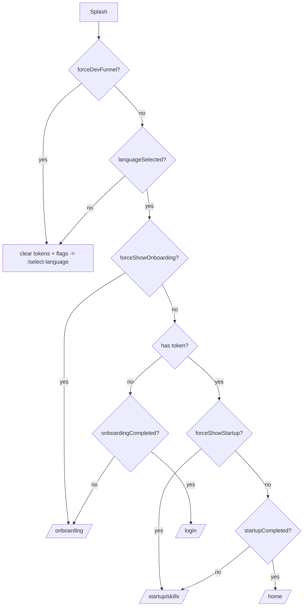

# Routing & Navigation

> Status: Verified · Last reviewed: 2026-09-30
> Evidence: `vithey_app/lib/routes/app_pages.dart`, `vithey_app/lib/core/constants/app_routes.dart`, `vithey_app/lib/modules/auth/splash/splash_controller.dart`, `vithey_app/lib/core/utils/auth_navigation.dart`

Vithey uses **GetX named routing** (`GetMaterialApp` + `GetPage`). There are **no GetX middleware / `GetMiddleware` guards** anywhere in the codebase. Auth gating is performed manually by `SplashController` at cold start and by `AuthNavigation` after login/registration. See [`07-authentication-flow.md`](07-authentication-flow.md).

## 1. Route registration

- Constant names live in `AppRoutes` (`lib/core/constants/app_routes.dart`).
- `AppPages.initial = AppRoutes.splash`; `AppPages.routes` is the ordered `GetPage` list (`lib/routes/app_pages.dart:94-371`).
- `GetMaterialApp` wires `initialRoute` and `getPages` (`lib/app.dart:28-29`).

Each `GetPage` optionally carries a `Binding` for per-route controller DI, and sometimes a `transition` (e.g. `Transition.noTransition` across the intro ribbon). [VERIFIED] `lib/routes/app_pages.dart`.

## 2. Full route table

All routes below are enumerated from `lib/core/constants/app_routes.dart` and mapped to their page/binding in `lib/routes/app_pages.dart`. [VERIFIED]

| Constant | Path | Screen | Binding |
| --- | --- | --- | --- |
| `splash` | `/splash` | `SplashScreen` | `SplashBinding` (inline in app_pages) |
| `selectLanguage` | `/select-language` | `IntroRibbonScreen` | `IntroRibbonBinding(pageLanguage)` |
| `onboarding` | `/onboarding` | `IntroRibbonScreen` | `IntroRibbonBinding(pageOnboarding1)` |
| `auth` | `/auth` | `IntroRibbonScreen` | `IntroRibbonBinding(pageSignIn)` |
| `login` | `/login` | `IntroRibbonScreen` | `IntroRibbonBinding(pageSignIn)` |
| `register` | `/register` | `IntroRibbonScreen` | `IntroRibbonBinding(pageSignUp)` |
| `forgotPassword` | `/auth/forgot-password` | `ForgotPasswordScreen` | `AuthBinding` |
| `googleAccountChooser` | `/auth/google` | `GoogleAccountChooserScreen` | `AuthBinding` |
| `googleAuthConfirmation` | `/auth/google/confirm` | `GoogleAuthConfirmationScreen` | `AuthBinding` |
| `startupSkills` | `/startup/skills` | `StartupScreen` | `StartupBinding` |
| `startupInterests` | `/startup/interests` | `StartupScreen` | `StartupBinding` |
| `startupDiscovery` | `/startup/discovery` | `StartupScreen` | `StartupBinding` |
| `home` | `/home` | `MainShellScreen` | `MainShellBinding` |
| `reels` | `/reels` | `ReelsScreen` | `ReelsBinding` |
| `createPost` | `/create-post` | `CreatePostScreen` | `CreatePostBinding` |
| `postDetail` | `/posts/detail` | `PostDetailScreen` | `PostDetailBinding` |
| `postAnalytics` | `/posts/analytics` | `PostAnalyticsScreen` | none |
| `applyCv` | `/apply-cv` | `ApplyCvScreen` | `ApplyCvBinding` |
| `applyCvTemplates` | `/apply-cv/templates` | `CvTemplateGalleryScreen` | `CvTemplateGalleryBinding` |
| `applyCvAiCreate` | `/apply-cv/ai-create` | `AiCvScreen` | `AiCvBinding` |
| `applySuccess` | `/apply-cv/success` | `ApplySuccessScreen` | none |
| `applicationStatus` | `/apply-cv/status` | `ApplicationStatusScreen` | `ApplicationStatusBinding` |
| `profile` | `/profile` | `ProfileScreen` | `ProfileBinding` |
| `profileView` | `/profile/view` | `ProfileViewScreen` | `ProfileViewBinding` |
| `scanQr` | `/profile/scan-qr` | `ScanQrScreen` | none |
| `editProfile` | `/profile/edit` | `EditProfileScreen` | `EditProfileBinding` |
| `jobApplicants` | `/profile/jobs/applicants` | `JobApplicantsScreen` | `JobApplicantsBinding` |
| `applicantDetail` | `/profile/applicants/detail` | `ApplicantDetailScreen` | `ApplicantDetailBinding` |
| `applicantCvPreview` | `/profile/applicants/cv` | `ApplicantCvScreen` | `ApplicantCvBinding` |
| `previewOwnCv` | `/profile/cv` | `PreviewOwnCvScreen` | none |
| `studentVerification` | `/student-verification` | `StudentVerificationScreen` | `StudentVerificationBinding` |
| `verificationStatus` | `/verification-status` | `VerificationStatusScreen` | `VerificationStatusBinding` |
| `finance` | `/finance` | `FinanceScreen` | `FinanceBinding` |
| `financePayment` | `/finance/pay` | `PaymentScreen` | `PaymentBinding` |
| `chat` | `/chat` | `ChatListScreen` | `ChatListBinding` |
| `chatDetail` | `/chat/detail` | `ChatDetailScreen` | `ChatDetailBinding` |
| `chatProfile` | `/chat/profile` | `ChatProfileScreen` | `ChatProfileBinding` |
| `chatbot` | `/chatbot` | `ChatbotScreen` | `ChatbotBinding` |
| `notifications` | `/notifications` | `NotificationScreen` | `NotificationBinding` |
| `search` | `/search` | `SearchScreen` | `SearchBinding` |
| `searchSeeAll` | `/search/see-all` | `SearchSeeAllScreen` | `SearchSeeAllBinding` |
| `settings` | `/settings` | `SettingsHomeScreen` | `SettingsBinding` |
| `settingsAccount` | `/settings/account` | `AccountSettingsScreen` | `AccountSettingsBinding` |
| `settingsEditAccount` | `/settings/account/edit` | `EditAccountSettingsScreen` | `EditAccountSettingsBinding` |
| `settingsPrivacy` | `/settings/privacy` | `PrivacySettingsScreen` | `PrivacySettingsBinding` |
| `settingsPrivacyPractices` | `/settings/privacy/practices` | `PrivacyPracticesScreen` | none |
| `settingsNotifications` | `/settings/notifications` | `NotificationPreferencesScreen` | `NotificationPreferencesBinding` |
| `settingsSecurity` | `/settings/security` | `SecuritySettingsScreen` | `SecuritySettingsBinding` |
| `settingsChangePassword` | `/settings/security/change-password` | `ChangePasswordScreen` | `ChangePasswordBinding` |
| `settingsHelpCenter` | `/settings/help-center` | `HelpCenterScreen` | `HelpCenterBinding` |
| `settingsAbout` | `/settings/about` | `AboutScreen` | `AboutBinding` |
| `map` | `/map` | `MapScreen` | `MapBinding` |

## 3. Tab shell navigation (not routes)

The persistent bottom bar is `/home` (`MainShellScreen`) with a `PageView`, **not** separate routes for tabs. Tab indices are constants in `MainTabNavigation` (`lib/core/navigation/main_tab_navigation.dart`):

| Index | Tab |
| --- | --- |
| 0 | Profile |
| 1 | Home feed |
| 2 | Reels |
| 3 | Chatbot (opens **full-screen route** `/chatbot`, no bottom bar) |
| 4 | Notifications |

The shell hides the bar on scroll-down and reveals it on scroll-up; tab switches animate page content only (`lib/modules/home/shell/main_shell_screen.dart:57-98`). [VERIFIED]

## 4. Manual gating (no middleware)

### Cold start — `SplashController._resolveNextRouteLocal()`

`SplashController` reads storage after the intro animation and returns a target route (`lib/modules/auth/splash/splash_controller.dart:179-233`):

Tokens starting with `mock` are treated as invalid and cleared. All storage reads have 500 ms timeouts with safe fallbacks. [VERIFIED] `splash_controller.dart:188-227`.

### After auth — `AuthNavigation`

`AuthNavigation.goAfterAuth({isNewUser})` (`lib/core/utils/auth_navigation.dart:15-33`):

- New registration → `/startup/skills` (once).
- Returning login → sets language/onboarding/startup-completed flags, then `/home`.
- Always bootstraps notification unread count and (if enabled) FCM token registration.

There is no route interceptor that blocks unauthenticated access to `/home` etc. Protection relies on the funnel: an unauthenticated user is routed away from `/home` at splash. [VERIFIED]

## 5. Navigation conventions

- Push: `Get.toNamed(AppRoutes.x, arguments: ...)`. Return values drive list refresh (e.g. post detail returns `FeedPost` or `PostMutationResult`).
- Full reset: `Get.offAllNamed(...)` after auth/splash.
- Bottom bar switching: `goToMainTab(index)` / `MainTabNavigation.handle(...)`.
- Deep links: `NotificationRouter` maps notification types to routes (see [`modules/notifications.md`](modules/notifications.md)).
- `openUserProfile(userId)` opens the visitor profile route unless it is the current user (`lib/modules/profile/profile_navigation.dart`).

## 6. TBDs

- [TBD] No `GetMiddleware`/redirect guard is implemented; whether route-level guards are intended is not documented. TBD — Requires confirmation.
- [TBD] Deep-link (URI/universal link) handling beyond notification payloads. TBD — Requires confirmation.
