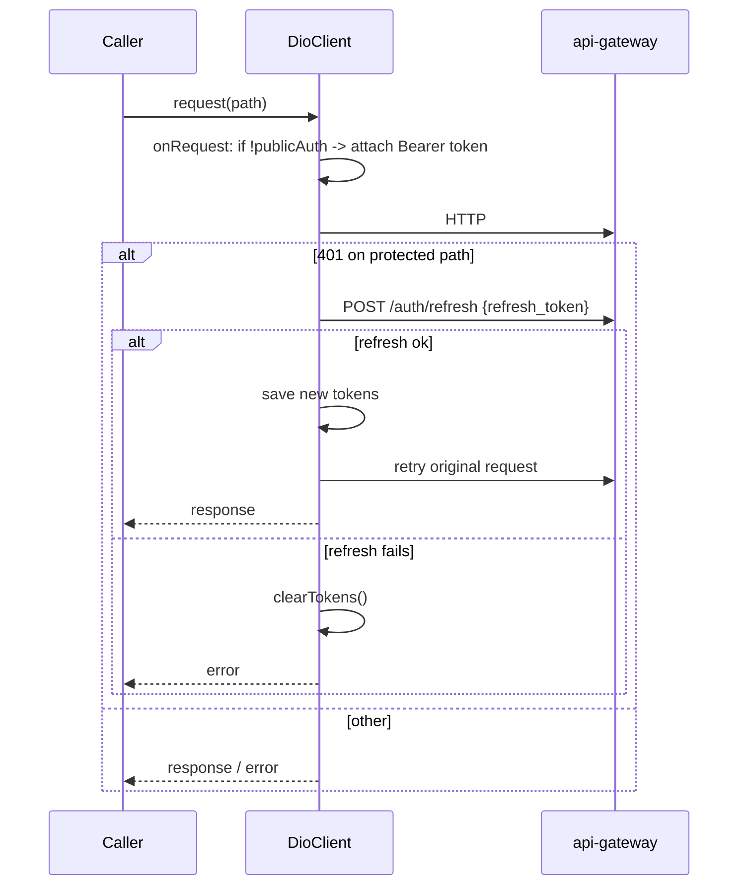

# Network Layer

> Status: Verified · Last reviewed: 2026-09-30
> Evidence: `vithey_app/lib/core/network/dio_client.dart`, `vithey_app/lib/core/network/api_service.dart`, `vithey_app/lib/core/network/api_response.dart`, `vithey_app/lib/core/config/app_config.dart`, `vithey_app/lib/core/constants/api_endpoints.dart`, `vithey_app/.env.example`

The Vithey Flutter client reaches the backend **only** through the `api-gateway` at `:8080` with paths under `/api/v1`. Dio 5.4 is configured with a **single interceptor** that injects the bearer token and transparently refreshes on `401`. See [`05-network-layer`] peers: [`06-local-storage.md`](06-local-storage.md), [`08-error-handling.md`](08-error-handling.md).

## 1. Environment configuration (`.env`)

`.env` is a declared pubspec asset and is gitignored; copy `.env.example` before build/analyze/test. [VERIFIED] `vithey_app/pubspec.yaml:48-57`, `.env.example`.

| Variable | Default in `AppConfig` | `.env.example` value | Purpose |
| --- | --- | --- | --- |
| `APP_ENV` | `dev` (via parse fallback) | `dev` | Environment selection |
| `API_BASE_URL` | `http://localhost:8080/api/v1` | `http://10.0.2.2:8080/api/v1` | REST base URL |
| `WS_BASE_URL` | `ws://10.0.2.2:8080/ws` | `ws://10.0.2.2:8080/ws` | STOMP WebSocket URL |
| `API_CONNECT_TIMEOUT_SECONDS` | `15` | `15` | Dio connect timeout |
| `API_RECEIVE_TIMEOUT_SECONDS` | `30` | `60` | Dio receive timeout |
| `FCM_DEBUG_TOKEN` | (empty) | (empty) | Dev push token override |
| `USE_MOCK_*`, `USE_AI_*`, `ENABLE_GOOGLE_AUTH`, `FCM_ENABLED`, `FORCE_*` | see [`01-flutter-architecture.md`](01-flutter-architecture.md#6-configuration-and-feature-flags) | — | Feature flags |

`AppConfig` reads `APP_ENV` from `String.fromEnvironment('APP_ENV')` first, then `.env` (`lib/core/config/app_config.dart:39-55`). `API_BASE_URL` default is `localhost` while `WS_BASE_URL` default is `10.0.2.2` — the Android emulator reaches the host at `10.0.2.2`, not `localhost`. [VERIFIED]

`AppConfig.init()` must be called before `AppConfig.instance`; accessing an uninitialized instance throws `StateError`. [VERIFIED] `app_config.dart:17-23`.

## 2. Dio client & the single interceptor

`DioClient` lazily builds one `Dio` with the base URL, timeouts, and JSON headers, then attaches one `InterceptorsWrapper` (`lib/core/network/dio_client.dart:25-67`).



Behavior:

- **Token injection** (`onRequest`): skips the public auth paths; otherwise reads `access_token` from secure storage. Tokens that are null, empty, or start with `mock` are **not** attached. [VERIFIED] `dio_client.dart:38-47`.
- **401 refresh** (`onError`): only for non-public paths; reads `refresh_token`; if null/empty/`mock`, refresh is skipped. On success it saves the new tokens and retries the original request via `client.fetch`. On failure it clears tokens and propagates the error. [VERIFIED] `dio_client.dart:48-92`.
- **Public auth paths** (no token, no refresh): `/auth/register`, `/auth/login`, `/auth/google`, `/auth/refresh`, `/auth/forgot-password`, `/auth/reset-password`, `/auth/verify-email`. [VERIFIED] `dio_client.dart:11-18`.
- There is exactly **one** interceptor; no logging, retry, or cache interceptors exist. [VERIFIED]

**Note:** the refresh call passes `Authorization: null` to avoid recursion. `_tryRefreshToken` returns `false` (no retry) when no refresh token is stored.

## 3. `ApiService` — envelope unwrapping

`ApiService` wraps `DioClient.dio` and exposes typed `get/post/put/patch/delete` returning `ApiResponse<T>` (`lib/core/network/api_service.dart`). Each method takes a `fromJson` mapper applied to the `data` field.

- Null/empty bodies produce `ApiResponse.fromJson({}, fromJson)` (data is null).
- `DioException` responses whose body is a JSON map are still parsed as `ApiResponse` (so an error envelope flows through); otherwise a synthetic `ApiError(code: 'NETWORK_ERROR')` is returned. [VERIFIED] `api_service.dart:51-77`.

Note that `ApiService` does **not** throw on non-2xx when the body parses; callers check `response.isSuccess` themselves. [VERIFIED]

## 4. Response envelope

The Vithey envelope is `{data, meta, error}` (snake_case). `ApiMeta` maps `page`, `limit`, `total`, `total_pages`; `ApiError` maps `code`, `message`, `details` (`lib/core/network/api_response.dart`).

```json
{
  "data": { },
  "meta": { "page": 1, "limit": 20, "total": 42, "total_pages": 3 },
  "error": null
}
```

`isSuccess => error == null`. [VERIFIED] `api_response.dart:44-62`. This matches the backend contract documented in [`../06-api/01-api-overview.md`](../06-api/01-api-overview.md) and `api_docs.md`.

## 5. Services & endpoints

Each backend surface has a thin service in `lib/data/services/` that calls `ApiService` with constants from `lib/core/constants/api_endpoints.dart`:

| Service | File | Endpoint constants used |
| --- | --- | --- |
| `AuthService` | `auth_service.dart` | `/auth/login`, `/auth/register`, `/auth/google`, `/auth/me`, `/auth/logout`, `/auth/refresh`, `/auth/me/password`, `/auth/forgot-password` |
| `PostService` | `post_service.dart` | `/posts`, `/posts/{id}`, `/posts/{id}/comments`, `/posts/{id}/reactions`, `/users/{id}/follow`, `/users/{id}/posts` |
| `ProfileService` | `profile_service.dart` | `/users/me`, `/users/{id}` |
| `UploadService` | `upload_service.dart` | `/files/upload` (multipart, via `DioClient`) |
| `JobApplicationService` | `job_application_service.dart` | `/job-applications*` |
| `FinanceService` | `finance_service.dart` | `/fees`, `/payments` |
| `StudentVerificationService` | `student_verification_service.dart` | `/students/verify`, `/auth/me` |
| `ChatService` | `chat_service.dart` | `/conversations*`, `/message-requests`, `/messages/{id}/read`, `/users/{id}/report` |
| `NotificationService` | `notification_service.dart` | `/notifications*`, `/notifications/devices` |
| `AiService` | `ai_service.dart` | `/ai/chat`, `/ai/chat/stream`, `/ai/sessions*`, `/ai/messages/{id}/regenerate`, `/ai/cv/generate`, `/ai/cv/suggest`, `/ai/chat/requests/{id}` |
| `SettingsService` | `settings_service.dart` | `/users/me/settings` |
| `UserSearchService` / `PostSearchService` | `user_search_service.dart`, `post_search_service.dart` | `/users/search`, `/posts` |
| `PlaceService` | `place_service.dart` | `/places/nearby`, `/places/search`, `/places/autocomplete`, `/places/{id}`, `/places/favorites`, `/places/history` |

[VERIFIED] `lib/core/constants/api_endpoints.dart`, `lib/data/services/`.

For the `AiService` SSE stream, `DioClient.dio` is used directly with `ResponseType.stream` and a 5-minute receive timeout, parsing `event:`/`data:` lines into typed stream events (`lib/data/services/ai_service.dart:96-183`). The `Accept: text/event-stream` header is set per-request.

## 6. WebSocket / STOMP

`ChatStompService` connects `stomp_dart_client` to `AppConfig.wsBaseUrl`, subscribes to `/user/queue/messages`, sends to `/app/chat.send`, and sets a 5 s reconnect delay. It is disabled (no-op) when `useMockChat` is on. [VERIFIED] `lib/data/services/chat_stomp_service.dart:33-92`.

Architecture note for the transport itself is in [`../06-api/13-websocket-api.md`](../06-api/13-websocket-api.md).

## 7. Connectivity

`ConnectivityWrapper` (installed in `app.dart`) listens to `connectivity_plus` and shows an `OfflineBanner` when every result is `ConnectivityResult.none`. It does not block requests. [VERIFIED] `lib/core/utils/connectivity_wrapper.dart`.

## 8. Security notes

- Only `.env.example` is tracked; `.env` is gitignored. Do not print values. [VERIFIED] `AGENTS.md`, `.env.example`.
- Tokens are stored in `flutter_secure_storage`, never in `shared_preferences`. See [`06-local-storage.md`](06-local-storage.md). [VERIFIED]
- Android release sets `usesCleartextTraffic=false`; debug allows cleartext for the local demo stack. [VERIFIED] `android/app/build.gradle:55-70`.

## 9. TBDs

- [TBD] No certificate pinning or request signing. Whether required for production is unspecified. TBD — Requires confirmation.
- [TBD] No refresh-token concurrency guard: two simultaneous 401s can each trigger a refresh. TBD — Requires confirmation (potential improvement).
