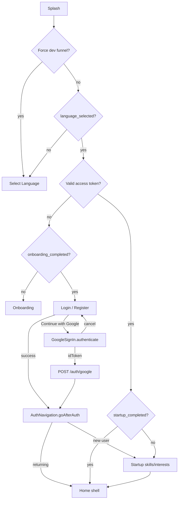

# Authentication Flow

> Status: Verified · Last reviewed: 2026-09-30
> Evidence: `vithey_app/lib/modules/auth/`, `vithey_app/lib/data/repositories/auth_repository.dart`, `vithey_app/lib/data/services/auth_service.dart`, `vithey_app/lib/core/utils/auth_navigation.dart`, `vithey_app/lib/core/network/dio_client.dart`, `vithey_app/lib/modules/auth/splash/splash_controller.dart`

This document covers login, registration, session restore, token refresh, logout, and Google sign-in. Route mechanics are in [`03-routing.md`](03-routing.md); tokens are in [`06-local-storage.md`](06-local-storage.md). Feature-level details in [`modules/auth.md`](modules/auth.md).

## 1. End-to-end flow

[VERIFIED] `SplashController._resolveNextRouteLocal` (`splash_controller.dart:179-233`), `AuthNavigation.goAfterAuth` (`auth_navigation.dart:15-33`).

## 2. Login

`AuthController.login()` (`lib/modules/auth/auth_controller.dart:186-203`):

1. Validates the login form (`FormErrorHost.submit`).
2. Sets `isLoading`.
3. Calls `AuthRepository.login(email, password)`.
4. On success calls `AuthNavigation.goAfterAuth()`.
5. `AuthServiceException` messages surface to `errorMessage`; other errors fall back to `AppStrings.errorGeneric`.

`AuthRepository.login` (`lib/data/repositories/auth_repository.dart:26-36`):

- If `useMockAuth` → `_mockAuth` (synthetic user + `mock-access-token`/`mock-refresh-token`).
- Else `AuthService.login` → `POST /auth/login` with body `{email_or_phone, password}` and saves tokens. [VERIFIED] `auth_service.dart:13-26`.

Note the API field is `email_or_phone` even though the UI label is "Email Address". [VERIFIED]

## 3. Registration

`AuthController.register()` is a two-step form (`registerStep`). On submit it calls `AuthRepository.register(fullName, email, phone, password)`, which:

- Posts to `/auth/register` with `{full_name, email, phone, password, role: 'USER'}`.
- Saves tokens.
- `AuthNavigation.goAfterAuth(isNewUser: true)` routes to `/startup/skills` once.

[VERIFIED] `auth_controller.dart:205-225`, `auth_service.dart:40-61`.

The register date-of-birth picker constrains age 13–? (`firstDate: 1950`, `lastDate: now - 13y`) but **DOB is not sent to the backend** in the register payload. [VERIFIED] `auth_controller.dart:161-184,205-216`.

## 4. Session restore (cold start)

`CurrentUserService.restoreSession()` runs at the end of `AppBindings.init()` (`app_bindings.dart:203`):

- No access token → clear user.
- `useMockAuth` → seed a mock user.
- Otherwise `GET /auth/me` → set user and refresh the student-verified flag.

[VERIFIED] `current_user_service.dart:41-70`.

Splash independently checks `readAccessToken()` to choose the next route (see diagram). A token starting with `mock` is cleared asynchronously. [VERIFIED] `splash_controller.dart:200-209`.

## 5. Token refresh (401 handling)

Refresh is implemented **only** in the Dio interceptor, not as a proactive timer:

- On a `401` for a non-public path, `DioClient._tryRefreshToken` POSTs `/auth/refresh` with `{refresh_token}` (Authorization header nulled to avoid recursion).
- Success → tokens saved, original request retried and resolved.
- Failure → `clearTokens()` and the original error propagates (which typically leads the user to re-authenticate).

[VERIFIED] `dio_client.dart:48-92`. Access TTL is 15 min, refresh TTL 7 days on the backend (`../00-project-overview` evidence basis §5). The client does **not** decode token expiry. [VERIFIED]

Student verification performs an explicit refresh after success to obtain a `STUDENT` role in the JWT (`student_verification_repository.dart:100-117`).

## 6. Logout

`SettingsController.logout()` (`lib/modules/settings/settings_controller.dart:92-120`):

1. Confirm dialog.
2. `FcmService.unregisterToken()` (no-op unless FCM enabled).
3. `NotificationRepository.clearSession()`.
4. `AuthRepository.logout()` → best-effort `POST /auth/logout {refresh_token}`, then `clearTokens()` + `CurrentUserService.clear()`.
5. `LocalStorageService.clearSessionPreferences()` (removes `startup_completed`).
6. Clear search recents.
7. `Get.offAllNamed(AppRoutes.login)`.

[VERIFIED]

## 7. Google sign-in

Google sign-in is **real** (not a stub). The mock chooser screens were removed.

`AuthController.continueWithGoogle({intent})` (`lib/modules/auth/auth_controller.dart`) is wired to
the "Continue with Google" buttons on both the Sign In and Sign Up forms. It calls
`AuthRepository.signInWithGoogle()`:

1. `GoogleAuthService.obtainIdToken()` (`lib/data/services/google_auth_service.dart`) initializes
   `GoogleSignIn.instance` once with `serverClientId: GOOGLE_WEB_CLIENT_ID` (from `.env` via
   `AppConfig`), then runs the real Google account chooser via `GoogleSignIn.instance.authenticate()`
   and returns `account.authentication.idToken`.
2. `AuthService.googleLogin(idToken)` posts `{id_token}` to `POST /auth/google`
   (`ApiEndpoints.authGoogle`, public path in `DioClient`).
3. On success the returned Vithey access + refresh tokens are stored via
   `SecureStorageService.saveTokens(...)` and `CurrentUserService.setUser(...)` — the existing
   session mechanism, not a second one. Then `AuthNavigation.goAfterAuth()` runs.

Error handling:

- User cancels → `GoogleSignInExceptionCode.canceled` is mapped to
  `GoogleSignInCancelledException`; the controller returns cleanly with no error and no navigation.
- Backend rejection / network failure → `AuthServiceException` message shown in `errorMessage`.
- Google/config failure → `GoogleAuthException` message shown.

The Account → Edit "change email" affordance also uses the real chooser
(`AuthRepository.googleEmailForAccountChange()`), returning the selected Google email client-side
only. No client secret is embedded. [VERIFIED] Roles are unchanged by Google sign-in; new accounts
get `USER` only.

Full setup, verification rules, and account-linking policy:
[`../10-security/12-google-sign-in.md`](../10-security/12-google-sign-in.md).

## 8. Forgot password

`AuthController.requestPasswordReset` → `AuthRepository.requestPasswordReset` → `POST /auth/forgot-password {email}`. Success shows a generic message regardless of account existence. Mock mode delays and succeeds. [VERIFIED] `auth_service.dart:115-124`, `auth_controller.dart:356-371`.

## 9. Password change

`Settings → Security → Change password` → `AuthRepository.changePassword` → `PATCH /auth/me/password {current_password, new_password}`. A `404`/`not found` is translated to "Password change is not available yet." [VERIFIED] `auth_repository.dart:96-118`.

## 10. Authorization roles

Roles `USER`, `STUDENT`, `COMPANY`, `ADMIN` exist on the backend. The client only influences `STUDENT` indirectly via student verification (finance requires it). `StudentVerificationRepository` updates the local user role to `STUDENT` after verification. [VERIFIED] `student_verification_repository.dart:89-98`.

## 11. Known limitations

- No biometric lock on app resume (feature stubbed). [VERIFIED]
- No 2FA. [VERIFIED]
- The client does not proactively refresh tokens before expiry. [VERIFIED]
- `validateSession()` exists on `AuthRepository` but is not used by splash gating (splash checks token presence only). [VERIFIED] `auth_repository.dart:69-79`.

## 12. TBDs

- [TBD] Email verification flow (`/auth/verify-email`, `reset-password` are in the public path list but no client screen calls them). TBD — Requires confirmation.
- [TBD] Formal security assessment of the auth flow: Not yet formally assessed.
- [TBD] End-to-end Android Google Sign-In on a real device (registered SHA-1 + live Web client ID)
  is a manual verification step; see [`../10-security/12-google-sign-in.md`](../10-security/12-google-sign-in.md) §9.
