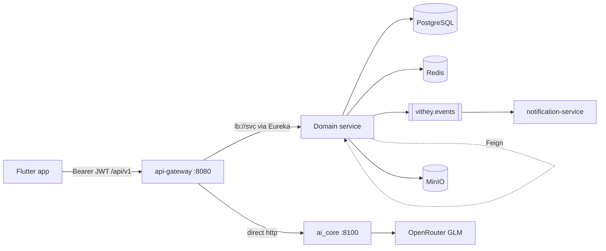

# Backend Architecture

> Status: Verified · Last reviewed: 2026-09-30
> Evidence: `backend/pom.xml`, `backend/services/*`, `backend/infrastructure/*`, `backend/DOCKER.md`, `backend/TESTING.md`, `docs/_meta/EVIDENCE-BASIS.md`

The **Vithey backend** is a Maven multi-module Spring Cloud stack (Java 21, Spring Boot 3.3.5,
Spring Cloud 2023.0.3) that implements nine domain services behind a reactive API gateway, plus
Eureka and a Spring Cloud Config server. [VERIFIED]

Part of the Vithey documentation set · Master index:
[`../00-project-overview/07-document-index.md`](../00-project-overview/07-document-index.md) ·
Siblings: [Microservices](02-microservice-architecture.md) · [Service discovery](03-service-discovery.md) ·
[Config server](04-config-server.md) · [API gateway](05-api-gateway.md) ·
[Event-driven](06-event-driven-architecture.md) · [Cache](07-cache-strategy.md) ·
[Error handling](08-error-handling.md).

## 1. Maven reactor

The aggregator `backend/pom.xml` inherits `spring-boot-starter-parent:3.3.5` and declares:

| Property | Value |
|---|---|
| `java.version` | 21 |
| `spring-cloud.version` | 2023.0.3 |
| `mapstruct.version` | 1.5.5.Final |
| `jjwt.version` | 0.12.6 |
| `testcontainers.version` | 1.20.4 |
| `resilience4j.version` | 2.2.0 |

`groupId:artifactId:version` = `com.vithey:vithey-backend:0.0.1-SNAPSHOT`, packaging `pom`.

Modules (reactor order):
`shared/vithey-test-support`, `infrastructure/eureka-server`, `infrastructure/config-server`,
then `services/api-gateway`, `auth-service`, `user-profile-service`, `file-service`,
`content-service`, `career-service`, `finance-service`, `chat-service`, `notification-service`,
`map-service`. [VERIFIED: `backend/pom.xml`]

> There is **no** `services/ai-service` module and **no** `general-service`. The Java AI service is
> retired; AI runs in Python `ai_core` (port 8100). [VERIFIED: `backend/DOCKER.md`, `EVIDENCE-BASIS.md` §3]

## 2. Component map

| Component | Module | Port | Eureka name | Data store |
|---|---|---|---|---|
| api-gateway | `services/api-gateway` | 8080 | `api-gateway` | Redis (rate limit) |
| auth-service | `services/auth-service` | 8081 | `auth-service` | `auth_db` |
| user-profile-service | `services/user-profile-service` | 8082 | `user-profile-service` | `user_db` |
| file-service | `services/file-service` | 8083 | `file-service` | `file_db` + MinIO |
| content-service | `services/content-service` | 8084 | `content-service` | `content_db` |
| career-service | `services/career-service` | 8085 | `career-service` | `career_db` |
| finance-service | `services/finance-service` | 8086 | `finance-service` | `finance_db` |
| chat-service | `services/chat-service` | 8087 | `chat-service` | `chat_db` + Redis |
| notification-service | `services/notification-service` | 8088 | `notification-service` | `notification_db` |
| map-service | `services/map-service` | 8090 | `map-service` | `map_db` + Redis |
| eureka-server | `infrastructure/eureka-server` | 8761 | (server) | — |
| config-server | `infrastructure/config-server` | 8888 | (server) | `config-repo` |
| ai_core | `ai_core/` (Python) | 8100 | (not registered) | `ai_db` |

Ports are fixed in `backend/infrastructure/config-repo/*.yml` and each service
`src/main/resources/application.yml` (`server.port: ${SERVER_PORT:<default>}`). [VERIFIED]

## 3. Standard service layout

Every domain service uses the same package structure under `src/main/java/com/vithey/<domain>/`:

| Package | Responsibility |
|---|---|
| `config/` | `SecurityConfig`, `RabbitMqConfig`, `OpenApiConfig`, `JacksonConfig`, `RedisConfig`, `FeignAuthConfig` |
| `controller/` | REST endpoints under `/api/v1/...` |
| `dto/request`, `dto/response` | snake_case request/response records |
| `entity/` | JPA entities (one DB per service) |
| `event/payload`, `event/publisher` | RabbitMQ event records + publisher beans |
| `exception/` | `ApiException`, `ErrorCode`, `GlobalExceptionHandler` |
| `mapper/` | MapStruct mappers |
| `repository/` | Spring Data JPA repositories |
| `security/` | `JwtAuthenticationFilter`, `CurrentUser`, `CurrentUserProvider`, `JwtProvider` (auth) |
| `service/` | Domain logic |
| `util/` | `ApiResponseWrapper`, token helpers |

[VERIFIED: service trees; `mapstruct` version in `backend/pom.xml`]

## 4. Runtime configuration flow

1. Each service imports `${CONFIG_SERVER_URL}` with `optional:configserver:` — see
   `application.yml`. [VERIFIED: e.g. `api-gateway/src/main/resources/application.yml`]
2. The config-server serves the **native** profile from `infrastructure/config-repo/` (baked into
   its image; bind-mounted for local compose). [VERIFIED: `config-server/Dockerfile`,
   `config-repo/config-server.yml`]
3. Common settings live in `config-repo/application.yml` and are inherited by all services:
   snake_case Jackson (`non_null`), Hibernate `ddl-auto: validate`, `open-in-view: false`,
   RabbitMQ/Redis hosts, Eureka `defaultZone`, JWT TTLs, exchange name, Resilience4j defaults.
4. Service-specific files (`auth-service.yml`, `career-service.yml`, …) override datasource and
   feature flags.

See [Config server](04-config-server.md) for the full file inventory and rebuild constraint.

## 5. Technology choices (verified)

| Concern | Choice |
|---|---|
| Web | Spring MVC (domain services); Spring Cloud Gateway (reactive, gateway only) |
| Persistence | Spring Data JPA + Hibernate, PostgreSQL 16, Flyway per service |
| Messaging | Spring AMQP on RabbitMQ 3 (`vithey.events` topic exchange) |
| Discovery | Netflix Eureka |
| Config | Spring Cloud Config (native) |
| Sync calls | OpenFeign + Resilience4j circuit breaker |
| Cache | `StringRedisTemplate` (imperative; no Spring Cache abstraction) |
| Object storage | MinIO (file-service) |
| Security | JJWT 0.12.6, HMAC, bcrypt |
| API docs | springdoc / Swagger UI per service |
| Observability | Micrometer `/actuator/prometheus` (profile-gated Prometheus/Grafana/Loki in `monitoring/`) |

[VERIFIED: `backend/pom.xml`, `config-repo/application.yml`, `EVIDENCE-BASIS.md` §§3–9]

## 6. Build and test

From `backend/`:

```powershell
mvn test                              # all modules (unit + context; smoke needs Docker)
mvn -pl services/auth-service -am test
mvn test -Dtest=CareerServiceSmokeIT  # single Docker-gated integration test
```

- Java 21 required.
- `*SmokeIT` are Testcontainers integration tests (`disabledWithoutDocker = true`); plain
  `mvn test` does **not** run them (no failsafe plugin). [VERIFIED: `EVIDENCE-BASIS.md` §8 defect 5]
- Test bases live in `shared/vithey-test-support` (H2 context base, Postgres/Rabbit/Redis/MinIO
  smoke bases, mock messaging/Redis annotations). See [TESTING.md](../../backend/TESTING.md).
- No JaCoCo/coverage configuration exists. [VERIFIED]

## 7. Packaging and deployment

- Each service has a multi-stage Dockerfile (Maven/Temurin 21 build → JRE 21 alpine, non-root
  `vithey` user). [VERIFIED: `EVIDENCE-BASIS.md` §9]
- The demo stack is `backend/docker-compose.demo.yml` + `backend/scripts/docker-up-demo.ps1`
  (Profile M). Resource caps come from `backend/.env` / `.env.example`, never hardcoded.
- CI builds and pushes 13 images to GHCR (`ghcr.io/<owner>/vithey-<service>`) and fast-forwards a
  passing commit to `dev` (`.github/workflows/ci-promote-dev.yml`).
- **Staging and production do not exist.** No Kubernetes/Helm/Terraform. `application-prod.yml`
  exists but is not activated by CI. [VERIFIED: `EVIDENCE-BASIS.md` §9]

## 8. High-level request path



Details: [API gateway](05-api-gateway.md), [microservices](02-microservice-architecture.md),
[event-driven architecture](06-event-driven-architecture.md).

## 9. Open items

- A documented, versioned inter-service contract (beyond Feign DTOs) does not exist:
  `TBD — Requires confirmation.`
- Whether `application-prod.yml` is intended for a real environment: `TBD — Requires confirmation.`
