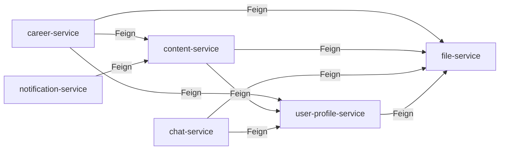

# Microservice Architecture

> Status: Verified · Last reviewed: 2026-09-30
> Evidence: `backend/services/*/src/main/java`, `backend/infrastructure/config-repo/*.yml`, `backend/pom.xml`

The Vithey backend decomposes business capabilities into independent deployables. Each service owns
its own PostgreSQL database, talks to the gateway (north) over REST, to peers (east–west)
synchronously via OpenFeign or asynchronously via RabbitMQ, and never shares a schema. [VERIFIED]

Part of the Vithey documentation set · Master index:
[`../00-project-overview/07-document-index.md`](../00-project-overview/07-document-index.md) ·
Siblings: [Backend architecture](01-backend-architecture.md) · [Service discovery](03-service-discovery.md) ·
[Event-driven](06-event-driven-architecture.md) · [Cache](07-cache-strategy.md).

## 1. Service responsibilities

| Service | Capability | Doc |
|---|---|---|
| `api-gateway` | Single entry point: routing, JWT validation, rate limiting, CORS | [05-api-gateway.md](05-api-gateway.md) |
| `auth-service` | Accounts, login/refresh, email/password reset, student verification | [services/auth-service.md](services/auth-service.md) |
| `user-profile-service` | Profiles, skills, settings, user search | [services/user-profile-service.md](services/user-profile-service.md) |
| `file-service` | MinIO uploads, metadata, presigned URLs, downloads | [services/file-service.md](services/file-service.md) |
| `content-service` | Posts (feed/jobs), comments, reactions, follows, mentions | [services/content-service.md](services/content-service.md) |
| `career-service` | Saved CV, job applications + status workflow | [services/career-service.md](services/career-service.md) |
| `finance-service` | Fee catalogue, student payments/alerts | [services/finance-service.md](services/finance-service.md) |
| `chat-service` | Peer chat (REST + STOMP/WebSocket), presence, reports | [services/chat-service.md](services/chat-service.md) |
| `notification-service` | Inbox, unread counts, device tokens, FCM push | [services/notification-service.md](services/notification-service.md) |
| `map-service` | Google Places nearby/text search, favorites, history | [services/map-service.md](services/map-service.md) |

## 2. Database-per-service

| Service | Database | Migrations (`db/migration`) |
|---|---|---|
| auth-service | `auth_db` | V1–V4 (4) |
| user-profile-service | `user_db` | V1–V3 (3) |
| file-service | `file_db` | V1–V3 (3) |
| content-service | `content_db` | V1–V5 (5) |
| career-service | `career_db` | V1–V3 ×2 (4 files) |
| finance-service | `finance_db` | V1–V3 (3) |
| chat-service | `chat_db` | V1–V3 (3) |
| notification-service | `notification_db` | V1–V4 (4) |
| map-service | `map_db` | V1 (1) |
| ai_core (Python) | `ai_db` | tables created by `vithey_ai/db.py` (no Flyway) |

`backend/infrastructure/scripts/init-databases.sql` creates all ten databases. There is no shared
database and no cross-database join. [VERIFIED: `init-databases.sql`, `EVIDENCE-BASIS.md` §8]

## 3. Synchronous calls (OpenFeign)

Feign clients resolve peers through Eureka and forward identity headers.

| Caller | Feign client | Target endpoint |
|---|---|---|
| user-profile | `FileServiceClient` | `GET /api/v1/files/{fileId}` |
| content | `UserProfileClient` | `GET /api/v1/users/{userId}` |
| content | `FileServiceClient` | `GET /api/v1/files/{fileId}` |
| career | `ContentServiceClient` | `GET /api/v1/posts/{postId}` |
| career | `UserProfileClient` | `GET /api/v1/users/{userId}` |
| career | `FileServiceClient` | `GET /api/v1/files/{fileId}` |
| chat | `UserProfileClient` | `GET /api/v1/users/{userId}` |
| chat | `FileServiceClient` | `GET /api/v1/files/{fileId}` |
| notification | `ContentServiceClient` | `GET /api/v1/posts/{postId}` |

[VERIFIED: `@FeignClient(name = …)` in each service]

`FeignAuthConfig` (content, chat, user-profile) installs a `RequestInterceptor` that forwards
`Authorization`, `X-User-Id`, `X-User-Email`, `X-User-Roles` from the inbound request. Circuit
breaking is enabled globally (`spring.cloud.openfeign.circuitbreaker.enabled: true`); named
Resilience4j instances exist for `content-service`, `file-service`, `user-profile-service` plus
`googlePlaces` in map-service. [VERIFIED: `config-repo/application.yml`, `FeignAuthConfig.java`]

## 4. Asynchronous calls (RabbitMQ)

Integration is event-driven over the single topic exchange `vithey.events`. Producers publish
domain events; notification-service binds one durable queue per routing key; user-profile and
finance consume their own queues. See the full routing-key/queue tables in
[Event-driven architecture](06-event-driven-architecture.md). [VERIFIED]

## 5. Security model (defense in depth)

1. **Gateway** validates every non-public `/api/v1/**` Bearer JWT and injects `X-User-Id`,
   `X-User-Roles`, `X-User-Email`.
2. **Each service** re-validates the JWT independently (`SecurityConfig` + `JwtAuthenticationFilter`,
   stateless, `@EnableMethodSecurity`).
3. Method security is only used on the two finance controllers (`@PreAuthorize("hasRole('STUDENT')")`);
   other role/ownership checks are imperative in service logic (e.g. career poster check, file CV
   owner-only download, chat participant checks).

Full detail: [API gateway](05-api-gateway.md) and [Error handling](08-error-handling.md).

## 6. Consistency and integration patterns (verified/observed)

| Pattern | Where |
|---|---|
| Idempotency key | `POST /api/v1/job-applications` (`Idempotency-Key` header), chat `client_message_id` |
| Dedupe key on ingest | notification `(user_id, dedupe_key)` unique index |
| Outbox | **None** — publishers log-and-swallow `AmqpException`; no transactional outbox |
| Saga/compensation | **None** |
| Cross-service ownership check | via Feign lookups (poster/author/owner) |

[VERIFIED: publishers `catch (AmqpException …)`, `RabbitMqConfig` queues]

## 7. Known limitations

- No transactional outbox: an event publish failure is logged, not retried or queued.
- Synchronous Feign calls add latency to post enrichment (author/media resolution per request).
- Enum vs DB `CHECK` supersets exist in career/content/chat/finance/notification
  (`EVIDENCE-BASIS.md` §8 defect 4).
- career-service has a duplicate Flyway `V3` and `UserCv @Id` mismatch (`EVIDENCE-BASIS.md` §8
  defects 1–2). Documented, not fixed.
