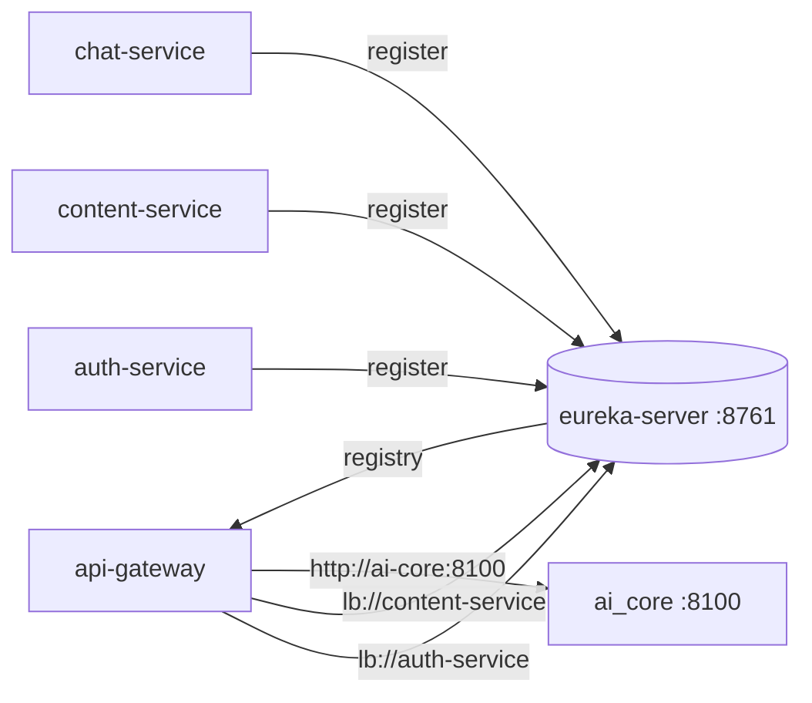

# Service Discovery (Eureka)

> Status: Verified · Last reviewed: 2026-09-30
> Evidence: `backend/infrastructure/eureka-server/`, `backend/infrastructure/config-repo/eureka-server.yml`, `backend/infrastructure/config-repo/api-gateway.yml`, `backend/infrastructure/config-repo/application.yml`

Vithey uses **Netflix Eureka** (Spring Cloud Netflix) for runtime service discovery. The gateway and
Feign callers resolve peer services by logical name (`lb://<service>`), so no fixed host list is
required for domain services. [VERIFIED]

Part of the Vithey documentation set · Master index:
[`../00-project-overview/07-document-index.md`](../00-project-overview/07-document-index.md) ·
Siblings: [Backend architecture](01-backend-architecture.md) · [Config server](04-config-server.md) ·
[API gateway](05-api-gateway.md).

## 1. Eureka server

| Item | Value |
|---|---|
| Module | `backend/infrastructure/eureka-server` |
| Main class | `com.vithey.eureka.EurekaServerApplication` (`@EnableEurekaServer`) |
| Port | `8761` (`SERVER_PORT`) |
| App name | `eureka-server` |
| Self-registration | `register-with-eureka: false` |
| Registry fetch | `fetch-registry: false` |
| Self-preservation | `enable-self-preservation: ${EUREKA_SELF_PRESERVATION:false}` |
| Empty-sync wait | `wait-time-in-ms-when-sync-empty: 0` |

[VERIFIED: `eureka-server.yml`, `EurekaServerApplication.java`]

## 2. Client registration

Every domain service and the gateway is a Eureka client with:

```yaml
eureka:
  client:
    enabled: ${EUREKA_CLIENT_ENABLED:true}
    service-url:
      defaultZone: ${EUREKA_URL:http://localhost:8761/eureka/}
  instance:
    prefer-ip-address: true
```

[VERIFIED: `config-repo/application.yml`, `config-repo/*-service.yml`]

| Variable | Purpose | Default |
|---|---|---|
| `EUREKA_CLIENT_ENABLED` | Toggle client registration/discovery | `true` |
| `EUREKA_URL` | Eureka `defaultZone` | `http://localhost:8761/eureka/` |
| `EUREKA_SELF_PRESERVATION` | Server self-preservation mode | `false` |

In Docker compose the value is overridden to `http://eureka-server:8761/eureka/`
(`application-docker.yml`, `CONFIG_SERVER_URL`-style hostnames). [VERIFIED]

> `map-service` sets `eureka.client.enabled: false` in its own local `application.yml` default
> (`EUREKA_CLIENT_ENABLED:false`), but the demo compose enables it (`EUREKA_CLIENT_ENABLED: "true"`).
> [VERIFIED]

## 3. How the gateway resolves services

All gateway routes except `ai-core` use `lb://<service-name>`:
`lb://auth-service`, `lb://career-service`, `lb://content-service`, `lb://file-service`,
`lb://finance-service`, `lb://chat-service` (plus `lb:ws://chat-service` for `/ws/**`),
`lb://notification-service`, `lb://map-service`, `lb://user-profile-service`.
[VERIFIED: `config-repo/api-gateway.yml`]

The `ai-core` route is a **direct** `http://ai-core:8100` target (not registered with Eureka):
`ai_core` is a Python service with no Eureka client. [VERIFIED]



## 4. Feign resolution

Feign clients declare `@FeignClient(name = "<eureka-name>")` (e.g. `file-service`,
`user-profile-service`, `content-service`), so Eureka resolves the instance list and Spring Cloud
LoadBalancer picks a replica. Circuit breakers apply per Resilience4j config
([Microservice architecture](02-microservice-architecture.md) §3). [VERIFIED]

## 5. Tests

`backend/infrastructure/eureka-server/src/test/java/com/vithey/eureka/` contains
`EurekaServerContextTest` and `EurekaServerSmokeIT`. Test implemented — current execution result
not independently verified. [VERIFIED: file exists]

## 6. Known limitations / TBD

- Single Eureka node; no peer replication or HA. [VERIFIED]
- Meta-refresh/lease tuning beyond defaults is not configured. `TBD — Requires confirmation.`
- Multi-replica behavior across hosts is not exercised (demo is single-PC). `TBD — Requires
  confirmation.`
