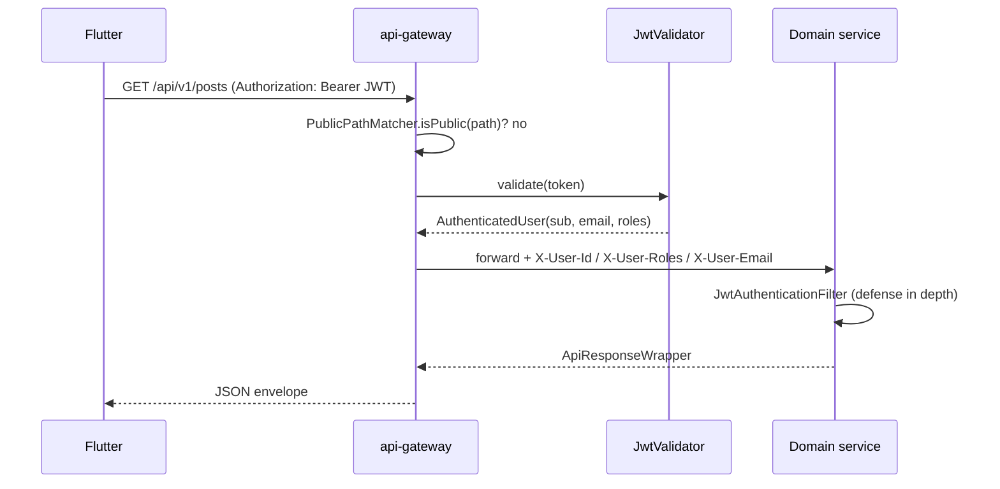

# API Gateway

> Status: Verified · Last reviewed: 2026-09-30
> Evidence: `backend/infrastructure/config-repo/api-gateway.yml`, `backend/services/api-gateway/src/main/**`, `backend/services/api-gateway/src/main/resources/application.yml`

`api-gateway` (port `8080`) is the single north/south boundary of the Vithey backend. It is a
**reactive Spring Cloud Gateway** application that validates JWTs, rate-limits, applies CORS, injects
identity headers downstream, and routes to Eureka-resolved services. [VERIFIED]

Part of the Vithey documentation set · Master index:
[`../00-project-overview/07-document-index.md`](../00-project-overview/07-document-index.md) ·
Siblings: [Backend architecture](01-backend-architecture.md) · [Service discovery](03-service-discovery.md) ·
[Config server](04-config-server.md) · [Error handling](08-error-handling.md) ·
API contract: [`../06-api/02-api-gateway.md`](../06-api/02-api-gateway.md).

## 1. Module layout

| Class | Role |
|---|---|
| `ApiGatewayApplication` | `@SpringBootApplication` |
| `filter/JwtAuthenticationGlobalFilter` | Validates Bearer JWT, injects `X-User-*` |
| `filter/RequestIdGlobalFilter` | Sets `X-Request-ID` on request/response |
| `filter/UserHeaderForwardFilter` | Placeholder/no-op |
| `security/JwtValidator` | HMAC verification, reads `sub`/`email`/`roles` |
| `security/AuthenticatedUser` | Record of validated identity |
| `util/PublicPathMatcher` | The allow-list of unauthenticated paths |
| `exception/GatewayErrorHandler` | Writes `{"error":{…}}` rejection bodies |
| `config/RedisRateLimiterConfig` | `RedisRateLimiter` + `rateLimitKeyResolver` |
| `config/CorsConfig`, `config/OpenApiConfig`, `config/VitheyGatewayProperties` | CORS, OpenAPI, rate-limit properties |

[VERIFIED: source tree]

## 2. Route table

From `config-repo/api-gateway.yml`. All routes carry `RequestRateLimiter` except the WebSocket route.

| # | Route id | Path predicate | Target | Rate limit (refill/burst) |
|---|---|---|---|---|
| 1 | `auth-service` | `/api/v1/auth/**`, `/api/v1/students/verify` | `lb://auth-service` | 100/100 |
| 2 | `career-user-cv` | `/api/v1/users/me/cv`, `/api/v1/users/me/cv/**` | `lb://career-service` | 100/100 |
| 3 | `content-user-social` | `/api/v1/users/*/follow`, `/followers`, `/following`, `/posts` | `lb://content-service` | 100/100 |
| 4 | `file-service` | `/api/v1/files/**` | `lb://file-service` | 100/100 |
| 5 | `content-service` | `/api/v1/posts/**`, `/api/v1/comments/**`, `/api/v1/reactions/**`, `/api/v1/follows/**` | `lb://content-service` | 100/100 |
| 6 | `career-service` | `/api/v1/jobs/**`, `/api/v1/job-applications/**` | `lb://career-service` | 100/100 |
| 7 | `finance-service` | `/api/v1/fees/**`, `/api/v1/payments/**` | `lb://finance-service` | 100/100 |
| 8 | `chat-service` | `/api/v1/conversations/**`, `/api/v1/messages/**`, `/api/v1/message-requests/**`, `/api/v1/users/*/report` | `lb://chat-service` | 100/100 |
| 9 | `chat-websocket` | `/ws/**` | `lb:ws://chat-service` | none |
| 10 | `notification-service` | `/api/v1/notifications/**` | `lb://notification-service` | 100/100 |
| 11 | `ai-core` | `/api/v1/ai/**` | `http://ai-core:8100` (direct, not Eureka) | 100/100 |
| 12 | `map-service` | `/api/v1/places/**` | `lb://map-service` | 30/60 |
| 13 | `user-profile-service` (order 1) | `/api/v1/users/**` (catch-all) | `lb://user-profile-service` | 100/100 |

Route **order** matters: the three specific `/api/v1/users/...` routes (career CV, content social,
chat report) are `order: 0`; the `/api/v1/users/**` catch-all is `order: 1`, so the specific routes
win. [VERIFIED]

Rate-limit defaults are `vithey.gateway.rate-limit.replenish-rate:burst-capacity` (100/100),
overridable via `VITHEY_GATEWAY_RATE_LIMIT_REPLENISH`, `VITHEY_GATEWAY_RATE_LIMIT_BURST`,
`VITHEY_GATEWAY_RATE_LIMIT_TOKENS`. The map route uses the places-specific keys
`VITHEY_GATEWAY_RATE_LIMIT_PLACES_REPLENISH`/`_BURST` (defaults 30/60). `key-resolver` is the bean
`#{@rateLimitKeyResolver}`. [VERIFIED]

## 3. JWT authentication filter

`JwtAuthenticationGlobalFilter` runs at `Ordered.HIGHEST_PRECEDENCE + 10` for every path that starts
with `/api/v1/` and is not public.



On missing/invalid token the gateway returns `401` and never reaches the service. `JwtValidator`
uses HMAC (`Keys.hmacShaKeyFor(vithey.jwt.secret)`) and reads `sub`, `email`, `roles`.
[VERIFIED: `JwtAuthenticationGlobalFilter.java`, `JwtValidator.java`]

## 4. Public paths (no JWT)

`PublicPathMatcher` allows exactly:

`/api/v1/auth/register`, `/api/v1/auth/login`, `/api/v1/auth/google`, `/api/v1/auth/refresh`,
`/api/v1/auth/forgot-password`, `/api/v1/auth/reset-password`, `/api/v1/auth/verify-email`,
`/actuator/**`, `/swagger-ui.html`, `/swagger-ui/**`, `/v3/api-docs/**`.

All other `/api/v1/**` requests require a Bearer token. Paths not starting with `/api/v1/` bypass the
JWT filter entirely. [VERIFIED]

> **Documented discrepancy:** `/api/v1/students/verify` is routed to auth-service but is **not** in
> the public matcher, so the gateway requires a JWT for it. [VERIFIED: `PublicPathMatcher.java`]

## 5. Rate limiting

- Redis-backed `RequestRateLimiter` on all `/api/v1/**` routes.
- `rateLimitKeyResolver` keys on `user:<X-User-Id>` when present, else `ip:<client-ip>` (honours
  `X-Forwarded-For`).
- Exceeding the token bucket yields `429`. [VERIFIED: `RedisRateLimiterConfig.java`]

## 6. CORS

`CorsConfig` uses `vithey.cors.allowed-origins` from `VITHEY_CORS_ALLOWED_ORIGINS` (default `*`).
[VERIFIED]

## 7. Rejection body

Gateway-originated errors use a compact body without `data`/`meta`
(`GatewayErrorHandler`):

```json
{ "error": { "code": "UNAUTHORIZED", "message": "Missing or invalid token", "details": [] } }
```

Downstream domain responses keep the standard `{data, meta, error}` envelope. See
[Error handling](08-error-handling.md).

## 8. Configuration and discovery

- Config via Spring Cloud Config native, baked into the config-server image
  ([Config server](04-config-server.md)).
- Eureka client enabled by `EUREKA_CLIENT_ENABLED`; `defaultZone` from `EUREKA_URL`.
- The `ai-core` route uses the static hostname `http://ai-core:8100`, resolving only inside the
  compose network. [VERIFIED]

## 9. Observability

`management.endpoints.web.exposure.include: health,info,metrics,prometheus`.
`GET /actuator/health` is the liveness probe (Docker healthcheck). [VERIFIED]

## 10. Tests

`api-gateway/src/test/java/com/vithey/gateway/`:
`ApiGatewayContextTest`, `ApiGatewaySmokeIT` (extends `AbstractRedisSmokeTestBase`),
`security/JwtValidatorTest`. Test implemented — current execution result not independently verified.
[VERIFIED]

## 11. Known limitations / TBD

- No request/response payload logging or distributed tracing beyond `X-Request-ID`. `TBD — Requires
  confirmation.`
- Whether the `ai-core` direct route should be hidden in production. `TBD — Requires confirmation.`
- No authentication on the OpenAPI/Swagger endpoints (public matcher includes them). `TBD — Requires
  confirmation.` (dev-only by design in `application-prod.yml`, which is not activated).
