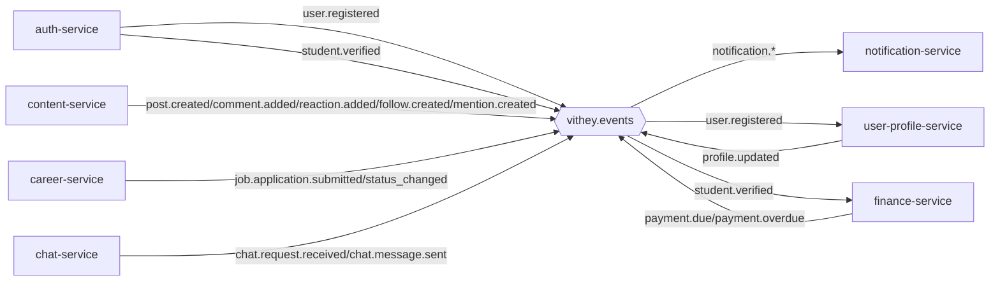
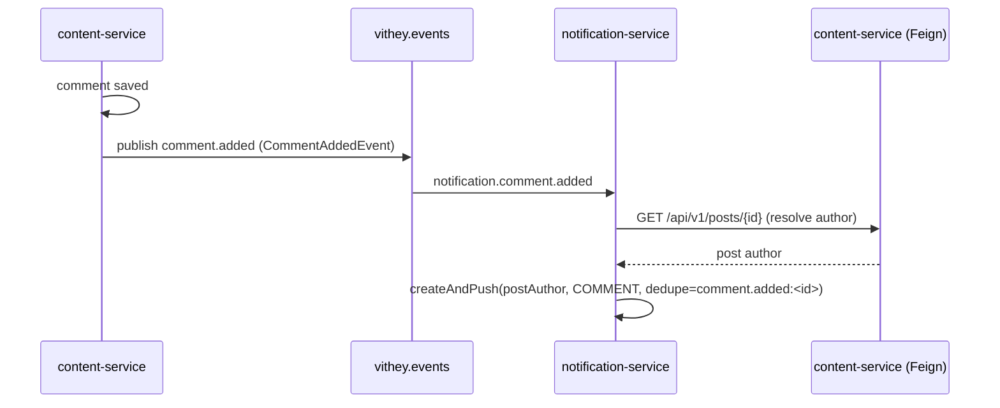

# Event-Driven Architecture (RabbitMQ)

> Status: Verified · Last reviewed: 2026-09-30
> Evidence: `backend/services/*/src/main/java/**/event/**`, `backend/services/*/src/main/java/**/config/RabbitMqConfig.java`, `backend/infrastructure/config-repo/application.yml`, `AGENTS.md`

Asynchronous integration between Vithey services uses **RabbitMQ** via Spring AMQP. There is a single
topic exchange, **`vithey.events`**, and **no Kafka anywhere**. Publishers use `RabbitTemplate`;
consumers use `@RabbitListener` on durable queues. [VERIFIED]

Part of the Vithey documentation set · Master index:
[`../00-project-overview/07-document-index.md`](../00-project-overview/07-document-index.md) ·
Siblings: [Microservice architecture](02-microservice-architecture.md) ·
[Cache strategy](07-cache-strategy.md) · [Error handling](08-error-handling.md).

## 1. Exchange and connection

| Item | Value |
|---|---|
| Exchange | `vithey.events` (topic, durable, non-auto-delete) |
| Env var | `VITHEY_EVENTS_EXCHANGE` (default `vithey.events`) |
| Host/port | `RABBITMQ_HOST` / `RABBITMQ_PORT` (defaults `localhost`/`5672`) |
| Credentials | `RABBITMQ_USERNAME` / `RABBITMQ_PASSWORD` |
| Listener concurrency | `RABBIT_CONCURRENCY` (1) / `RABBIT_MAX_CONCURRENCY` (2) |

[VERIFIED: `config-repo/application.yml`, per-service `RabbitMqConfig.java`]

## 2. Producers (routing keys)

| Routing key | Producer | Payload record | Published from |
|---|---|---|---|
| `user.registered` | auth | `UserRegisteredEvent` | `AuthService.register` |
| `student.verified` | auth | `StudentVerifiedEvent` | `StudentVerificationService.verify` |
| `post.created` | content | `PostCreatedEvent` | `PostService.createPost` |
| `comment.added` | content | `CommentAddedEvent` | `CommentService.addComment` |
| `reaction.added` | content | `ReactionAddedEvent` | `ReactionService.toggleReaction` |
| `follow.created` | content | `FollowCreatedEvent` | `FollowService.follow` |
| `mention.created` | content | `MentionCreatedEvent` | `CommentService.addComment` |
| `job.application.submitted` | career | `JobApplicationSubmittedEvent` | `JobApplicationService.apply` |
| `job.application.status_changed` | career | `JobApplicationStatusChangedEvent` | `JobApplicationService.updateStatus` |
| `chat.request.received` | chat | `ChatRequestReceivedEvent` | `ConversationService.createRequest` |
| `chat.message.sent` | chat | `ChatMessageSentEvent` | `MessageService.createMessage` |
| `payment.due` | finance | `PaymentDueEvent` | `PaymentAlertScheduler` |
| `payment.overdue` | finance | `PaymentOverdueEvent` | `PaymentAlertScheduler` |
| `profile.updated` | user-profile | `ProfileUpdatedEvent` | `ProfileService` |

[VERIFIED: each `*EventPublisher.java`]

## 3. Consumers (queues and bindings)

### notification-service

Ten durable queues, each bound to `vithey.events` with the routing key that equals its suffix:

| Queue | Routing key | Listener |
|---|---|---|
| `notification.comment.added` | `comment.added` | `ContentEventListener` |
| `notification.reaction.added` | `reaction.added` | `ContentEventListener` |
| `notification.follow.created` | `follow.created` | `ContentEventListener` |
| `notification.mention.created` | `mention.created` | `ContentEventListener` |
| `notification.chat.request.received` | `chat.request.received` | `ChatEventListener` |
| `notification.chat.message.sent` | `chat.message.sent` | `ChatEventListener` |
| `notification.payment.due` | `payment.due` | `FinanceEventListener` |
| `notification.payment.overdue` | `payment.overdue` | `FinanceEventListener` |
| `notification.job.application.submitted` | `job.application.submitted` | `CareerEventListener` |
| `notification.job.application.status_changed` | `job.application.status_changed` | `CareerEventListener` |

[VERIFIED: `notification-service/.../config/RabbitMqConfig.java`, `event/listener/*.java`]

### user-profile-service

| Queue | Routing key | Listener |
|---|---|---|
| `user-profile.user.registered` | `user.registered` | `UserRegisteredEventListener` |

[VERIFIED]

### finance-service

| Queue | Routing key | Listener |
|---|---|---|
| `finance.student.verified` | `student.verified` | `StudentVerifiedEventListener` |

[VERIFIED]

> `post.created` and `profile.updated` currently have **no consumer queue** in the repository; they
> are published but not consumed by any service here. [VERIFIED]

## 4. Message conversion

- Most services configure a plain `Jackson2JsonMessageConverter`.
- `finance-service` and `user-profile-service` configure
  `DefaultJackson2JavaTypeMapper` with `TypePrecedence.INFERRED` and `addTrustedPackages("*")`,
  because auth publishes with `__TypeId__=com.vithey.auth...` and the consumer DTO package differs.
  [VERIFIED: both `RabbitMqConfig.java`]

## 5. End-to-end topology

## 6. Reliability characteristics

- Publishers wrap `convertAndSend` in `try/catch (AmqpException)` and **log a warning** on failure;
  no transactional outbox or retry queue exists. [VERIFIED]
- Queues are durable; listeners use the default (auto-ack) semantics — no dead-letter exchange is
  configured. [VERIFIED]
- Idempotency on the consumer side is enforced in notification-service by a unique
  `(user_id, dedupe_key)` index (`ux_notifications_user_dedupe`); `createAndPush` returns `null` on a
  duplicate key. [VERIFIED]

## 7. Known limitations / TBD

- No dead-letter queue, retry policy, or poison-message handling. `TBD — Requires confirmation.`
- No event schema registry/versioning; payloads are Java records serialized as JSON. `TBD — Requires
  confirmation.`
- `post.created`/`profile.updated` are published without a consumer (informational). `TBD — Requires
  confirmation.`
