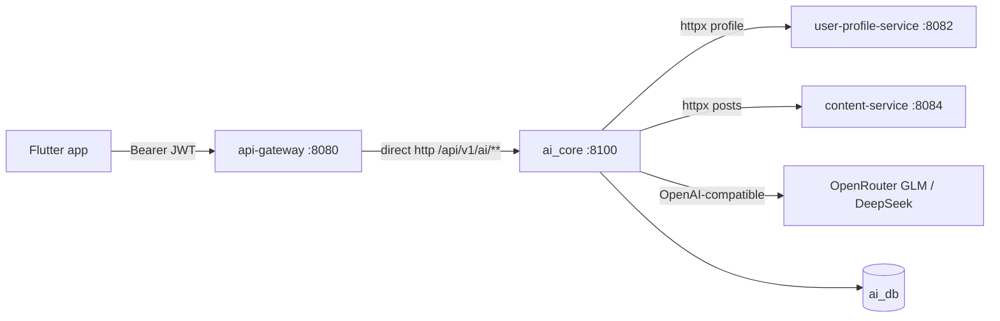

# AI Overview

> Status: Verified · Last reviewed: 2026-09-30
> Evidence: `ai_core/vithey_ai/`, `ai_core/main.py`, `ai_core/README.md`, `ai_core/pyproject.toml`, `backend/infrastructure/config-repo/api-gateway.yml`, `docs/_meta/EVIDENCE-BASIS.md` §6

**ai_core** is the Vithey AI engine: a self-contained Python package (`vithey_ai`, distribution
`vithey-ai` `0.2.0`) served by FastAPI on port `8100`. It owns the entire `/api/v1/ai/**` surface
(chat + CV) and returns the Vithey `{data, meta, error}` snake_case envelope. There is **no Java
ai-service** — it is retired. [VERIFIED]

Part of the Vithey documentation set · Master index:
[`../00-project-overview/07-document-index.md`](../00-project-overview/07-document-index.md) ·
Siblings: [AI architecture](02-ai-architecture.md) · [ai_core](03-ai-core.md) ·
[LLM integration](04-llm-integration.md) · [CV generation](05-cv-generation.md) ·
[Chatbot](06-chatbot.md) · [Prompts](07-prompt-management.md) · [Data flow](08-ai-data-flow.md) ·
[Rate limit & cache](09-rate-limit-cache.md) · [Error handling](10-ai-error-handling.md) ·
[Limitations](11-ai-limitations.md) · API: [`../06-api/12-ai-api.md`](../06-api/12-ai-api.md).

## 1. What is real vs. stub

This distinction is the single most important fact about the current AI feature.

| Capability | Status | Evidence |
|---|---|---|
| **CV generation** (`POST /api/v1/ai/cv/generate`, legacy `/api/v1/cv/generate`) | **Real LLM** — extraction + generation through `DeepSeekClient` | `cv_app_service.py`, `service.py`, `generation.py` |
| **Chat** (`/chat`, `/chat/stream`) | **Stub** — always `stub_reply`; no LLM call | `chat_service.py`, `chat_stubs.py` |
| **CV section suggest** (`/cv/suggest`) | **Stub** — `stub_cv_suggest` | `cv_app_service.py`, `chat_stubs.py` |
| Job matching / skill score / feed recommendations | **Not shipped** (Flutter stubs only) | `docs/06-api/01-api-overview.md` §7 |
| RAG / GDCE / general-service | **Out of scope**, explicitly not wired | `EVIDENCE-BASIS.md` §6 |

`AI_CHAT_MODE` defaults to `stub` and is read into config but **never branched on**; `ChatService`
calls `stub_reply` unconditionally. [VERIFIED: `config.py`, `chat_service.py`]

## 2. Architecture at a glance

The gateway routes `/api/v1/ai/**` directly to `http://ai-core:8100` (not via Eureka). Legacy engine
routes (`/api/v1/activities/**`, `/api/v1/cv/generate`) are **not** gateway-routed. [VERIFIED:
`api-gateway.yml`]

## 3. Runtime surfaces

| Surface | Prefix | Envelope | Gateway-routed |
|---|---|---|---|
| Flutter contract | `/api/v1/ai/**` | `{data, meta, error}` | Yes |
| Legacy engine | `/api/v1/activities/**`, `/api/v1/cv/generate`, `GET /health` | `{success, data, meta}` | No (health is internal) |

[VERIFIED: `api/flutter_envelope.py`, `api/envelope.py`, `api/flutter_routes.py`, `api/routes.py`]

## 4. Two ways to run it

- HTTP: `python main.py serve --port 8100` (or `uvicorn vithey_ai.api.app:create_app --factory`).
- Programmatic: import `VitheyAI` and call `extract_activity` / `generate_cv` /
  `build_cv_from_raw_posts` / `quality_report`.
- CLI: `python main.py extract|generate|serve` (`ai_core/main.py`).

[VERIFIED: `README.md`, `main.py`]

## 5. Configuration summary

All knobs are env-driven (`config.py`). LLM env names keep the legacy `DEEPSEEK_*` prefix but default
to OpenRouter GLM (`DEEPSEEK_BASE_URL=https://openrouter.ai/api/v1`,
`DEEPSEEK_MODEL=z-ai/glm-5.3-flash`). The only required secret is `DEEPSEEK_API_KEY` (names only,
never a value). See [LLM integration](04-llm-integration.md) and
[Rate limit & cache](09-rate-limit-cache.md).

## 6. Open items

- Whether chat will ever call a real LLM: currently out of scope (`AI_CHAT_MODE` unused).
- `cv_app_service.to_draft` field mismatch (see [Limitations](11-ai-limitations.md)).
- `ai_db` schema is created by Python, not Flyway; migration/retention governance is
  `TBD — Requires confirmation.`
