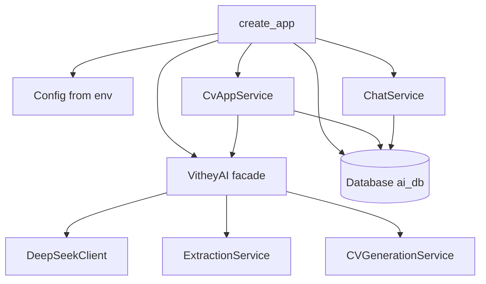

# AI Architecture

> Status: Verified · Last reviewed: 2026-09-30
> Evidence: `ai_core/vithey_ai/api/app.py`, `ai_core/vithey_ai/api/deps.py`, `ai_core/vithey_ai/service.py`, `ai_core/vithey_ai/db.py`, `ai_core/vithey_ai/config.py`

Part of the Vithey documentation set · Master index:
[`../00-project-overview/07-document-index.md`](../00-project-overview/07-document-index.md) ·
Siblings: [AI overview](01-ai-overview.md) · [ai_core](03-ai-core.md) · [Data flow](08-ai-data-flow.md) ·
[Rate limit & cache](09-rate-limit-cache.md) · [Error handling](10-ai-error-handling.md).

## 1. Module map

```
ai_core/
├── main.py                    # CLI: extract | generate | serve
├── vithey_ai/
│   ├── config.py              # env-driven Config (all knobs)
│   ├── schemas.py             # Pydantic models incl. StandardCV
│   ├── errors.py              # exception hierarchy
│   ├── logging_conf.py        # structured logging
│   ├── ratelimit.py           # sliding-window LLM limiter
│   ├── cache.py               # bounded extraction cache (SHA-256 key)
│   ├── deepseek_client.py     # OpenAI-compatible JSON-mode client
│   ├── prompts.py             # system prompts (internal)
│   ├── extraction.py          # single/batch activity extraction
│   ├── dedupe.py              # merge duplicate activities
│   ├── generation.py          # CV generation service
│   ├── normalize.py           # LLM JSON -> guaranteed StandardCV
│   ├── quality.py             # deterministic 0–100 CV scoring
│   ├── service.py             # public facade VitheyAI
│   ├── cv_app_service.py      # Flutter cv/generate + cv/suggest
│   ├── chat_service.py        # chat sessions + stub replies
│   ├── chat_stubs.py          # canned topic replies
│   ├── chat_registry.py       # in-memory stream cancel registry
│   ├── db.py                  # psycopg helpers + ai_db schema
│   └── api/
│       ├── app.py             # create_app() factory + middleware
│       ├── routes.py          # legacy engine routes + /health
│       ├── flutter_routes.py  # /api/v1/ai/** routes
│       ├── auth.py            # JWT / X-User-* auth dependency
│       ├── deps.py            # shared singletons
│       ├── envelope.py        # {success,data,meta}
│       ├── flutter_envelope.py# {data,meta,error} + page_meta
│       ├── middleware.py      # request-id, per-IP limit, body cap
│       └── schemas.py         # HTTP request models
├── tests/                     # 11 pytest files (+ fakes.py helper)
├── pyproject.toml             # deps + `server`/`dev` extras
└── Dockerfile
```

[VERIFIED: directory listing]

## 2. Application factory and dependency graph

`create_app(config=None, ai=None)`:

1. Creates `FastAPI(title="Vithey AI Core", version=Config.VERSION)`.
2. Builds `app.state.ai` via `build_ai(config)` → `VitheyAI(config=config)`; if `DEEPSEEK_API_KEY`
   is missing, logs `CV engine disabled` and sets `app.state.ai = None` (chat still starts).
3. Builds `app.state.db` via `build_database(config)` (returns `None` if `DATABASE_URL` unset).
4. Creates `app.state.chat_service = ChatService(db)` and
   `app.state.cv_app_service = CvAppService(ai, config, db)`.
5. Registers middleware, exception handler, and routers (`health_router`, legacy `router`,
   `flutter_router`).
6. Tests inject a fake `ai` (`create_app(ai=fake)`).

[VERIFIED: `api/app.py`, `api/deps.py`]



## 3. Middleware stack (outermost → innermost)

Added in this order in `create_app`:

1. `RequestContextMiddleware` — `X-Request-ID` in/out, `X-Process-Time-Ms`.
2. `PerClientRateLimitMiddleware` — per-client-IP 30/min (skips `/health`).
3. `BodySizeLimitMiddleware` — rejects bodies over 512 KB with a 413 envelope.
4. `CORSMiddleware` — allow-list from `API_CORS_ORIGINS`; exposes `X-Request-ID`,
   `X-Process-Time-Ms`, `X-RateLimit-Remaining`.

[VERIFIED: `api/app.py`, `api/middleware.py`]

## 4. Request authentication

`require_user` (`api/auth.py`) accepts either:

1. Gateway-injected `X-User-Id` (+ optional `X-User-Email`, `X-User-Roles`), or
2. A Bearer JWT verified with `VITHEY_JWT_SECRET`, `HS256`, requiring claim `sub`.

`UserDep = Annotated[CurrentUser, Depends(require_user)]` is used on all `/api/v1/ai/**` routes.
[VERIFIED]

## 5. Concurrency model

- FastAPI + uvicorn; worker count from `AI_CORE_WORKERS` (Dockerfile `--workers`).
- `chat/stream` offloads blocking DB calls with `asyncio.to_thread`.
- The extraction cache, LLM rate limiter and chat request registry are **in-process**
  (module/instance state), so they are not shared across workers/replicas. See
  [Rate limit & cache](09-rate-limit-cache.md) and [Limitations](11-ai-limitations.md).
- `Database.connection()` opens a new `psycopg` connection per operation (no pool). [VERIFIED]

## 6. Dependencies (`pyproject.toml`)

Core: `openai>=1.0`, `pydantic>=2.0`, `python-dotenv`, `httpx>=0.27`, `PyJWT>=2.8`,
`psycopg[binary]>=3.1`. Optional `server` extra: `fastapi>=0.110`, `uvicorn[standard]>=0.29`.
`dev` adds `pytest`. Python `>=3.10`; Docker image uses `python:3.12-slim`. [VERIFIED]

## 7. Open items

- In-process state (cache/limiter/registry) is incompatible with horizontal scaling without a shared
  store. `TBD — Requires confirmation.`
- DB connection pooling is absent. `TBD — Requires confirmation.`
