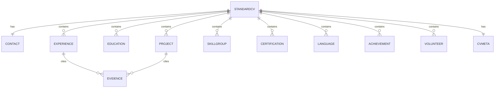

# ai_core Package

> Status: Verified · Last reviewed: 2026-09-30
> Evidence: `ai_core/vithey_ai/service.py`, `ai_core/vithey_ai/schemas.py`, `ai_core/vithey_ai/errors.py`, `ai_core/vithey_ai/__init__.py`, `ai_core/README.md`

Part of the Vithey documentation set · Master index:
[`../00-project-overview/07-document-index.md`](../00-project-overview/07-document-index.md) ·
Siblings: [AI architecture](02-ai-architecture.md) · [CV generation](05-cv-generation.md) ·
[LLM integration](04-llm-integration.md) · [Error handling](10-ai-error-handling.md).

## 1. Public facade: `VitheyAI`

`VitheyAI` (`service.py`) is the only class other code should use. It wires a `DeepSeekClient`,
`ExtractionService` and `CVGenerationService`.

```python
VitheyAI(api_key=None, config=None, client=None)
```

- `api_key` overrides `DEEPSEEK_API_KEY`.
- `client` injects a fake LLM (tests/DI); otherwise a real `DeepSeekClient` is created.
- Missing `DEEPSEEK_API_KEY` raises `ValueError`.

[VERIFIED]

### Public methods

| Method | Returns |
|---|---|
| `extract_activity(content, source_id, source_type="post")` | `ExtractedActivity` |
| `extract_activities(posts, on_error="skip")` | `ExtractionBatchResult` (dedupes, reports failures) |
| `generate_cv(activities, profile=None, target_role="", job_description="", language="en")` | `StandardCV` |
| `build_cv_from_raw_posts(posts, profile=None, target_role="", job_description="", language="en", on_error="skip")` | `StandardCV` |
| `quality_report(cv)` | `CVQualityReport` |

`generate_cv`/`build_cv_from_raw_posts` validate language, dedupe activities, then call the
generation service. `build_cv_from_raw_posts` raises `VitheyAIError` if no activity could be
extracted. [VERIFIED]

## 2. Pydantic schemas

Inputs: `RawPost(source_id, source_type, content)`, `UserProfile(full_name, headline, email, phone,
location, linkedin, github, website, skills[], education[])`.

Intermediate: `ExtractedActivity(activity_type, title, role, summary, tools[], skills[], outcome,
date, source_id, additional_source_ids[])`; `.all_source_ids` merges evidence IDs.

[VERIFIED: `schemas.py`]

## 3. `StandardCV` (the guaranteed output shape)

Every generated CV is a `StandardCV`; sections are always present (possibly empty) and in a fixed
order so renderers/exporters can rely on it.

| Field | Type |
|---|---|
| `contact` | `ContactInfo` (full_name, headline, email, phone, location, linkedin, github, website) |
| `summary` | `str` |
| `experience` | `ExperienceItem[]` (title, organization, location, period, start/end, bullets[], evidence[]) |
| `education` | `EducationItem[]` (degree, institution, field_of_study, period, details, evidence[]) |
| `projects` | `ProjectItem[]` (name, role, period, summary, tech_stack[], bullets[], link, evidence[]) |
| `skills` | `SkillGroup[]` (category, skills[]) |
| `certifications` | `CertificationItem[]` |
| `languages` | `LanguageItem[]` (name, proficiency) |
| `achievements` | `AchievementItem[]` |
| `volunteer` | `VolunteerItem[]` |
| `meta` | `CVMeta` (language, target_role, job_tailored, generated_at, model, activity_count) |

`section_lists()` maps display names to entries in standard order. [VERIFIED]



## 4. Quality report

`CVQualityReport(score, grade, issues[])`; `QualityIssue(code, message, field)`. Weights total 100
across `contact_name` 10, `contact_channels` 15, `summary` 20, `experience` 20, `projects` 10,
`education` 10, `skills` 10, `evidence` 5. Grades: `excellent ≥ 85`, `good ≥ 65`, `fair ≥ 40`,
else `weak`. Pure function, no LLM. See [CV generation](05-cv-generation.md) §5. [VERIFIED]

## 5. Error hierarchy

```
VitheyAIError
├── AIClientError              # LLM call failed after retries
├── AIResponseValidationError  # invalid JSON / schema validation failed
├── EmptyInputError            # no posts/activities
├── RateLimitError             # LLM sliding-window limit hit
├── InputLimitError            # too many posts / input too large
└── UnsupportedLanguageError   # language not in {en, km}
```

[VERIFIED: `errors.py`]

## 6. Batch extraction result

`ExtractionBatchResult(activities[], failures[])` with `.ok_count` / `.failure_count`;
`ExtractionFailure(source_id, error, recoverable)`. Duplicate activities are merged in
`extract_activities`. [VERIFIED]

## 7. Persistence helpers

`db.py` exposes `Database(dsn)`, `Database.connection()` (per-call psycopg connection with
commit/rollback), `ensure_schema()`, and `build_database(config)`. It creates `ai_chat_sessions`,
`ai_chat_messages`, `ai_cv_interactions` and two indexes. Returns `None` when `DATABASE_URL` is
unset. See [AI data flow](08-ai-data-flow.md). [VERIFIED]

## 8. Tests

`ai_core/tests/`: `test_api.py`, `test_cli.py`, `test_dedupe.py`, `test_deepseek_client.py`,
`test_extraction.py`, `test_flutter_routes.py`, `test_generation.py`, `test_normalize.py`,
`test_quality.py`, `test_ratelimit.py`, `test_service.py` plus `fakes.py` (12 test modules).
Test implemented — current execution result not independently verified. [VERIFIED: file listing,
`EVIDENCE-BASIS.md` §10]

## 9. Open items

- `to_draft` mapping mismatch (see [Limitations](11-ai-limitations.md)).
- No `ai_cv_interactions` read path; only inserts. `TBD — Requires confirmation.`
