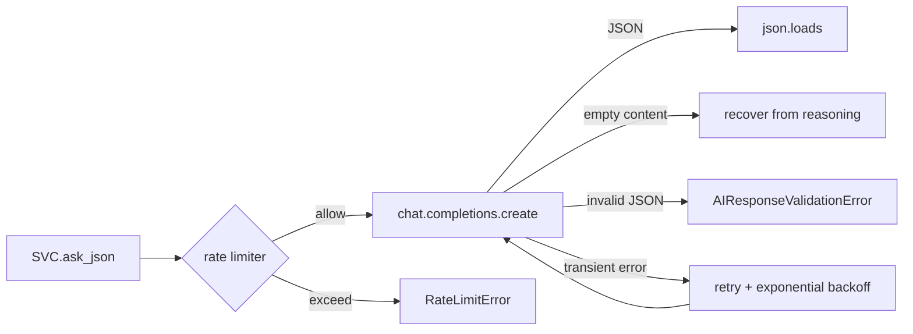

# LLM Integration (`DeepSeekClient`)

> Status: Verified · Last reviewed: 2026-09-30
> Evidence: `ai_core/vithey_ai/deepseek_client.py`, `ai_core/vithey_ai/config.py`, `ai_core/.env.example`, `ai_core/vithey_ai/api/routes.py`, `docs/_meta/EVIDENCE-BASIS.md` §6

Part of the Vithey documentation set · Master index:
[`../00-project-overview/07-document-index.md`](../00-project-overview/07-document-index.md) ·
Siblings: [AI overview](01-ai-overview.md) · [CV generation](05-cv-generation.md) ·
[Prompts](07-prompt-management.md) · [Rate limit & cache](09-rate-limit-cache.md) ·
[Error handling](10-ai-error-handling.md).

## 1. `DeepSeekClient`

`DeepSeekClient` wraps the official `openai.OpenAI` client configured with
`api_key=DEEPSEEK_API_KEY`, `base_url=DEEPSEEK_BASE_URL`, `timeout=TIMEOUT_SECONDS`. It is
**OpenAI-compatible**, so it works with DeepSeek direct or OpenRouter. [VERIFIED]

## 2. Defaults and env names

Env names keep the legacy **`DEEPSEEK_*`** prefix; defaults target OpenRouter GLM. Only names are
listed — never values.

| Env var | Default | Purpose |
|---|---|---|
| `DEEPSEEK_API_KEY` | `""` | Required for any LLM call; missing → engine disabled |
| `DEEPSEEK_BASE_URL` | `https://openrouter.ai/api/v1` | OpenAI-compatible base URL |
| `DEEPSEEK_MODEL` | `z-ai/glm-5.3-flash` | Model id |
| `TEMPERATURE` | `0.2` | Sampling temperature |
| `MAX_TOKENS` | `3000` | Max completion tokens |
| `TIMEOUT_SECONDS` | `30` | Per-request timeout |
| `MAX_RETRIES` | `2` | Retries for transient failures |
| `RETRY_BACKOFF_SECONDS` | `1.0` | Base backoff (doubles per attempt) |
| `RATE_LIMIT_ENABLED` | `true` | Toggle LLM rate limiter |
| `RATE_LIMIT_MAX_CALLS` | `120` | Calls per window |
| `RATE_LIMIT_WINDOW_SECONDS` | `60` | Window length |

The alternate direct-DeepSeek config is documented (commented) in `ai_core/.env.example`
(`DEEPSEEK_BASE_URL=https://api.deepseek.com`). [VERIFIED]

> The demo compose overrides some model knobs in-container: `MAX_TOKENS: "2000"`,
> `TIMEOUT_SECONDS: "60"`, `MAX_POSTS_PER_BUILD: "20"`, `MAX_CONTENT_CHARS: "2000"`,
> `API_RATE_LIMIT_PER_MINUTE: "20"`, `CACHE_MAX_SIZE: "128"`.
> [VERIFIED: `backend/docker-compose.demo.yml`]

## 3. JSON-mode request

`ask_json(system_prompt, user_prompt)` issues a single chat completion with
`response_format={"type": "json_object"}` and returns `json.loads(...)`. [VERIFIED]

## 4. Retry and error semantics

- Attempts = `1 + MAX_RETRIES`; transient `AIClientError`s are retried with delay
  `RETRY_BACKOFF_SECONDS * 2**attempt`.
- `AIResponseValidationError` (invalid/empty JSON) is **never retried** — it is deterministic.
- After exhausting attempts, raises `AIClientError`.
- The sliding-window rate limiter is checked before every call and raises `RateLimitError` when
  exceeded. [VERIFIED: `deepseek_client.py`, `ratelimit.py`]

## 5. Robust parsing / reasoning recovery

Because some OpenRouter models (notably GLM flash) may return empty `content` with text under
`reasoning`, the client:

1. If `content` is empty, calls `_extract_json_text(message)` which scans `content`, then
   `reasoning`, then `reasoning_details[].text` for the first `{...}` block.
2. Strips markdown code fences (`_strip_json_fence`) before parsing.
3. On `json.JSONDecodeError`, attempts the same recovery before failing.

[VERIFIED]

## 6. Health check

`GET /health` (legacy surface) reports `status: healthy` when `DEEPSEEK_API_KEY` is set, else
`degraded` with `checks.llm: unconfigured`. It does **not** make an LLM call. [VERIFIED:
`api/routes.py`]

## 7. Where the LLM is used

| Caller | LLM call? | Prompt |
|---|---|---|
| `ExtractionService.extract` | Yes | `EXTRACTION_SYSTEM_PROMPT` |
| `CVGenerationService.generate` | Yes | `CV_GENERATION_SYSTEM_PROMPT` |
| `ChatService.chat` / stream | No (stub) | — |
| `CvAppService.suggest` | No (stub) | — |

See [Prompts](07-prompt-management.md) and [CV generation](05-cv-generation.md).

## 8. Open items

- No token/cost accounting, prompt caching, or model fallback chain. `TBD — Requires confirmation.`
- No streaming from the LLM (chat SSE streams a stub). `TBD — Requires confirmation.`
- Exact production model/version selection is `TBD — Requires confirmation.`
