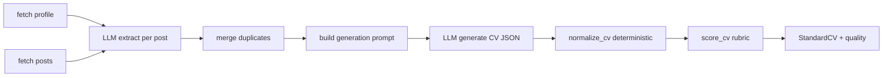

# CV Generation

> Status: Verified · Last reviewed: 2026-09-30
> Evidence: `ai_core/vithey_ai/cv_app_service.py`, `ai_core/vithey_ai/extraction.py`, `ai_core/vithey_ai/dedupe.py`, `ai_core/vithey_ai/normalize.py`, `ai_core/vithey_ai/quality.py`, `ai_core/vithey_ai/generation.py`, `ai_core/vithey_ai/service.py`

CV generation is the **real-LLM** capability of ai_core. It reads a user's own posts, extracts
structured activities, merges duplicates, generates a standard CV, normalises it deterministically,
and scores its completeness. [VERIFIED]

Part of the Vithey documentation set · Master index:
[`../00-project-overview/07-document-index.md`](../00-project-overview/07-document-index.md) ·
Siblings: [AI overview](01-ai-overview.md) · [LLM integration](04-llm-integration.md) ·
[Prompts](07-prompt-management.md) · [Data flow](08-ai-data-flow.md) · [Limitations](11-ai-limitations.md) ·
API: [`../06-api/12-ai-api.md`](../06-api/12-ai-api.md).

## 1. Pipeline

Steps:

1. **Fetch** profile (`GET {USER_PROFILE_BASE_URL}/api/v1/users/{id}`) and posts
   (`GET {CONTENT_BASE_URL}/api/v1/users/{id}/posts?page=1&limit=AI_CV_MAX_POSTS`), both via `httpx`
   with a 5 s timeout and `X-User-Id` + forwarded `Authorization`. Failures return `{}` / `[]`.
2. **Extract** each post with the JSON-mode LLM (cached by SHA-256 of content).
3. **Dedupe** activities by normalized title + type.
4. **Generate** the standard CV JSON via the LLM.
5. **Normalize** to a guaranteed `StandardCV`.
6. **Score** with the deterministic 100-point rubric.

[VERIFIED: `cv_app_service.py`, `service.py`, `extraction.py`, `dedupe.py`, `normalize.py`, `quality.py`]

## 2. Extraction (`ExtractionService`)

- Empty content → `EmptyInputError`.
- Content longer than `MAX_CONTENT_CHARS` is truncated (a note is appended to the prompt).
- Cache key = SHA-256(`source_type:content`); cached extraction is reused even if `source_id` differs.
- The model's `source_id` is overwritten with the real one; parsing failures raise
  `AIResponseValidationError`. Batch extraction enforces `MAX_POSTS_PER_BUILD`.
- `on_error="skip"` records an `ExtractionFailure` and continues; `"fail"` re-raises.

[VERIFIED]

## 3. Dedupe (`merge_activities`)

Two activities merge when their alphanumeric-lowercased `title` and `activity_type` match. Merging
preserves every `source_id` as evidence, keeps the longer `summary`/`outcome`, the lexicographically
later partial date, and the union of `tools`/`skills` (de-duplicated, order-preserving). [VERIFIED]

## 4. Normalize (`normalize_cv` → `StandardCV`)

`normalize_cv` never raises on odd payloads; worst case is a valid, mostly-empty CV. It:

- Tolerates missing/extra keys, wrong types, string-instead-of-list.
- Maps stray headings ("Work History", "My Projects", …) onto canonical buckets (legacy
  `{"sections":[...]}` support included).
- Merges `UserProfile` into the contact header and education (profile always wins).
- Filters evidence to known `source_id`s.
- Fills an empty/short summary with a fact-based template (English or Khmer) — no hallucination.
- Sorts experience/projects by best-effort date descending.
- Sets `CVMeta` (language, target_role, `job_tailored = bool(job_description)`, `generated_at` UTC,
  model, activity count).

Language must be `en` or `km` (`validate_language`), else `UnsupportedLanguageError`. [VERIFIED]

## 5. Quality rubric (`score_cv`)

| Dimension | Weight | Rule |
|---|---|---|
| Contact name | 10 | present |
| Contact channels | 15 | email+phone=full, one=half |
| Summary | 20 | ≥ 12 words=full, > 0=half |
| Experience | 20 | ≥ 1 entry=full |
| Projects | 10 | ≥ 1 entry=full |
| Education | 10 | ≥ 1 entry=full |
| Skills | 10 | ≥ 5 skills=full, > 0=half |
| Evidence trail | 5 | all entries cite evidence=full, some=half |

Grades: `excellent ≥ 85`, `good ≥ 65`, `fair ≥ 40`, else `weak`. Issues carry codes such as
`MISSING_NAME`, `MISSING_CONTACT`, `SHORT_SUMMARY`, `NO_SKILLS`, `EMPTY_HISTORY`, `NO_EDUCATION`.
[VERIFIED]

## 6. Flutter endpoint flow (`CvAppService.generate`)

`POST /api/v1/ai/cv/generate` → `CvAppService.generate(user_id, authorization, target_role,
language, template_id)`:

- If no posts → **incomplete draft** (`incomplete_profile: true` + guidance message) rather than an
  error.
- Otherwise `VitheyAI.build_cv_from_raw_posts(...)` → `quality_report` → `to_draft(...)` maps the
  `StandardCV` to the Flutter `AiCvDraft`.
- Any exception → incomplete draft (never a 500).

Response fields: `full_name, summary, skills[], education[], experience[], projects[], contact,
template_id, incomplete_profile, incomplete_message, quality_score, quality_grade`. [VERIFIED]

> **Known limitation:** `to_draft` reads `group["items"]` for skills and `item["summary"]` for
> experience, but the normalizer emits `SkillGroup.skills` and `ExperienceItem.bullets`. This
> field-name mismatch can drop skills/experience bullets from the Flutter draft. See
> [Limitations](11-ai-limitations.md) §2. [VERIFIED]

## 7. Legacy engine endpoint

`POST /api/v1/cv/generate` (not gateway-routed) returns `{cv, quality}` and requires exactly one of
`posts` or `activities`; otherwise `INVALID_INPUT` (400). [VERIFIED: `api/routes.py`]

## 8. Open items

- Template rendering/PDF export is **not** in ai_core; `template_id` is passed through only.
  `TBD — Requires confirmation.`
- Whether `cv/generate` persists anything (it does not; only `/cv/suggest` writes
  `ai_cv_interactions`). `TBD — Requires confirmation.`
