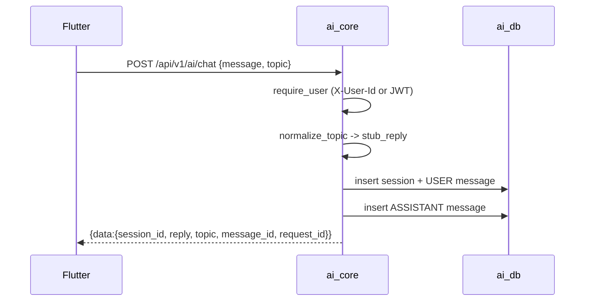

# Chatbot (Stub)

> Status: Stub/Placeholder · Last reviewed: 2026-09-30
> Evidence: `ai_core/vithey_ai/chat_service.py`, `ai_core/vithey_ai/chat_stubs.py`, `ai_core/vithey_ai/chat_registry.py`, `ai_core/vithey_ai/cv_app_service.py`, `ai_core/vithey_ai/api/flutter_routes.py`

The Vithey AI chatbot is **not** LLM-backed. `AI_CHAT_MODE` defaults to `stub` but is **never
branched on**; `ChatService` always calls `stub_reply`. `/cv/suggest` is likewise a stub. Chat
session/message persistence is real. [VERIFIED]

Part of the Vithey documentation set · Master index:
[`../00-project-overview/07-document-index.md`](../00-project-overview/07-document-index.md) ·
Siblings: [AI overview](01-ai-overview.md) · [AI architecture](02-ai-architecture.md) ·
[CV generation](05-cv-generation.md) · [Data flow](08-ai-data-flow.md) · [Limitations](11-ai-limitations.md) ·
API: [`../06-api/12-ai-api.md`](../06-api/12-ai-api.md).

## 1. Topics and stubs

`chat_stubs.py` defines topics `CV, JOB, INTERVIEW, STUDENT, FINANCE`. `normalize_topic` uppercases,
maps aliases (`CV_HELP→CV`, `MOCK_INTERVIEW→INTERVIEW`, `FINANCE_QA→FINANCE`, `MEDIA→STUDENT`) and
falls back to `STUDENT` for unknown values. `stub_reply(topic, message)` returns a canned,
topic-specific Markdown reply (echoing a truncated copy of the user message) and explicitly states it
is a demo stub. `stub_cv_suggest(section, original_text)` returns a canned "improved" section. [VERIFIED]

> No RAG, no GDCE, no retrieval and no LLM call occur on the chat path. [VERIFIED: `EVIDENCE-BASIS.md` §6]

## 2. REST chat (`ChatService`)

`chat(user_id, message, topic, session_id)`:

1. `registry.register(user_id)` → `request_id`.
2. Resolve/create session (persisted when `DATABASE_URL` is set; in-memory fallback otherwise).
3. Insert the USER message and touch the session.
4. Compute `reply = stub_reply(topic, message)`.
5. Insert the ASSISTANT message; mark the request done.

Returns `{session_id, reply, topic, message_id, request_id}`. [VERIFIED]

## 3. Streaming chat (SSE)

`POST /api/v1/ai/chat/stream` emits server-sent events via `StreamingResponse`:

| Event | Payload |
|---|---|
| `meta` | `{request_id, session_id, user_message_id, topic}` |
| `token` | plain-text chunk (24 chars, `chunk_reply`) |
| `done` | `{request_id, session_id, message_id, cancelled}` |
| `error` | `{code:"UPSTREAM_ERROR", message}` |

- Chunks are emitted with a 20 ms delay (`asyncio.sleep(0.02)`).
- Cancellation is checked via `ChatRequestRegistry.is_cancelled` between chunks.
- `DELETE /api/v1/ai/chat/requests/{request_id}` cancels a stream.
- Blocking DB work is offloaded with `asyncio.to_thread`.

[VERIFIED: `api/flutter_routes.py`, `chat_service.py`, `chat_registry.py`]

## 4. Session and message persistence

`ChatService` writes to `ai_db` when a `Database` is available:

| Table | Columns |
|---|---|
| `ai_chat_sessions` | `id`, `user_id`, `topic`, `title` (first 40 chars of the message), `created_at`, `updated_at` |
| `ai_chat_messages` | `id`, `session_id` (FK, cascade), `role` (`USER`/`ASSISTANT`), `content`, `created_at` |
| `ai_cv_interactions` | `id`, `user_id`, `section`, `original_text`, `suggested_text`, `cv_file_id`, `created_at` |

Endpoints: `GET /sessions` (page/limit, newest first), `GET /sessions/{id}/messages` (ASC),
`DELETE /sessions/{id}`, `POST /messages/{id}/regenerate` (assistant messages only).
When `DATABASE_URL` is unset, an in-memory store is used (local tests). [VERIFIED: `db.py`,
`chat_service.py`]

## 5. CV suggest (`/cv/suggest`)

`CvAppService.suggest` returns `stub_cv_suggest(...)` and, when a DB is available, inserts an
`ai_cv_interactions` row with the user, section, original text and suggestion. Returns
`{suggested_text, interaction_id}`. [VERIFIED]

## 6. Sequence (chat, stub)

## 7. Known limitations / TBD

- Chat is a **stub**; wiring a real LLM or RAG is explicitly out of scope. `AI_CHAT_MODE` is dead
  configuration today. `TBD — Requires confirmation.`
- The cancel registry is in-process; cancellation only works within one worker. `TBD — Requires
  confirmation.`
- `ChatBody.message` enforces `min_length=1` only; the `max 4000` rule in `api_docs.md` is not
  implemented. [VERIFIED]
- Session/message retention in `ai_db`: `TBD — Requires confirmation.`
