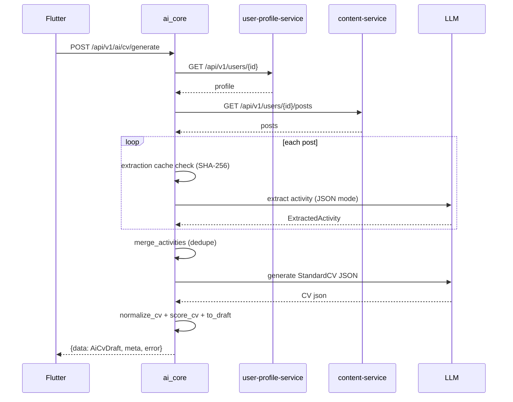

# AI Data Flow

> Status: Verified · Last reviewed: 2026-09-30
> Evidence: `ai_core/vithey_ai/cv_app_service.py`, `ai_core/vithey_ai/service.py`, `ai_core/vithey_ai/chat_service.py`, `ai_core/vithey_ai/db.py`, `ai_core/vithey_ai/api/flutter_routes.py`

Part of the Vithey documentation set · Master index:
[`../00-project-overview/07-document-index.md`](../00-project-overview/07-document-index.md) ·
Siblings: [AI overview](01-ai-overview.md) · [CV generation](05-cv-generation.md) ·
[Chatbot](06-chatbot.md) · [Rate limit & cache](09-rate-limit-cache.md).

## 1. CV generation data flow

```mermaid
flowchart TD
  U[Flutter] -->|POST /api/v1/ai/cv/generate| GW[api-gateway]
  GW --> AI[ai_core :8100]
  AI -->|require_user| AUTH[identity]
  AI -->|httpx GET /users/{id}| PROF[user-profile-service]
  AI -->|httpx GET /users/{id}/posts| CONT[content-service]
  PROF -->|profile json| AI
  CONT -->|posts json| AI
  AI -->|cache lookup| CACHE[(in-memory extraction cache)]
  AI -->|JSON-mode| LLM[OpenRouter GLM]
  LLM -->|activities + CV json| AI
  AI --> NORM[normalize_cv]
  NORM --> QUAL[score_cv]
  QUAL --> DRAFT[to_draft AiCvDraft]
  DRAFT --> AI
  AI -->|{data,meta,error}| GW
  GW --> U
```

Notes:

- Profile fetch: `UserProfileClient`-equivalent via `httpx` to `USER_PROFILE_BASE_URL`
  (`GET /api/v1/users/{id}`), 5 s timeout, forwards `Authorization` + `X-User-Id`.
- Posts fetch: `GET {CONTENT_BASE_URL}/api/v1/users/{id}/posts?page=1&limit=AI_CV_MAX_POSTS`.
- No persistence on this path. `ai_db` is **not** written by `cv/generate`.

[VERIFIED]

## 2. CV generation sequence



If posts are empty or the engine/LLM fails, ai_core returns an **incomplete draft**
(`incomplete_profile: true`) instead of an error. [VERIFIED: `cv_app_service.py`]

## 3. Chat data flow (stub)

```mermaid
flowchart LR
  U[Flutter] -->|POST /ai/chat or /ai/chat/stream| AI[ai_core]
  AI -->|normalize_topic| STUB[stub_reply]
  STUB --> AI
  AI -->|insert session/messages| DB[(ai_db)]
  AI -->|{reply or SSE tokens}| U
```

- No LLM call on the chat path. [VERIFIED]
- With `DATABASE_URL` unset, sessions/messages are held in memory. [VERIFIED]

## 4. Database writes (`ai_db`)

| Endpoint | Writes |
|---|---|
| `POST /ai/chat`, `/ai/chat/stream` | `ai_chat_sessions` (insert/touch), `ai_chat_messages` (user + assistant) |
| `POST /messages/{id}/regenerate` | `ai_chat_messages.content` update |
| `DELETE /ai/sessions/{id}` | `ai_chat_sessions` (cascade delete messages) |
| `POST /ai/cv/suggest` | `ai_cv_interactions` (insert) |
| `POST /ai/cv/generate` | none |

`ensure_schema()` runs at startup via `build_database`. [VERIFIED: `db.py`]

## 5. Outbound dependencies and failure handling

| Dependency | Failure behaviour |
|---|---|
| user-profile-service | returns `{}` (profile optional) |
| content-service | returns `[]` → incomplete draft |
| LLM | raises → incomplete draft for `/cv/generate`; chat path unaffected |

[VERIFIED]

## 6. Open items

- Whether `to_draft` should read `skills`/`bullets` (field mismatch) — see
  [Limitations](11-ai-limitations.md). [VERIFIED defect]
- No read API for persisted chat history beyond session/message listing. `TBD — Requires
  confirmation.`
