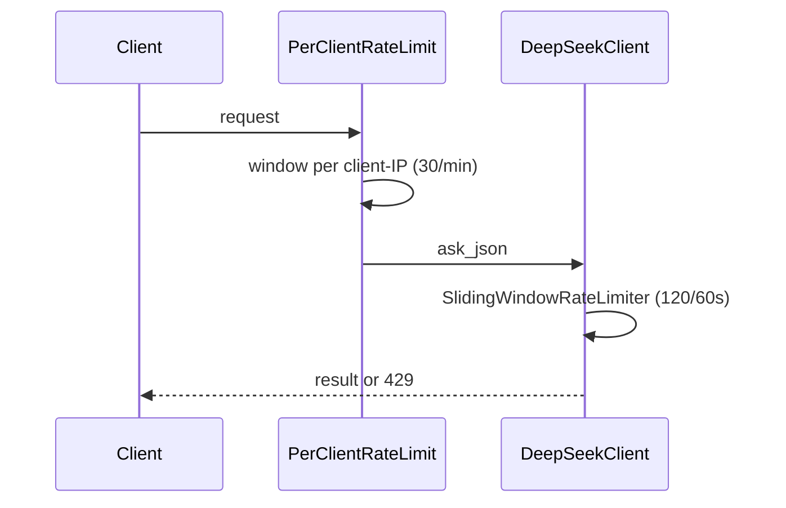

# Rate Limiting and Caching

> Status: Verified · Last reviewed: 2026-09-30
> Evidence: `ai_core/vithey_ai/ratelimit.py`, `ai_core/vithey_ai/cache.py`, `ai_core/vithey_ai/api/middleware.py`, `ai_core/vithey_ai/config.py`, `backend/docker-compose.demo.yml`

ai_core protects LLM cost and its own HTTP surface with three independent, **in-process** mechanisms
plus input caps. None of them use Redis or a shared store. [VERIFIED]

Part of the Vithey documentation set · Master index:
[`../00-project-overview/07-document-index.md`](../00-project-overview/07-document-index.md) ·
Siblings: [LLM integration](04-llm-integration.md) · [AI architecture](02-ai-architecture.md) ·
[Error handling](10-ai-error-handling.md) · [Limitations](11-ai-limitations.md).

## 1. Three layers

| Layer | Scope | Mechanism | Default |
|---|---|---|---|
| Per-IP HTTP limit | Every route except `/health` | `PerClientRateLimitMiddleware` (sliding window) | 30 req/min |
| Body size cap | Every request | `BodySizeLimitMiddleware` (`Content-Length`) | 512 KB |
| LLM call limit | Every LLM call | `SlidingWindowRateLimiter` in `DeepSeekClient` | 120 calls / 60 s |
| Extraction cache | `ExtractionService` | `InMemoryCache` (FIFO, bounded) | 512 entries |

[VERIFIED]

## 2. LLM rate limiter (`ratelimit.py`)

`SlidingWindowRateLimiter(max_calls, window_seconds)` is thread-safe (`threading.Lock`) and deque-based.
`max_calls <= 0` disables limiting. On overflow it raises `RateLimitError` with a retry hint.
Configured from `RATE_LIMIT_ENABLED`, `RATE_LIMIT_MAX_CALLS`, `RATE_LIMIT_WINDOW_SECONDS`. One limiter
instance lives per `DeepSeekClient` (per process). [VERIFIED]

## 3. HTTP per-IP limiter (`middleware.py`)

- 60-second window keyed by `request.client.host`.
- Skips `/health`.
- Returns a 429 envelope with `details.retry_after_seconds` and a `Retry-After` header.
- Sets `X-RateLimit-Limit` / `X-RateLimit-Remaining` on responses.
- Configured from `API_RATE_LIMIT_PER_MINUTE`; `<= 0` disables it. [VERIFIED]

## 4. Body size cap

`BodySizeLimitMiddleware` rejects requests whose `Content-Length` exceeds `API_MAX_BODY_BYTES`
(default 512 × 1024) with a 413 envelope (`REQUEST_TOO_LARGE`). [VERIFIED]

## 5. Extraction cache (`cache.py`)

- Bounded `OrderedDict`, FIFO eviction at `CACHE_MAX_SIZE` (default 512).
- Key = SHA-256 of `source_type:content`, so identical text never pays twice even across `source_id`s.
- Only the extraction result is cached (not the final CV generation).
- `CACHE_ENABLED` toggles it. [VERIFIED]

## 6. Input caps (cost controls)

| Env var | Default | Effect |
|---|---|---|
| `MAX_POSTS_PER_BUILD` | `100` | Max posts per build (`InputLimitError` beyond) |
| `MAX_CONTENT_CHARS` | `6000` | Post truncation before extraction |
| `AI_CV_MAX_POSTS` | `20` | Max posts fetched from content-service (clamped 1..50) |
| `MAX_TOKENS` | `3000` | Completion cap |
| `TEMPERATURE` | `0.2` | Low temperature for determinism |
| `TIMEOUT_SECONDS` | `30` | Request timeout |
| `MAX_RETRIES` | `2` | Bounded retries |

[VERIFIED: `config.py`; `EVIDENCE-BASIS.md` §6]

## 7. Demo-stack overrides

`backend/docker-compose.demo.yml` tightens the container for the Profile M demo:

| Var | Compose value |
|---|---|
| `MAX_POSTS_PER_BUILD` | `20` |
| `MAX_CONTENT_CHARS` | `2000` |
| `MAX_TOKENS` | `2000` |
| `TIMEOUT_SECONDS` | `60` |
| `API_RATE_LIMIT_PER_MINUTE` | `20` |
| `CACHE_MAX_SIZE` | `128` |

[VERIFIED]

## 8. Known limitations / TBD

- All limits and the cache are **per process**; multiple uvicorn workers/replicas multiply the
  effective budget. `TBD — Requires confirmation.`
- No token/cost metering or global budget. `TBD — Requires confirmation.`
- The HTTP limiter keys on the direct client IP; behind the gateway the client IP may be the gateway
  unless `X-Forwarded-For` is honoured (the middleware does not read it). [VERIFIED limitation]
