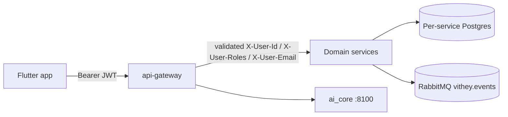

# Security Overview

> Status: Verified baseline (code-level) · Last reviewed: 2026-09-30
> Evidence: `backend/services/api-gateway/.../filter/`, `backend/services/*/src/main/java/**/config/SecurityConfig.java`, `backend/services/*/src/main/java/**/security/`, `backend/infrastructure/config-repo/application*.yml`, `ai_core/vithey_ai/api/auth.py`, `vithey_app/lib/core/network/dio_client.dart`
> Evidence anchor: `../_meta/EVIDENCE-BASIS.md` §5, §13
> Governance status: **Not yet formally assessed.** No penetration test or security audit has been performed.

## 1. Purpose & scope

This is the entry point to the security documentation set for **Vithey**. It summarises how
identity, authorization, data protection, and secrets are handled across the monorepo and
points to the detailed documents. Everything here is a **code-level observation** from the
repository; nothing in this set constitutes an audit, penetration test, or certification.

| Document | Topic |
| --- | --- |
| [02-authentication.md](02-authentication.md) | Login, registration, token issuance/lifecycle |
| [03-authorization-RBAC.md](03-authorization-RBAC.md) | Roles `USER`/`STUDENT`/`COMPANY`/`ADMIN`, method & ownership checks |
| [04-JWT-security.md](04-JWT-security.md) | JWT structure, signing, TTL, validation |
| [05-password-security.md](05-password-security.md) | bcrypt, password policy, reset flow |
| [06-data-security.md](06-data-security.md) | At-rest/transport handling, tokens stored hashed, DB isolation |
| [07-api-security.md](07-api-security.md) | Gateway edge, CORS, rate limiting, headers |
| [08-secrets-management.md](08-secrets-management.md) | Environment variables, `.env` policy |
| [09-security-checklist.md](09-security-checklist.md) | Pre-release gate checklist |
| [10-vulnerability-assessment.md](10-vulnerability-assessment.md) | Findings register (code-level observations only) |
| [11-security-review-report.md](11-security-review-report.md) | Review report — **no formal review performed** |

Master index: [`../00-project-overview/07-document-index.md`](../00-project-overview/07-document-index.md).

## 2. Defensive model (as implemented)

- **Edge authentication** — the gateway validates the Bearer JWT and injects identity
  headers ([VERIFIED] `JwtAuthenticationGlobalFilter`, `JwtValidator`, `PublicPathMatcher`).
- **Defense in depth** — every domain service re-runs its own security filter chain and,
  when a Bearer token is present, re-validates the JWT locally ([VERIFIED]
  `auth-service .../SecurityConfig.java`, `JwtAuthenticationFilter.java`).
- **Stateless sessions** — services use `SessionCreationPolicy.STATELESS` and disable CSRF
  because there is no cookie/session state ([VERIFIED] each `SecurityConfig`).
- **Identity propagation** — `X-User-Id`, `X-User-Roles`, `X-User-Email`; **no** shared
  session store ([VERIFIED] `JwtAuthenticationGlobalFilter`).
- **AI surface** — `ai_core` trusts the gateway identity headers or re-decodes an HS256
  JWT with `VITHEY_JWT_SECRET` ([VERIFIED] `ai_core/vithey_ai/api/auth.py`).

## 3. What is implemented (summary)

| Area | Implementation | Tag |
| --- | --- | --- |
| Password storage | bcrypt (`BCryptPasswordEncoder`) | [VERIFIED] `PasswordEncoderConfig.java` |
| Access token | HMAC-signed JWT, 15m TTL, claims `sub`, `email`, `roles` | [VERIFIED] `JwtProvider.java`, `config-repo/application.yml` |
| Refresh token | opaque 48-byte random, stored SHA-256 hash, rotated on refresh, revoked on logout | [VERIFIED] `TokenService.java`, `TokenHash.java`, migrations |
| Email-verify / reset tokens | opaque random, stored SHA-256 hash, single-use, expiring | [VERIFIED] `AuthService.java`, `PasswordResetService.java` |
| Authorization | roles from JWT; method security configured everywhere but `@PreAuthorize` used only in finance | [VERIFIED] `FeeController.java`, `PaymentController.java` |
| File authorization | CV download owner-only; delete owner-only; MIME allow-list; filename sanitisation | [VERIFIED] `FileController.java`, `FileValidationService.java` |
| Edge hardening | Redis rate limiter on all HTTP routes, CORS filter, request-id | [VERIFIED] `api-gateway.yml`, `CorsConfig.java` |
| Secrets | env-variable names only; `.env` gitignored; `.env.example` tracked | [VERIFIED] `.gitignore`, `*.env.example` |

## 4. Known gaps & discrepancies (see findings register)

- **RBAC is thin:** only `finance-service` uses `@PreAuthorize`; other services rely on
  "authenticated" plus ad-hoc ownership logic in the service layer. [VERIFIED]
- **Gateway trusts `X-User-*` headers at services:** if a domain service port is reachable
  directly, its `JwtAuthenticationFilter` will trust unauthenticated `X-User-Id` headers
  (defaulting roles to `USER`). [VERIFIED] `JwtAuthenticationFilter.java` (all services)
- **CORS default `*`:** `vithey.cors.allowed-origins` defaults to `*` and `allowCredentials`
  is `false` (so cookies are not exposed). [VERIFIED] `CorsConfig.java`, `api-gateway.yml`
- **`ai_core` default JWT secret** is a placeholder (`change-me-...`) if `VITHEY_JWT_SECRET`
  is unset; request identity is taken from `X-User-Id` first. [VERIFIED] `config.py`, `auth.py`
- **`/api/v1/students/verify` discrepancy:** routed by the gateway but absent from
  `PublicPathMatcher`, so it requires a JWT (matches `api_docs.md`). [VERIFIED]
- **No formal security assessment.** **Not yet formally assessed.**

Details and severity are tracked in [10-vulnerability-assessment.md](10-vulnerability-assessment.md)
and [11-security-review-report.md](11-security-review-report.md).

## 5. Environment status

| Environment | Status |
| --- | --- |
| Local development / demo | Local demo (verified) — the only environment that exists |
| Staging | Does not exist |
| Production | Does not exist (`application-prod.yml` exists but is not activated by CI) |

## 6. Cross-references

- Architecture & deployment: `../03-system-design/01-system-architecture.md`, `../03-system-design/07-network-architecture.md`
- API contract: `../06-api/01-api-overview.md`, `../06-api/03-authentication-api.md`
- Roles & permission matrix: `../01-requirements/05-user-roles-permissions.md`
- Non-functional security requirements: `../01-requirements/04-non-functional-requirements.md` §1
