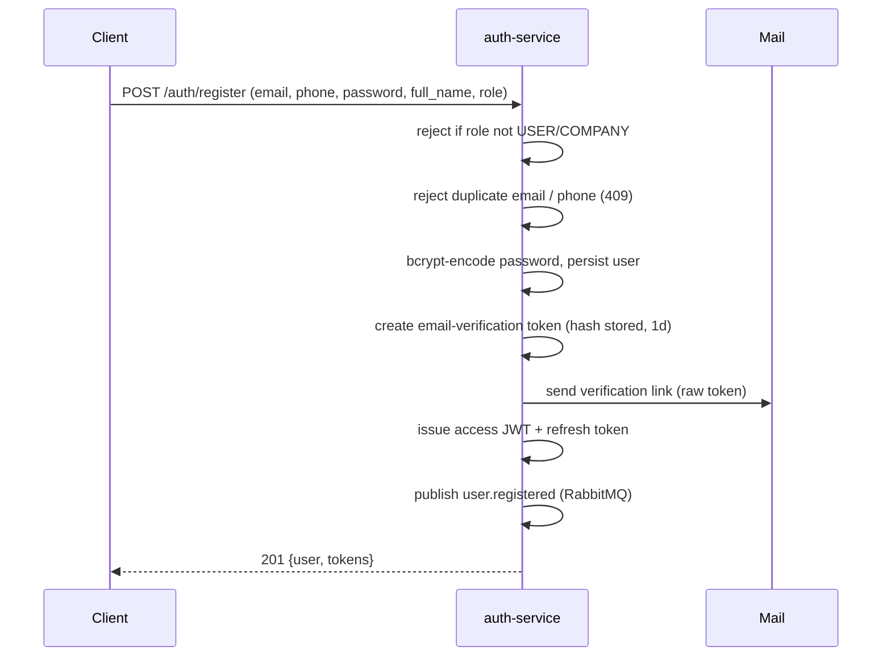

# Authentication

> Status: Verified baseline (code-level) · Last reviewed: 2026-09-30
> Evidence: `backend/services/auth-service/src/main/java/com/vithey/auth/**`, `backend/services/api-gateway/src/main/java/com/vithey/gateway/**`, `backend/infrastructure/config-repo/application.yml`
> Evidence anchor: `../_meta/EVIDENCE-BASIS.md` §5

## 1. Overview

Vithey uses a **stateless** authentication model: the Flutter app exchanges credentials for a
short-lived **JWT access token** plus an opaque **refresh token**, and sends the access token
as `Authorization: Bearer <jwt>` on every protected request. The gateway validates the token
at the edge; each service re-validates it as defense in depth.

| Credential | Type | TTL | Storage | Evidence |
| --- | --- | --- | --- | --- |
| Access token | HMAC-signed JWT | 15m (`VITHEY_ACCESS_TOKEN_TTL`) | Flutter secure storage | `JwtProvider.java` |
| Refresh token | opaque 48-byte random | 7d (`VITHEY_REFRESH_TOKEN_TTL`) | SHA-256 hash in `auth_db.refresh_tokens` | `TokenService.java` |
| Email-verification token | opaque 40-byte random | 1 day | SHA-256 hash in `auth_db.email_verification_tokens` | `AuthService.java` |
| Password-reset token | opaque 40-byte random | 30 minutes | SHA-256 hash in `auth_db.password_reset_tokens` | `PasswordResetService.java` |

## 2. Authentication flows

### 2.1 Registration

`POST /api/v1/auth/register` (public) — `AuthService.register` [VERIFIED]:

- Only `USER` and `COMPANY` may self-register; `STUDENT` is granted later via
  `POST /api/v1/students/verify`, and `ADMIN` is backend-only. [VERIFIED] `AuthService.java:61`
- Email is normalised to lower-case before uniqueness checks. [VERIFIED]

### 2.2 Login

`POST /api/v1/auth/login` (public) — `AuthService.login` [VERIFIED]. Accepts `email_or_phone`;
both branches filter `deleted_at IS NULL` and `is_active`. A wrong password returns
`INVALID_CREDENTIALS` (401). Successful login issues a fresh token pair.

### 2.3 Refresh (rotation)

`POST /api/v1/auth/refresh` (public) — `TokenService.rotateRefreshToken` [VERIFIED]:

1. Look up stored SHA-256 hash of the presented refresh token.
2. Reject if unknown, revoked, or expired (`INVALID_TOKEN`).
3. Revoke the presented token (`revoked_at = now`) and issue a **new** pair (rotation).

Replay of an old refresh token fails because it is already revoked. [VERIFIED]

### 2.4 Logout

`POST /api/v1/auth/logout` (authenticated) — revokes the supplied refresh token
(`revoked_at = now`); idempotent. Returns `204`. [VERIFIED] `AuthService.logout`, `TokenService.revokeRefreshToken`.

### 2.5 Email verification & password reset
- `POST /api/v1/auth/verify-email` (public) — consumes a single-use, unexpired token and sets
  `is_email_verified = true`. [VERIFIED] `AuthService.verifyEmail`.
- `POST /api/v1/auth/forgot-password` (public) — always responds generically; only acts if the
  account exists (prevents account enumeration). [VERIFIED] `PasswordResetService.startReset`.
- `POST /api/v1/auth/reset-password` (public) — validates a single-use, unexpired reset token,
  re-bcrypts the new password, marks the token used. [VERIFIED] `PasswordResetService.resetPassword`.

### 2.6 Google sign-in

`POST /api/v1/auth/google` (public) — `GoogleAuthService.authenticate` [VERIFIED]. The client
sends only the Google ID token; the server verifies it via `GoogleTokenVerifier` (RS256 against
Google JWKS, issuer, audience = `GOOGLE_WEB_CLIENT_ID`, expiry, and `email_verified`) and ignores
any separately supplied email/name. The resolved user is linked through
`auth_db.user_external_identities` (`UNIQUE(provider, provider_subject)`), creating a default
`USER` account when none exists, or auto-linking an existing account that owns the same verified
email. Standard Vithey tokens are then issued — the Google token is never used as a session token.
No privileged role is granted. Full details: [12-google-sign-in.md](12-google-sign-in.md).

## 3. Token issuance and claims
`JwtProvider.createAccessToken` sets [VERIFIED] `JwtProvider.java`:

| Claim | Value |
| --- | --- |
| `sub` | user id (UUID) |
| `email` | user email |
| `roles` | single-element list, e.g. `["STUDENT"]` |
| `iat` / `exp` | issued-at / now + 15m |

No `iss`, `aud`, or `jti` claims are set. See [04-JWT-security.md](04-JWT-security.md).

## 4. Edge validation

`JwtAuthenticationGlobalFilter` [VERIFIED]:

1. Skip if the path is public (`PublicPathMatcher`) or does not start with `/api/v1/`.
2. Require `Authorization: Bearer ...`, else `401 UNAUTHORIZED`.
3. Validate signature/expiry via `JwtValidator`; inject `X-User-Id`, `X-User-Roles`,
   `X-User-Email` and forward.

Public paths [VERIFIED] `PublicPathMatcher.java`: `/api/v1/auth/{register,login,google,refresh,forgot-password,reset-password,verify-email}`, `/actuator/**`, `/swagger-ui*`, `/v3/api-docs/**`.

> **Discrepancy — `/api/v1/students/verify`:** the route is defined in `auth-service` gateway
> config (`Path=/api/v1/auth/**,/api/v1/students/verify`) but the path is **not** in
> `PublicPathMatcher`, so the gateway requires a JWT for it even though it is a
> registration-like action. This is a documented behaviour, not a bug fix in scope here.
> [VERIFIED] `api-gateway.yml`, `PublicPathMatcher.java`; consistent with `api_docs.md` §3.

## 5. Client-side handling

- Tokens are stored via `flutter_secure_storage` (Keychain / Keystore-backed). [VERIFIED]
  `vithey_app/lib/core/storage/secure_storage_service.dart`
- `DioClient` injects `Authorization` for non-public paths and transparently refreshes once on
  `401`, then retries; on refresh failure it clears tokens. [VERIFIED]
  `vithey_app/lib/core/network/dio_client.dart`
- Tokens that start with `mock` are never sent (mock-first mode). [VERIFIED]

## 6. Observations

- `checkPassword` uses bcrypt `matches`; no account lockout or failed-login throttling is
  implemented in `auth-service` (the gateway rate limiter is the only throttle). [VERIFIED]
- Access tokens are not revocable before `exp` (no server-side denylist / `jti`). Logout only
  revokes the refresh token, so an already-issued access token stays valid up to 15m.
  [VERIFIED] `TokenService.revokeRefreshToken`.
- No multi-factor authentication (2FA) exists (2FA is a "coming soon" UI item). [VERIFIED]
  EVIDENCE-BASIS §7.

See [04-JWT-security.md](04-JWT-security.md), [05-password-security.md](05-password-security.md),
[03-authorization-RBAC.md](03-authorization-RBAC.md).
