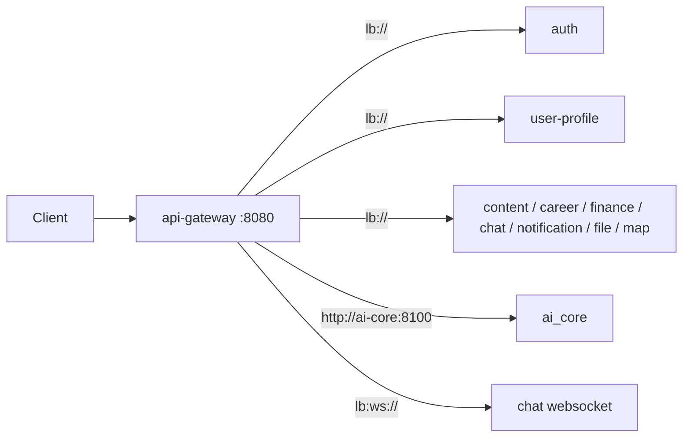

# API Security

> Status: Verified baseline (code-level) · Last reviewed: 2026-09-30
> Evidence: `backend/services/api-gateway/src/main/java/com/vithey/gateway/**`, `backend/infrastructure/config-repo/api-gateway.yml`, `backend/services/*/.../config/SecurityConfig.java`, `ai_core/vithey_ai/api/**`
> Evidence anchor: `../_meta/EVIDENCE-BASIS.md` §4, §5

## 1. Edge topology

All client traffic enters through `api-gateway :8080`. Flutter never calls services or
`ai_core` directly. [VERIFIED] EVIDENCE-BASIS §4.

## 2. Gateway filter chain

| Order | Filter | Purpose | Evidence |
| --- | --- | --- | --- |
| `HIGHEST_PRECEDENCE` | `RequestIdGlobalFilter` | Ensures/echoes `X-Request-ID` | `RequestIdGlobalFilter.java` |
| `+10` | `JwtAuthenticationGlobalFilter` | Validates JWT, injects `X-User-*` | `JwtAuthenticationGlobalFilter.java` |
| `+20` | `UserHeaderForwardFilter` | No-op placeholder (currently does nothing) | `UserHeaderForwardFilter.java` |
| — | `CorsWebFilter` | CORS policy | `CorsConfig.java` |
| — | `RequestRateLimiter` (per route) | Redis token-bucket | `api-gateway.yml` |

> `UserHeaderForwardFilter` is an empty pass-through — the actual header injection happens in
> `JwtAuthenticationGlobalFilter`. It is dead code but harmless. [VERIFIED]

## 3. Route protection

Every `/api/v1/**` route requires a valid Bearer JWT **except** the public auth paths.
Non-`/api/v1/` paths (e.g. `/actuator/**`, swagger) bypass the JWT filter by design.
[VERIFIED] `JwtAuthenticationGlobalFilter.java:41`.

| Path family | Backing service | Public? | Rate limited? |
| --- | --- | --- | --- |
| `/api/v1/auth/**`, `/api/v1/students/verify` | auth-service | Only 6 auth paths | Yes (100/100) |
| `/api/v1/users/**` | user-profile-service | No | Yes (100/100) |
| `/api/v1/posts|comments|reactions|follows/**` | content-service | No | Yes (100/100) |
| `/api/v1/jobs|job-applications/**` | career-service | No | Yes (100/100) |
| `/api/v1/users/me/cv*` | career-service | No | Yes (100/100) |
| `/api/v1/fees|payments/**` | finance-service | No | Yes (100/100) |
| `/api/v1/conversations|messages|message-requests/**` | chat-service | No | Yes (100/100) |
| `/api/v1/files/**` | file-service | No | Yes (100/100) |
| `/api/v1/notifications/**` | notification-service | No | Yes (100/100) |
| `/api/v1/ai/**` | ai_core (direct `http://ai-core:8100`) | No | Yes (100/100) |
| `/api/v1/places/**` | map-service | No | Yes (30/60) |
| `/ws/**` | chat-service (websocket) | No | **No rate limiter** |

[VERIFIED] `config-repo/api-gateway.yml`.

## 4. Rate limiting

- Redis-backed `RequestRateLimiter`; key resolver returns `user:<id>` when `X-User-Id` exists,
  else `ip:<first X-Forwarded-For>` / socket address. [VERIFIED] `RedisRateLimiterConfig.java`.
- Defaults: HTTP routes 100 replenish / 100 burst; map-service 30/60; all env-tunable
  (`VITHEY_GATEWAY_RATE_LIMIT_*`). [VERIFIED] `api-gateway.yml`.
- The `/ws/**` websocket route has no `RequestRateLimiter`. [VERIFIED]
- `ai_core` additionally applies an **in-memory per-IP** limiter (30/min) and a 512 KB body cap.
  [VERIFIED] `ai_core/vithey_ai/api/middleware.py`, `config.py`.

## 5. CORS

`CorsConfig` [VERIFIED] `CorsConfig.java`:

| Setting | Value |
| --- | --- |
| `allowedOriginPatterns` | `${VITHEY_CORS_ALLOWED_ORIGINS:*}` (default `*`) |
| Methods | GET, POST, PUT, PATCH, DELETE, OPTIONS |
| Allowed headers | `Authorization`, `Content-Type`, `Upgrade`, `Connection`, `X-Request-ID`, websocket headers |
| Exposed headers | `X-Request-ID`, `Retry-After` |
| `allowCredentials` | `false` |
| Max age | 3600s |

> `*` is acceptable **only because** `allowCredentials=false` (no cookies). For a browser
> front end this is permissive; for the native Flutter client CORS is largely irrelevant.
> Still, lock this down before any web exposure. [INFERRED] — requires confirmation.

`ai_core` CORS defaults to `http://localhost:3000,http://localhost:8080` with
`allow_credentials=True` and `*` methods/headers. [VERIFIED] `ai_core/vithey_ai/api/app.py:67`, `config.py`.

## 6. Error envelope & information leakage

- Gateway errors are written as `{error: {code, message}}` (`UNAUTHORIZED`, etc.) by
  `GatewayErrorHandler`. Services return `{data, meta, error}` via `ApiResponseWrapper`.
  [VERIFIED]
- `application-prod.yml` restricts actuator to `health,info` and disables Swagger/OpenAPI.
  The **demo/base** profile exposes `health,info,metrics,prometheus`. [VERIFIED]
  `config-repo/application.yml:46`, `application-prod.yml`.
- No stack traces or internal messages are returned in the standard error envelope
  [INFERRED from `GlobalExceptionHandler` usage] — requires confirmation per-service.

## 7. Request/response hygiene

- JSON is snake_case globally (`spring.jackson.property-naming-strategy: SNAKE_CASE`),
  `default-property-inclusion: non_null`. [VERIFIED] `config-repo/application.yml`.
- Request id propagates `X-Request-ID` from gateway to services and `ai_core`. [VERIFIED]
- File upload MIME allow-list + filename sanitisation prevent path traversal. [VERIFIED]
  `FileValidationService.sanitizeFileName` strips directories and `..`.

## 8. Observations & risks

| # | Observation | Severity | Evidence |
| --- | --- | --- | --- |
| A1 | Websocket route `/ws/**` is not rate-limited and sits outside the JSON filter's per-service limiter | Medium | `api-gateway.yml` |
| A2 | CORS default `*` at the gateway | Low–Medium | `CorsConfig.java` |
| A3 | `ai_core` CORS enables credentials with configurable origins; default is localhost only | Low | `api/app.py` |
| A4 | Public path list is duplicated in gateway `PublicPathMatcher` and in each service `SecurityConfig`; drift is possible (see `/students/verify`) | Medium | `PublicPathMatcher.java`; service configs |
| A5 | `UserHeaderForwardFilter` is a no-op (dead code) | Info | `UserHeaderForwardFilter.java` |
| A6 | `actuator/**` is public at the gateway and `metrics,prometheus` are exposed in the demo profile | Medium | `config-repo/application.yml` |

**Not yet formally assessed.** See [10-vulnerability-assessment.md](10-vulnerability-assessment.md).

## 9. Cross-references

- [01-security-overview.md](01-security-overview.md) · [03-authorization-RBAC.md](03-authorization-RBAC.md) · [04-JWT-security.md](04-JWT-security.md)
- Gateway details: `../06-api/02-api-gateway.md`
- Network design: `../03-system-design/07-network-architecture.md`
