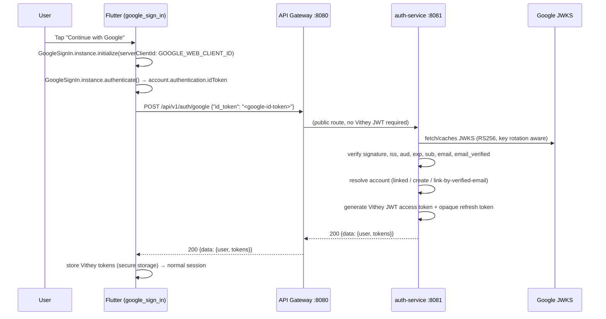

# Google Sign-In

> Status: Implemented · Last reviewed: 2026-09-30
> Evidence: `backend/services/auth-service/src/main/java/com/vithey/auth/security/GoogleTokenVerifier.java`,
> `.../service/GoogleAuthService.java`, `.../controller/AuthController.java`,
> `backend/services/api-gateway/src/main/java/com/vithey/gateway/util/PublicPathMatcher.java`,
> `vithey_app/lib/data/services/google_auth_service.dart`, `vithey_app/lib/data/repositories/auth_repository.dart`

This document covers the real (non-mock) Google Sign-In integration: how it works, how to
configure it, and the security rules it follows. Related: [`02-authentication.md`](02-authentication.md),
[`../06-api/03-authentication-api.md`](../06-api/03-authentication-api.md),
[`../07-frontend/07-authentication-flow.md`](../07-frontend/07-authentication-flow.md).

## 1. Architecture

The Google ID token is used **once**, to bootstrap a normal Vithey session. It is never used as
the application's session token.



The Flutter app only ever talks to the gateway. The gateway treats `POST /api/v1/auth/google`
as a public route (no existing Vithey JWT), and forwards it to `auth-service`.

## 2. Endpoint

`POST /api/v1/auth/google` (public)

Request (snake_case):

```json
{ "id_token": "<google-id-token>" }
```

Success `200` returns the standard `AuthResponse` (`{data: {user, tokens}}`) — the same shape as
`/auth/login` and `/auth/register`. Errors use the standard envelope.

| Error code | HTTP | Cause |
| --- | --- | --- |
| `VALIDATION_ERROR` | 400 | `id_token` missing/blank |
| `INVALID_TOKEN` | 401 | Invalid/expired token, wrong audience, wrong issuer, bad signature, missing/unverified email |
| `UNAUTHORIZED` | 401 | Matched Vithey account is disabled |
| `INTERNAL_ERROR` | 500 | `GOOGLE_WEB_CLIENT_ID` not configured on the server |

## 3. Token verification (backend)

`GoogleTokenVerifier` validates every ID token with Nimbus JOSE + JWT against Google's published
JWKS (`https://www.googleapis.com/oauth2/v3/certs`, key-rotation aware):

- **Signature** — RS256 against the key matching the token `kid`.
- **Issuer** — `https://accounts.google.com` (legacy `accounts.google.com` also accepted).
- **Audience** — must equal the configured Web OAuth client ID (`GOOGLE_WEB_CLIENT_ID`).
- **Expiration** — `exp` (plus `nbf`/`iat` when present) checked with the default clock skew.
- **Subject** — `sub` required (the stable Google account id, used as the provider key).
- **Email** — `email` required; **`email_verified` must be true**.

The verified payload is the only source of identity. Any `email`/`name` the client sends
separately is ignored.

## 4. Account resolution

Storage uses a provider-neutral table `auth_db.user_external_identities`
(`provider`, `provider_subject` unique, FK cascade to `users`).

1. **Google identity already linked** → authenticate the existing user (fresh Vithey tokens).
2. **No identity, no matching account** → create a new account with the default role `USER`
   (no password set — a hash of a random secret is stored so password login is impossible until
   the user sets one), `is_email_verified = true`, then link the identity.
3. **No identity, but a Vithey account has the same verified email** → link the Google identity
   to that account (no duplicate). This is a deliberate **safe auto-link**: Google has
   cryptographically asserted control of the email address, so linking does not grant access to
   an email the user cannot already control. Documented decision in §6.

## 5. Roles

Google authentication **never** grants `STUDENT`, `COMPANY`, or `ADMIN`. New Google accounts get
`USER` only. AUB student verification stays a separate, explicit flow
(`POST /api/v1/students/verify`).

## 6. Safe account-linking decision

Auto-linking (case 3) is justified for this project because:

- Google is a trusted identity provider and the `email_verified` claim is verified before linking.
- The Vithey email uniqueness model already treats a verified email as belonging to the account;
  an attacker who controls the Google identity for that email also controls password-reset for
  the same address.
- It prevents duplicate accounts (the unsafe alternative).

If a project later needs stricter separation, switch case 3 to require an explicit "link account"
step after an authenticated server-side approval; the data model already supports it.

## 7. Configuration

| Variable | Where | Purpose |
| --- | --- | --- |
| `GOOGLE_WEB_CLIENT_ID` | auth-service env + Flutter `.env` | Web OAuth client ID; the token audience. **Required.** |
| `GOOGLE_JWK_SET_URI` | auth-service env (optional) | Override Google's JWKS URL (defaults to Google). |

Notes:

- Use the **Web** application OAuth client ID on both sides. The Flutter client passes it as
  `serverClientId` (required on Android when not using `google-services.json`).
- The backend only *verifies* ID tokens, so **no OAuth client secret is required or stored**.
- A client ID is a public identifier and may ship in client config; a **client secret must never**
  be embedded in Flutter or committed.

### Android setup

1. In Google Cloud Console, create an OAuth consent screen and a project.
2. Create an **Android** OAuth client: package name `com.vithey.aub_connect_app` and the SHA-1 of
   the signing certificate (`./gradlew signingReport`, and your release keystore SHA-1).
3. Create a **Web** OAuth client; put its ID in:
   - `backend/.env` → `GOOGLE_WEB_CLIENT_ID=...` (picked up by `docker-compose.yml`), or
     `backend/services/auth-service/.env.example` for that service's `env_file`
   - `vithey_app/.env` → `GOOGLE_WEB_CLIENT_ID=...`
4. No `google-services.json` is required (the Web client ID is passed as `serverClientId`).
5. Restart the auth-service (or `docker compose up -d --build auth-service`) so it picks up the env.

### iOS/macOS (for later)

Also add the iOS client and a reversed-client-ID URL scheme to `ios/Runner/Info.plist`, and pass
the iOS client ID via `clientId`. Android is the current target.

## 8. Security rules

- Never trust client-supplied email/name — only the verified token.
- Never log ID tokens, access tokens, refresh tokens, or OAuth secrets.
- Do not expose stack traces; the standard `{error:{code,message}}` envelope is returned.
- Google login does not weaken JWT security or bypass role/student verification.
- `.env` files are gitignored; only `GOOGLE_WEB_CLIENT_ID` (a public value) belongs in
  `.env.example`.

## 9. Tests

Backend (`backend/services/auth-service`):

- `GoogleTokenVerifierTest` — valid, expired, wrong audience, wrong issuer, bad signature,
  unverified email, missing email, legacy issuer, blank token, missing config.
- `GoogleAuthServiceTest` — new user, linked user, same-email link, disabled (linked + by email),
  invalid token, Vithey token generation.
- `AuthControllerGoogleTest` — endpoint 200/401/400 via MockMvc.

Flutter (`vithey_app/test`):

- `data/services/google_auth_service_test.dart` — initialize/serverClientId, success, cancellation,
  unsupported platform, missing id token, failure mapping.
- `data/repositories/auth_repository_google_test.dart` — token exchange + Vithey token storage,
  cancellation, backend failure, network failure.
- `modules/auth/auth_controller_google_test.dart` — button action, cancellation, backend failure.

### Manual end-to-end (device)

Not automatable here. Requires a physical/emulator Android device signed with a registered SHA-1,
a Google test account, and the configured Web client ID:

1. Run the demo stack and the app (`.env` with `GOOGLE_WEB_CLIENT_ID`).
2. Tap **Continue with Google**, pick an account → real Google chooser opens.
3. Confirm a Vithey session is created (user + tokens stored) and authenticated requests work.
4. Cancel the chooser → returns to login with no error.
