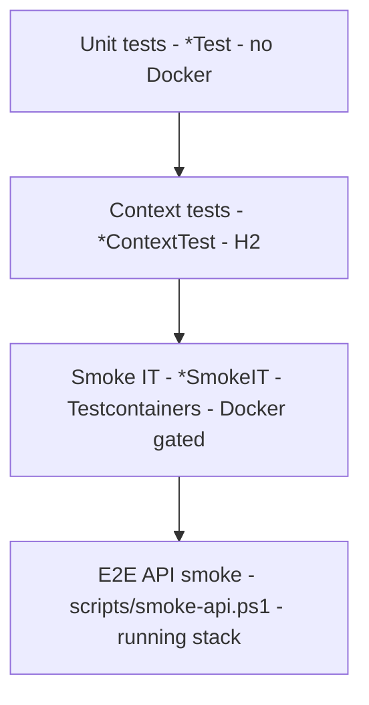

# Test Strategy

> Status: Verified baseline (inventory) · Last reviewed: 2026-09-30
> Evidence: `backend/TESTING.md`, `backend/**/src/test/java`, `vithey_app/test/`, `ai_core/tests/`, `backend/scripts/smoke-api.ps1`, `.github/workflows/`
> Evidence anchor: `../_meta/EVIDENCE-BASIS.md` §10
> Execution status: **Tests exist but were NOT executed during this documentation task.** Anywhere a result is expected the text reads `Test implemented — current execution result not independently verified.`

## 1. Purpose & principles

This document defines how Vithey is tested across its four build units (Flutter app, Spring
backend, ai_core, monitoring). It records the **real** test inventory and the gap between
"test files exist" and "tests pass" — the latter is never claimed without execution evidence.

Guiding principles:

1. **Layered testing.** Fast unit tests first, Spring context tests second, Docker-gated smoke
   tests third, end-to-end API smoke last.
2. **Honest status.** A present test file is `Implemented`; it is **not** `Passed` unless a run
   was observed. Results in this set use `Test implemented — current execution result not
   independently verified.`
3. **Repeatable commands.** The command matrix in §5 is the canonical way to run each layer.

## 2. Test pyramid (as implemented)

| Layer | Location | Runner | Docker | Count (verified) |
| --- | --- | --- | --- | --- |
| Backend unit | `backend/**/src/test/java/**/*Test.java` | Maven Surefire | No | 19 |
| Backend context | `backend/**/src/test/java/**/*ContextTest.java` | Maven Surefire | No | 11 |
| Backend smoke IT | `backend/**/src/test/java/**/*SmokeIT.java` | not wired (no Failsafe) | Yes | 11 |
| Flutter unit/widget | `vithey_app/test/**` | `flutter test` | No | 3 files |
| ai_core unit/API | `ai_core/tests/test_*.py` | `pytest` | No | 11 files |
| E2E API smoke | `backend/scripts/smoke-api.ps1` | PowerShell | Running stack | 1 script |
| Monitoring / scripts | — | — | — | none |

> **Inventory note (resolved):** the `../_meta/EVIDENCE-BASIS.md` §10 anchor was corrected on
> 2026-09-30 to **41** backend test Java files (19 unit + 11 H2 context + 11 Docker-gated smoke)
> and **11** ai_core pytest files. [VERIFIED]

## 3. Scope by component

| Component | Unit | Integration/Context | E2E | Performance |
| --- | --- | --- | --- | --- |
| api-gateway | `JwtValidatorTest` | `ApiGatewayContextTest`, `ApiGatewaySmokeIT` | `smoke-api.ps1` | Not performed |
| auth-service | 4 unit tests | `AuthServiceContextTest`, `AuthServiceSmokeIT` | `smoke-api.ps1` (register/login/refresh) | Not performed |
| user-profile-service | 2 unit | Context + SmokeIT | `smoke-api.ps1` (`/users/me`) | Not performed |
| content-service | 3 unit | Context + SmokeIT | `smoke-api.ps1` (posts/comments/reactions) | Not performed |
| career-service | 1 unit | Context + SmokeIT | `smoke-api.ps1` (jobs/CV) | Not performed |
| finance-service | 1 unit | Context + SmokeIT | `smoke-api.ps1` (fees/payments, 403→200) | Not performed |
| chat-service | 1 unit | Context + SmokeIT | `smoke-api.ps1` (message-requests/accept) | Not performed |
| notification-service | 1 unit | Context + SmokeIT | `smoke-api.ps1` (notifications) | Not performed |
| file-service | 1 unit | Context + SmokeIT | — | Not performed |
| map-service | 4 unit | none (no context/IT) | `smoke-api.ps1` (places history) | Not performed |
| ai_core | 11 pytest files | FastAPI TestClient tests | `smoke-api.ps1` (`/ai/*`) | Not performed |
| Flutter app | 3 test files | none | Manual/emulator only | Not performed |

## 4. Test data & isolation

- Context tests use **H2 in-memory**; Flyway/JPA validate against H2 in test.
- Smoke ITs use **Testcontainers** (`postgres`, `rabbitmq`, `redis`, `minio`) and start the
  service on a random port with profile `test`, Eureka/Config disabled. [VERIFIED] `TESTING.md`.
- Shared base classes live in `backend/shared/vithey-test-support`.
- The E2E script registers a **fresh random user** per run (`smoke$stamp@aub.edu.kh`) to avoid
  data collisions. [VERIFIED] `smoke-api.ps1`.

## 5. Command matrix (from `backend/TESTING.md`)

| Goal | Command | Working dir | Docker |
| --- | --- | --- | --- |
| All backend tests | `mvn test` | `backend/` | No (smoke skipped) |
| One module (with deps) | `mvn -pl services/<svc> -am test` | `backend/` | No |
| Single smoke test | `mvn test -Dtest=CareerServiceSmokeIT` | `backend/services/career-service` | **Yes** |
| Unit only (skip smoke) | `mvn test -Dtest='!*SmokeIT'` | `backend/` | No |
| Live health check | `.\scripts\check-service-health.ps1` | `backend/scripts` | Running stack |
| E2E API smoke | `.\scripts\smoke-api.ps1` | `backend/` | Running stack |
| Flutter analyze | `flutter analyze --no-fatal-infos` | `vithey_app/` | No |
| Flutter tests | `flutter test` | `vithey_app/` | No |
| ai_core tests | `pytest` | `ai_core/` | No |

> Because there is **no Maven Failsafe plugin**, `mvn test` does not run `*SmokeIT`. They must
> be invoked explicitly (which also requires Docker). [VERIFIED] EVIDENCE-BASIS §8.5, `TESTING.md`.

## 6. CI gates

[VERIFIED] `.github/workflows/`:

- `ci-promote-dev.yml` — on push to `kimheang`/`main`: `mvn -B -f backend/pom.xml test`,
  `flutter analyze --no-fatal-infos` + `flutter test`, `pytest -q`; then builds/pushes 13 GHCR
  images and fast-forwards the passing commit to `dev`.
- Nine per-service workflows (`auth`, `career`, `chat`, `content`, `file`, `finance`,
  `notification`, `user-profile`, `api-gateway`) run `mvn -pl services/<svc> -am test` and
  build the image. **map-service has no dedicated workflow.**
- Smoke ITs (`*SmokeIT`) are **not** run in CI (no Failsafe) despite CI runners having Docker.

## 7. Coverage & quality gaps

| Gap | Status |
| --- | --- |
| Code coverage (JaCoCo/Cobertura) | Not configured — no coverage number exists |
| Mutation testing | Not performed |
| Performance/load testing | Not performed — all perf results `TBD` |
| Accessibility testing | Not performed |
| Contract testing (Pact) | Not performed |
| Flutter integration/golden tests | None (3 unit/widget files only) |
| E2E automation in CI | The PowerShell smoke is manual, not in CI |

## 8. Risk-based prioritisation

| Priority | Area | Rationale |
| --- | --- | --- |
| P0 | Auth/token flows, gateway JWT enforcement | Security-critical; thin automated coverage |
| P0 | Finance `@PreAuthorize` (403→200 upgrade) | Only method-security surface; covered by smoke script |
| P1 | File upload/download authorization | Owner-only logic untested at unit level beyond validation |
| P1 | ai_core CV/chat routes + envelope | LLM integration risk; cost/rate limits |
| P2 | Flutter critical paths (login, feed, CV) | Very low automated coverage today |

## 9. Execution status (this task)

No test command was executed while producing this documentation set. Therefore, across all
testing documents, results are stated as:

> **Test implemented — current execution result not independently verified.**

## 10. Cross-references

- [02-test-plan.md](02-test-plan.md) · [03-test-cases.md](03-test-cases.md) · [13-test-summary-report.md](13-test-summary-report.md)
- [09-security-testing.md](09-security-testing.md) · [08-performance-testing.md](08-performance-testing.md)
- `../../backend/TESTING.md` (canonical testing guide)
