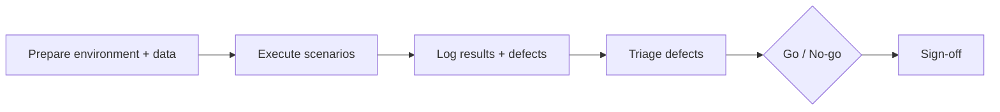

# UAT Plan

> Status: **Not executed** · Last reviewed: 2026-09-30
> Evidence: `vithey_app/lib/modules/`, `api_docs.md`, `../06-api/`, `../10-security/`, `../11-testing/`
> Governance: **UAT has not yet been formally executed / evidence was not found.**

## 1. Purpose

This plan defines how **User Acceptance Testing (UAT)** would validate that Vithey meets
business needs from an end-user perspective. It is a *proposed* plan: no UAT session has been
run and no participant has provided acceptance.

## 2. Objectives

1. Confirm the core student journey works end-to-end through the Flutter app and gateway.
2. Confirm role-gated behaviour (student finance) is understandable and correct.
3. Confirm usability of key screens (auth, feed, jobs/CV, chat, AI, profile, map).
4. Capture defects and feedback for a go/no-go decision.

## 3. Scope

| In scope (proposed) | Out of scope |
| --- | --- |
| Real endpoints/screens listed in [02-UAT-test-cases.md](02-UAT-test-cases.md) | Production (does not exist) |
| Local demo stack + Android emulator/device | Load/performance |
| Student `USER`/`STUDENT` journeys; `COMPANY` job posting | Security penetration testing |
| Error/empty/offline states | Accessibility audit |

## 4. Roles & participants

Roles are inferred and require confirmation. [INFERRED] — requires business confirmation.

| Role | Responsibility | Name | Status |
| --- | --- | --- | --- |
| UAT coordinator | Schedules, collates results | TBD — Requires confirmation. | Not assigned |
| Business/student representative | Executes scenarios | TBD | Not assigned |
| Product owner | Accepts/rejects | TBD | Not assigned |
| Technical support | Environment/logs | TBD | Not assigned |

## 5. Test environment

| Item | Value |
| --- | --- |
| Environment | Local demo (verified) — the only environment |
| Stack | `backend/scripts/docker-up-demo.ps1` (Profile M) |
| Client | Flutter app on Android emulator/physical device |
| API base | `http://10.0.2.2:8080/api/v1` (emulator) |
| Dependencies | `ai_core/.env` with an LLM API key; Docker Desktop |

> Staging (does not exist) and Production (does not exist).

## 6. Entry criteria

- Demo stack starts and `check-service-health.ps1` shows services UP.
- Flutter `.env` configured and app installs on the test device.
- UAT test data/accounts prepared (fresh users; a company account for job posting).
- Test cases reviewed and baselined.

## 7. Exit criteria

- Every UAT case in [02-UAT-test-cases.md](02-UAT-test-cases.md) is executed and marked with an
  outcome.
- Defects logged in [04-UAT-issues.md](04-UAT-issues.md) and triaged.
- Results recorded in [03-UAT-results.md](03-UAT-results.md).
- Go/no-go sign-off in [05-UAT-signoff.md](05-UAT-signoff.md).

> **None of the exit criteria have been met. UAT has not been executed.**

## 8. Approach

- Scenario-based, business-language test cases (Given/When/Then).
- Each case references a real endpoint/screen and expected user-visible result.
- Evidence: screenshots + `X-Request-ID`; never capture real secrets/tokens.

## 9. Schedule (proposed)

| Phase | Activity | Status |
| --- | --- | --- |
| U0 | Plan + case authoring | This document (draft) |
| U1 | Environment + data prep | Not started |
| U2 | Execute UAT | Not executed |
| U3 | Defect triage + retest | Not started |
| U4 | Sign-off | Not signed |

## 10. Risks

| Risk | Mitigation |
| --- | --- |
| No assigned business representative | Confirm participants |
| Local demo only | Treat as functional, not production-readiness |
| AI chat is a stub; Google auth/FCM disabled | Exclude from acceptance or mark expected |
| Release build uses debug keys | Not UAT-blocking, but distribution-blocking |

## 11. Cross-references

- [02-UAT-test-cases.md](02-UAT-test-cases.md) · [03-UAT-results.md](03-UAT-results.md) · [04-UAT-issues.md](04-UAT-issues.md) · [05-UAT-signoff.md](05-UAT-signoff.md)
- [../11-testing/02-test-plan.md](../11-testing/02-test-plan.md) · `../06-api/01-api-overview.md`
