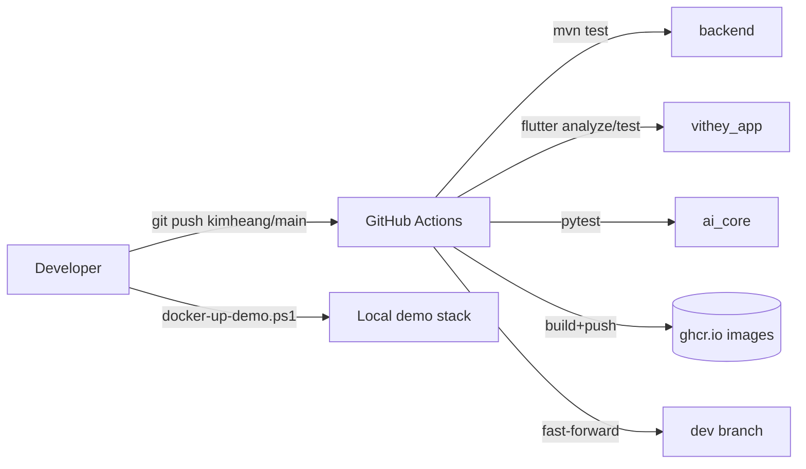

# DevOps Overview

> Status: Verified · Last reviewed: 2026-09-30
> Evidence: `backend/Dockerfile`s, `backend/docker-compose.yml`, `backend/docker-compose.demo.yml`, `backend/scripts/`, `.github/workflows/`, `monitoring/`, `backend/.env.example`

Part of the Vithey documentation set · Master index: [`../00-project-overview/07-document-index.md`](../00-project-overview/07-document-index.md) · [Docker architecture](02-docker-architecture.md) · [CI/CD](05-CI-CD.md) · [Deployment architecture](../14-deployment/01-deployment-architecture.md)

## 1. Purpose

This section documents how Vithey is packaged, configured, built, tested, monitored and run. It is written from repository evidence only; anything not implemented is tagged `[PLANNED]` or `[TBD]`.

## 2. What actually exists

| Capability | Status | Evidence |
|---|---|---|
| Multi-stage Java Dockerfiles (build → JRE runtime, non-root) | Implemented | `backend/services/*/Dockerfile`, `backend/infrastructure/*/Dockerfile` |
| Python `ai_core` image | Implemented | `ai_core/Dockerfile` |
| Docker Compose full stack + demo overlay | Implemented | `backend/docker-compose.yml`, `backend/docker-compose.demo.yml` |
| Env-driven resource caps | Implemented (demo overlay only) | `backend/docker-compose.demo.yml` |
| PowerShell operational scripts | Implemented | `backend/scripts/*.ps1` |
| CI (tests + GHCR image build/push + promote to `dev`) | Implemented | `.github/workflows/ci-promote-dev.yml` |
| Per-service CI (test + build + compose validate) | Implemented | `.github/workflows/*-service-ci.yml`, `.github/workflows/api-gateway-ci.yml` |
| Monitoring stack (Prometheus/Grafana/Loki/...) | Implemented, profile-gated | `monitoring/docker-compose.yml` |
| Alertmanager | Not implemented | `monitoring/prometheus/alerts.yml` only |
| CD to any environment | Not implemented | no deploy job in any workflow |
| Kubernetes / Helm / Terraform / Jenkins | Not implemented | absent from repo |
| Staging environment | Does not exist | `EVIDENCE-BASIS.md` §12 |
| Production environment | Does not exist | `EVIDENCE-BASIS.md` §12 |

## 3. Environments

| Environment | Status |
|---|---|
| Local development (host-run or Docker) | Local development (verified) |
| Local demo (Profile M) | Local demo (verified) |
| Staging | Staging (does not exist) |
| Production | Production (does not exist) |

Only two local environments are real. CI builds and publishes images but deploys nowhere. See [Environment setup](../14-deployment/02-environment-setup.md) and [CI/CD](05-CI-CD.md).

## 4. Toolchain by component

| Component | Build | Test | Package |
|---|---|---|---|
| `backend/` | Maven, Java 21 | `mvn test` | Spring Boot JAR → JRE image |
| `vithey_app/` | Flutter (Dart) | `flutter analyze --no-fatal-infos`, `flutter test` | Android APK (no image) |
| `ai_core/` | Python 3.12 | `pytest` | `python:3.12-slim` image |
| `monitoring/` | — | — | upstream images |

[VERIFIED — `AGENTS.md`, `pom.xml`, `pyproject.toml`, `pubspec.yaml`]

## 5. Flow at a glance

[VERIFIED — `ci-promote-dev.yml`, `backend/scripts/docker-up-demo.ps1`]

## 6. Sibling documents

- Packaging & images: [02-docker-architecture.md](02-docker-architecture.md), [07-image-registry.md](07-image-registry.md)
- Compose model: [03-docker-compose.md](03-docker-compose.md)
- Env & secrets: [04-environment-configuration.md](04-environment-configuration.md)
- Pipelines: [05-CI-CD.md](05-CI-CD.md), [06-github-actions.md](06-github-actions.md), [08-release-process.md](08-release-process.md)

[TBD] Formal DevOps ownership, on-call rota and service-level objectives — TBD — Requires confirmation. No evidence in repo.
