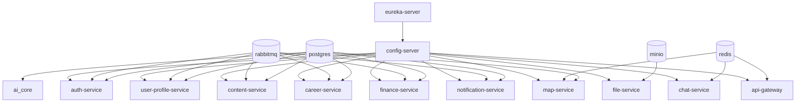

# Docker Compose Model

> Status: Verified · Last reviewed: 2026-09-30
> Evidence: `backend/docker-compose.yml`, `backend/docker-compose.demo.yml`, `backend/infrastructure/docker-compose.yml`, `backend/services/*/docker-compose.yml`, `monitoring/docker-compose.yml`, `backend/scripts/*.ps1`

Part of the Vithey documentation set · Master index: [`../00-project-overview/07-document-index.md`](../00-project-overview/07-document-index.md) · [Docker architecture](02-docker-architecture.md) · [Environment configuration](04-environment-configuration.md) · [Start/stop system](../16-operations/02-start-stop-system.md)

## 1. Compose files

| File | Role | Network | Postgres host port |
|---|---|---|---|
| `backend/docker-compose.yml` | Full stack: infra + platform + domain services + `ai_core` + `map-service` (profile `map`) | `vithey-network` (created) | 15432 |
| `backend/docker-compose.demo.yml` | **Overlay** on the base: env-driven `mem_limit`, JVM opts, logging, map + ai_core wiring | inherits | 15432 |
| `backend/infrastructure/docker-compose.yml` | Infra only: Postgres, Redis, RabbitMQ, MinIO, Eureka, Config | `vithey-network` (created) | 15433 |
| `backend/services/<name>/docker-compose.yml` | One service, attaches to `vithey-network` (external) | external | — |
| `monitoring/docker-compose.yml` | Prometheus/Grafana/Loki/Promtail/node-exporter/cAdvisor, profile `monitoring` | `vithey-network` (external) | — |

[VERIFIED — the five compose files above]

The project name is `vithey` and the shared network is `vithey-network` (bridge). [VERIFIED — `backend/docker-compose.yml:9,461-464`]

## 2. Base vs demo overlay

`backend/docker-compose.yml` is intentionally **limit-free**: it defines services, ports, health checks, `depends_on` and named volumes, but **no `mem_limit` / `cpus`**. All resource caps live in `backend/docker-compose.demo.yml` and are read from `backend/.env` via `${VAR:-default}`. [VERIFIED — base file has no `mem_limit`; overlay defines them]

The demo overlay provides:

- Two anchor blocks for JVM settings: `x-java-demo` (domain services), `x-java-platform` (Eureka/Config), `x-java-gateway`.
- Shared JSON-file logging limits: `max-size: 10m`, `max-file: "2"`.
- `mem_limit` per service group, e.g. `PG_MEM_LIMIT`, `SERVICE_MEM_LIMIT`, `GATEWAY_MEM_LIMIT`, `AI_CORE_MEM_LIMIT`.
- Postgres tuning: `max_connections`, `shared_buffers`, `work_mem`, `effective_cache_size`.
- Redis: `--maxmemory` + `--maxmemory-policy allkeys-lru`.
- A `map-service` block gated by `profiles: ["map"]`.

[VERIFIED — `backend/docker-compose.demo.yml`]

> The demo overlay intentionally also re-declares `map-service` and `ai-core` so `docker-up-demo.ps1` includes them. When using the base file alone, `map-service` starts only under the `map` profile.

## 3. Startup command used by the scripts

```powershell
# from backend/
docker compose -f docker-compose.yml -f docker-compose.demo.yml up -d --build
```

`docker-up-demo.ps1` builds exactly this argument list, optionally appending `-Profiles map` and/or a service subset. It requires `ai_core/.env` to exist and warns if `backend/.env` is missing (defaults still apply). [VERIFIED — `backend/scripts/docker-up-demo.ps1`]

## 4. Dependency graph (health-gated)



[VERIFIED — `depends_on` conditions in `backend/docker-compose.yml`]

Every dependency uses `condition: service_healthy`. Service health checks use the shared `x-service-health` anchor (interval 15s, timeout 5s, start-period 120s, retries 12). [VERIFIED — `backend/docker-compose.yml:11-15`]

## 5. Named volumes

Base compose declares four named volumes: `vithey-postgres-data`, `vithey-redis-data`, `vithey-rabbitmq-data`, `vithey-minio-data`. The monitoring compose declares its own `vithey-prometheus-data`, `vithey-grafana-data`, `vithey-loki-data`. [VERIFIED]

Removing volumes (`docker compose ... down -v`) **wipes all databases**. Use only for Flyway checksum recovery or a deliberate reset. [VERIFIED — `docker-down-demo.ps1` comment]

## 6. Profiles

| Profile | Started by | Effect |
|---|---|---|
| `map` | `docker-up-demo.ps1 -Profiles map` | starts `map-service` (shared Postgres `map_db`, Redis) |
| `monitoring` | `cd monitoring; docker compose --profile monitoring up -d` | starts observability stack |

A plain `docker compose up` in `monitoring/` starts nothing — every service there declares `profiles: ["monitoring"]`. [VERIFIED — `monitoring/docker-compose.yml`]

## 7. One-service runs and infra reuse

```powershell
# infra once
cd backend/infrastructure; docker compose up -d

# a single service from its own folder
cd backend
.\scripts\docker-build-service.ps1 auth-service -Up
```

The script creates `vithey-network` if missing and runs `docker compose build/up` inside the service folder. `ai-core` is handled specially (must be built from the monorepo compose). [VERIFIED — `backend/scripts/docker-build-service.ps1`]

## 8. Operational notes

- Other than the `logging` limits in the demo overlay, base compose defines no log rotation — container logs grow until Docker's daemon config applies. [VERIFIED — base compose has no `logging` block]
- Config-server bind-mounts `infrastructure/config-repo` read-only so gateway AI-route edits apply without an image rebuild. In a normal image deployment, config is baked in and requires a config-server rebuild. [VERIFIED — `backend/docker-compose.yml:128-130`]
