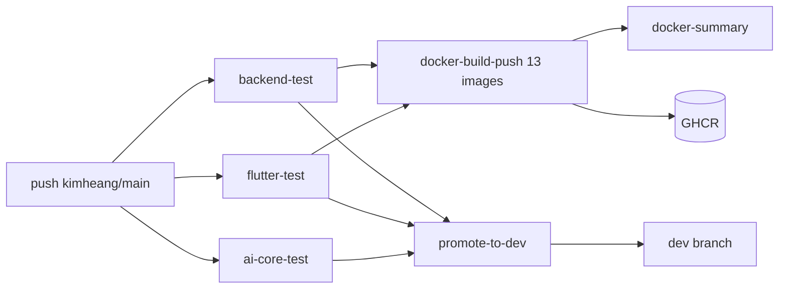

# CI/CD

> Status: Verified · Last reviewed: 2026-09-30
> Evidence: `.github/workflows/ci-promote-dev.yml`, `.github/workflows/*-service-ci.yml` (9 files), `backend/pom.xml`, `vithey_app/pubspec.yaml`, `ai_core/pyproject.toml`

Part of the Vithey documentation set · Master index: [`../00-project-overview/07-document-index.md`](../00-project-overview/07-document-index.md) · [GitHub Actions detail](06-github-actions.md) · [Image registry](07-image-registry.md) · [Release process](08-release-process.md)

## 1. What the pipeline does

There are **two pipeline families**:

1. `.github/workflows/ci-promote-dev.yml` — full-stack CI: tests all three components, builds/pushes 13 Docker images to GHCR, and fast-forwards the passing commit to `dev`.
2. Nine per-service workflows — narrower, path-triggered CI that tests one Java service, builds its image locally, and validates its compose file.

There is **no deployment stage in any workflow** and **no release/tagging workflow**. [VERIFIED — repo `.github/workflows/`]

## 2. `ci-promote-dev.yml`

### Triggers

| Event | Scope |
|---|---|
| `push` | `kimheang`, `main` |
| `pull_request` | `kimheang`, `main`, `dev` |
| `workflow_dispatch` | manual |

Concurrency group `ci-promote-dev-${{ github.ref }}` with `cancel-in-progress: true`. Permissions: `contents: write`, `packages: write`. [VERIFIED]

### Jobs

| Job | Depends on | Runs on | Notes |
|---|---|---|---|
| `backend-test` | — | any event | `mvn -B -f backend/pom.xml test`; uploads surefire reports on failure |
| `flutter-test` | — | any event | Flutter `3.16.9`, `cp .env.example .env`, `flutter pub get`, `flutter analyze --no-fatal-infos`, `flutter test` |
| `ai-core-test` | — | any event | Python `3.12`, `pip install -e ".[dev]"`, `pytest -q` |
| `docker-build-push` | `backend-test`, `flutter-test` | **push only** | 13-way matrix; builds/pushes GHCR images |
| `docker-summary` | `docker-build-push` | push only | writes an image list to the step summary |
| `promote-to-dev` | `backend-test`, `flutter-test`, `ai-core-test` | push to `kimheang`/`main` (not `dev`) | `git push origin "$GITHUB_SHA:refs/heads/dev"` |

[VERIFIED — `ci-promote-dev.yml`]

### Promotion semantics

Promotion is a **fast-forward push** of the exact tested commit:

```bash
git push origin "${GITHUB_SHA}:refs/heads/dev"
```

It uses the default `GITHUB_TOKEN`; the commit author is `github-actions[bot]`. If `dev` has diverged, the push is rejected — there is no merge and no auto-retry logic. [VERIFIED]

## 3. Per-service workflows

Nine files:

`api-gateway-ci.yml`, `auth-service-ci.yml`, `career-service-ci.yml`, `chat-service-ci.yml`, `content-service-ci.yml`, `file-service-ci.yml`, `finance-service-ci.yml`, `notification-service-ci.yml`, `user-profile-service-ci.yml`.

There are **no** equivalent workflows for `eureka-server`, `config-server`, `map-service` or `ai_core` as standalone triggers (they are covered only by `ci-promote-dev.yml`).

Each workflow has the same three jobs:

| Job | Command |
|---|---|
| `test` | `mvn -B -f backend/pom.xml -pl services/<svc> -am test` |
| `docker-build` | `docker build -f backend/services/<svc>/Dockerfile --build-arg SERVICE_PORT=<port> -t vithey-<svc>:ci backend` |
| `compose-validate` | `docker compose -f backend/services/<svc>/docker-compose.yml config` |

Triggers are path-filtered to the service folder plus shared paths (`backend/pom.xml`, its `config-repo/<svc>.yml`, config-server, eureka-server, the workflow file). [VERIFIED — `auth-service-ci.yml` and siblings]

## 4. Pipeline flow



[VERIFIED — `ci-promote-dev.yml`]

## 5. Gaps (explicitly not implemented)

- No environment deployment job (no SSH, no cloud CLI, no K8s). [VERIFIED]
- No rollback automation. [VERIFIED]
- No release/tagging workflow; version tags are manual git tags. [VERIFIED — see [08-release-process.md](08-release-process.md)]
- No coverage gate (no JaCoCo) and no failsafe config, so `*SmokeIT` are not run by `mvn test`. [VERIFIED — `EVIDENCE-BASIS.md` §8, §10]
- Per-service images built in the `docker-build` job are tagged `:ci` and **not pushed**. [VERIFIED]

[TBD] Required branch-protection rules, required checks and merge strategy — TBD — Requires confirmation. No repository settings captured in code.
