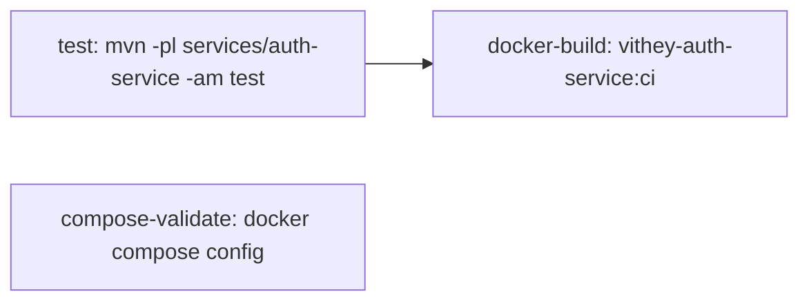

# GitHub Actions

> Status: Verified · Last reviewed: 2026-09-30
> Evidence: `.github/workflows/ci-promote-dev.yml`, `.github/workflows/api-gateway-ci.yml`, `.github/workflows/auth-service-ci.yml`, `.github/workflows/{career,chat,content,file,finance,notification,user-profile}-service-ci.yml`

Part of the Vithey documentation set · Master index: [`../00-project-overview/07-document-index.md`](../00-project-overview/07-document-index.md) · [CI/CD](05-CI-CD.md) · [Image registry](07-image-registry.md)

## 1. Workflow inventory

| Workflow file | Type | Trigger paths |
|---|---|---|
| `ci-promote-dev.yml` | full-stack | push to `kimheang`/`main`, PR to `kimheang`/`main`/`dev`, manual |
| `api-gateway-ci.yml` | service | `backend/services/api-gateway/**`, shared poms/config |
| `auth-service-ci.yml` | service | `backend/services/auth-service/**`, shared poms/config |
| `career-service-ci.yml` | service | `backend/services/career-service/**`, shared poms/config |
| `chat-service-ci.yml` | service | `backend/services/chat-service/**`, shared poms/config |
| `content-service-ci.yml` | service | `backend/services/content-service/**`, shared poms/config |
| `file-service-ci.yml` | service | `backend/services/file-service/**`, shared poms/config |
| `finance-service-ci.yml` | service | `backend/services/finance-service/**`, shared poms/config |
| `notification-service-ci.yml` | service | `backend/services/notification-service/**`, shared poms/config |
| `user-profile-service-ci.yml` | service | `backend/services/user-profile-service/**`, shared poms/config |

Total: **10 workflows** (1 full-stack + 9 per-service). [VERIFIED — directory listing]

## 2. Shared conventions

| Convention | Value |
|---|---|
| Runners | `ubuntu-latest` |
| Java | Temurin 21, Maven cache |
| Flutter | stable `3.16.9`, cache |
| Python | `3.12`, pip cache |
| Backend test command | `mvn -B -f backend/pom.xml test` (full) or `-pl services/<svc> -am test` (per service) |
| Flutter gate | `flutter analyze --no-fatal-infos` then `flutter test` |
| ai_core test | `pytest -q` after `pip install -e ".[dev]"` |
| Actions used | `actions/checkout@v4`, `actions/setup-java@v4`, `actions/setup-python@v5`, `subosito/flutter-action@v2`, `docker/setup-buildx-action@v3`, `docker/login-action@v3`, `docker/metadata-action@v5`, `docker/build-push-action@v5`, `actions/upload-artifact@v4` |

[VERIFIED — workflow files]

## 3. `ci-promote-dev.yml` job-by-job

### `backend-test`
```yaml
- run: mvn -B -f backend/pom.xml test
```
Test reports are uploaded to `backend-test-reports` only on failure. [VERIFIED]

### `flutter-test`
```yaml
working-directory: vithey_app
- run: cp .env.example .env
- run: flutter pub get
- run: flutter analyze --no-fatal-infos
- run: flutter test
```
The `.env` copy is mandatory because `.env` is a declared pubspec asset. [VERIFIED]

### `ai-core-test`
```yaml
working-directory: ai_core
- run: pip install -e ".[dev]"
- run: pytest -q
```
[VERIFIED]

### `docker-build-push` (push only, `needs: [backend-test, flutter-test]`)
13-entry matrix (`eureka-server`, `config-server`, `api-gateway`, `auth-service`, `user-profile-service`, `file-service`, `content-service`, `career-service`, `finance-service`, `chat-service`, `notification-service`, `ai-core`, `map-service`). Steps: lowercase GHCR owner, setup buildx, login to `ghcr.io` with `GITHUB_TOKEN`, metadata tags, build+push with GHA cache. [VERIFIED]

### `docker-summary`
Writes the registry, tags and image list to `$GITHUB_STEP_SUMMARY`. [VERIFIED]

### `promote-to-dev`
```yaml
if: github.event_name == 'push' && github.ref != 'refs/heads/dev' &&
    (github.ref == 'refs/heads/kimheang' || github.ref == 'refs/heads/main')
```

```bash
git config user.name "github-actions[bot]"
git push origin "${GITHUB_SHA}:refs/heads/dev"
```
[VERIFIED]

## 4. Per-service workflow shape

The 9 service workflows are structurally identical, varying only by service name, port, and `name:`. Job graph:



`compose-validate` runs in parallel (it does not `needs: test`). [VERIFIED — `auth-service-ci.yml:50-55`]

## 5. What is intentionally absent

- No deployment environment, secrets for a target host, or cloud credentials. [VERIFIED]
- No image scanning (Trivy/Grype), SBOM, or signing. [VERIFIED]
- No scheduled (cron) workflows. [VERIFIED]
- No release/tagging workflow. [VERIFIED]
- No cache-key or artifact retention configuration. [VERIFIED]

## 6. Version pinning note

Flutter is pinned to `3.16.9` in CI; the local toolchain may differ. Java and Python majors are pinned (21 / 3.12). Third-party Docker base images in compose are **not** pinned (floating `latest`), while Java build/runtime images are pinned (`maven:3.9.11-eclipse-temurin-21-alpine`, `eclipse-temurin:21-jre-alpine`). [VERIFIED]
